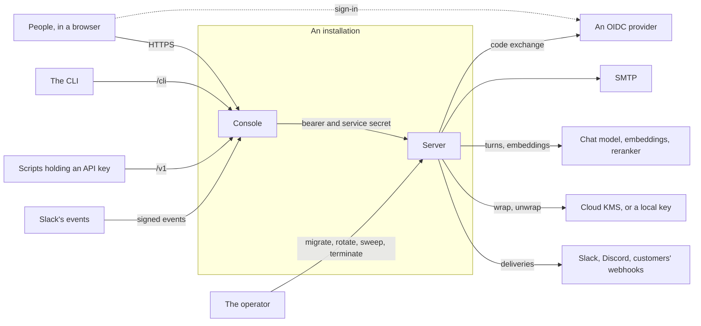
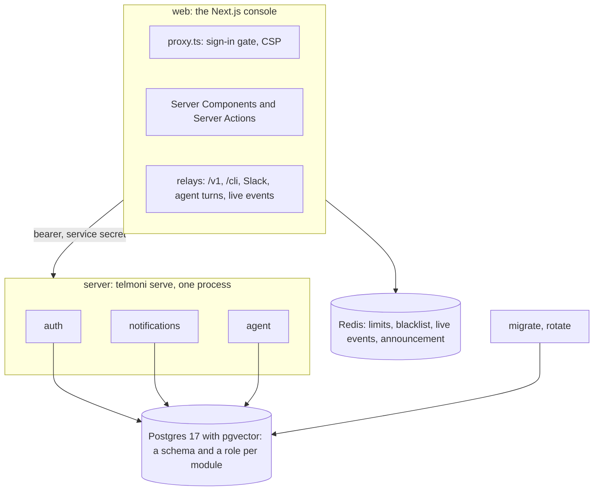
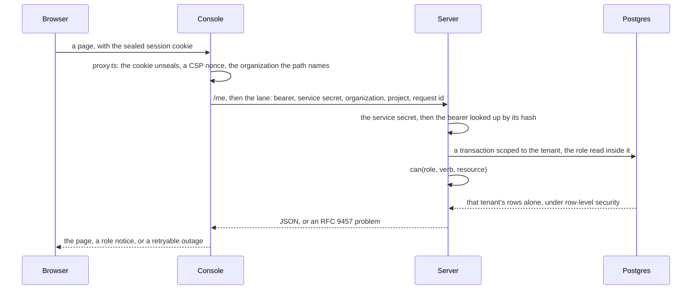
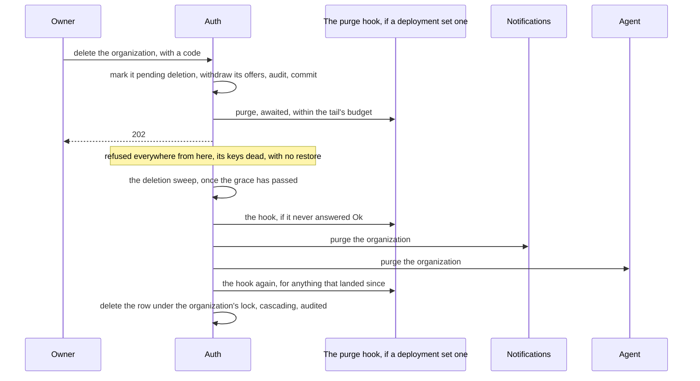
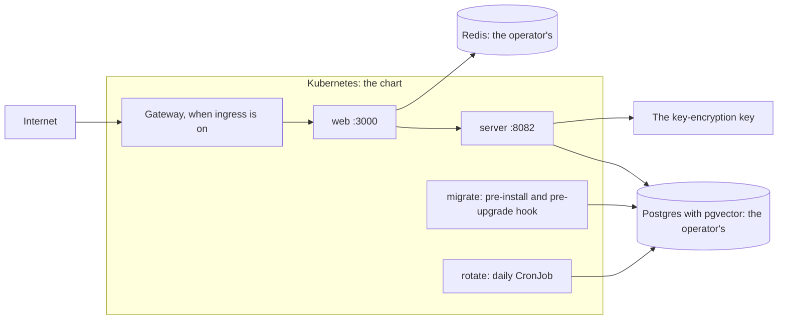

# High-level design

Telmoni's core on one page: what it is for, what it is made of, how a request moves through it, how tenants are kept apart, how data lives and is erased, how it runs, how it fails, and why it is built this way. Start here. Each area has a page of its own (the [index](README.md#pages)), and this page restates none of them: where a rule or a number lives on an area page, this page links to it rather than copy it.

**Where it stands:** Telmoni has not launched. What runs is the foundation: organizations and projects, members and roles, API keys, notifications, a hash-chained audit log and a read-only console agent. The telemetry the product is for is built on it next, in the open, and nothing records a run yet ([Where it goes next](#where-it-goes-next)).

## Contents

- [Purpose and scope](#purpose-and-scope)
- [Goals and constraints](#goals-and-constraints)
- [Context](#context)
- [Building blocks](#building-blocks)
- [How a request moves](#how-a-request-moves)
- [Identity and access](#identity-and-access)
- [Data](#data)
- [Notifications](#notifications)
- [The console agent](#the-console-agent)
- [Background work](#background-work)
- [Deployment](#deployment)
- [Extending the core](#extending-the-core)
- [Conventions everywhere](#conventions-everywhere)
- [When something fails](#when-something-fails)
- [Scale](#scale)
- [Where it goes next](#where-it-goes-next)
- [Decisions](#decisions)
- [Known gaps](#known-gaps)

## Purpose and scope

Telmoni is a privacy-first telemetry and monitoring platform for AI agents, open source under Apache-2.0. This repository is its core: everything an installation runs. Today that is the multi-tenant foundation the telemetry will stand on:
- organizations and projects, members and roles;
- API keys, and a read API, `/v1`;
- notifications, to an in-app feed, Slack, Discord and webhooks;
- a hash-chained audit log, exportable by range;
- a read-only console agent that answers from the docs and a project's own data.

It is **one Rust binary**, `telmoni`, and **a Next.js console** beside it, deployed together with a Helm chart or Docker Compose. A deployment that needs more builds its own binary and console on these crates rather than forking them ([Extending the core](#extending-the-core)).

| For | Read |
|---|---|
| What the product does for a customer | The console's book, `web/content/docs`, served at `/docs` |
| Running it yourself | The book's self-host pages, `web/content/docs/self-host` |
| Developing it | `README.md` and `AGENTS.md` |

## Goals and constraints

**What the design must hold:**

| Goal | How |
|---|---|
| **One tenant never sees another's data** | A database role per module; the tenant bound into every transaction's type; forced row-level security; one permission matrix; work across tenants only through a module's own maintenance lane ([tenancy](tenancy.md)) |
| **Every change is accounted for** | Its audit row commits in the same transaction, on a chain per organization that is verified daily ([data](data.md#the-audit-log)) |
| **What a customer deletes is gone** | Deletion is a saga across every module, finished by a sweep, with no restore once its grace has passed ([deletion](deletion.md)) |
| **Secrets and personal data never leak** | `Redacted` in memory, ids alone in logs, problems that carry no internals, and connector grants sealed row by row under a key-encryption key ([server](server.md#logging), [notifications](notifications.md#secrets-at-rest)) |
| **Nothing is lost when a process stops** | Every loop is leader-locked, leased or chunked, and work begun by a request is either awaited or backed by a sweep ([background](background.md)) |
| **It is simple to run** | One binary, one console, one Postgres, one Redis; configuration only from the environment; the chart on a cluster, or Compose on one machine ([deploy](deploy.md)) |

**What it is not, on purpose:**
- **Microservices.** The modules are libraries in one process, and never call each other over the network.
- **A console with logic.** The console renders and relays; every rule is in Rust.
- **Signed tokens.** Every token is opaque and stored as its hash, so nothing needs a signing key.

**What it must live with:**
- **Nothing has shipped.** Schemas, wire contracts, Redis keys and APIs change in place: one migration per module, edited, and no migration path (`AGENTS.md`).
- **It is built in the open**, under Apache-2.0, and names no deployment built on it.
- **Self-hosting is a first path**, not an afterthought: Compose on one machine, or the chart on any cluster.

## Context

Who and what an installation talks to.



| Party | What it is to the core | What crosses | Page |
|---|---|---|---|
| **People** | An organization's owner, admins and members, in a browser | Pages and Server Actions, under a sealed session cookie | [console](console.md) |
| **The CLI** | `telmoni/telmoni-cli`, signed in by a device grant | The `/cli` lanes: start, poll, refresh, `/me`, sign-out | [identity](identity.md#the-cli) |
| **Scripts** | Whoever holds a project's API key | `/v1`, read-only today | [identity](identity.md#api-tokens) |
| **Slack's events** | Slack telling the core an app was removed or its tokens revoked | Signed events, verified by the server | [console](console.md#relays) |
| **An OIDC provider** | Optional: who a person is, beside or instead of the password form | Discovery, the code exchange, an RS256 id token, logout | [identity](identity.md#signing-in) |
| **SMTP** | Mail: verification, reset, invitations, codes | Each message | [identity](identity.md#mail) |
| **Models** | The agent's chat model (Anthropic, or anything OpenAI-compatible), embeddings and an optional reranker: the operator's, and never egress-guarded | A turn's text and the passages it reads; every passage the agent indexes | [agent](agent.md#model-access) |
| **The key-encryption key** | A Cloud KMS key on a cluster, a local key on a laptop | Each connector row's data key, to wrap or unwrap | [notifications](notifications.md#secrets-at-rest) |
| **Slack, Discord, customers' webhooks** | Where notices are delivered | Each notice; a webhook's signed | [notifications](notifications.md#connectors) |
| **The operator** | Whoever runs the installation | Subcommands, feature flags, the log level | [server](server.md#subcommands) |

## Building blocks



| Block | What it is | What it keeps | Page |
|---|---|---|---|
| `telmoni` | The binary: `App`, `Parts`, `Module` and `run`; `serve` and the subcommands; the sweeps' timers | — | [server](server.md) |
| `auth` | Identity, sessions and the one issuer; organizations, projects, rosters, invitations and transfers; API keys; flags; export, audit exports and deletion; `/me` and `/v1` | The `auth` schema | [identity](identity.md), [tenancy](tenancy.md), [deletion](deletion.md) |
| `notifications` | The feeds, the connectors, the delivery queue and its loop, Slack's events | The `notifications` schema | [notifications](notifications.md) |
| `agent` | Model adapters, embeddings, the index and hybrid search, five read-only tools, the turn loop | The `agent` schema, with pgvector | [agent](agent.md) |
| `shared` | Errors and problems, RBAC, `Acting`, scoped transactions, the seams, the audit writer and verifier, envelope encryption, the egress guard, logging, configuration, `Redacted`, slugs | — | [server](server.md) |
| `migrator` | The migration runner, `rotate`, the `audit` schema, role hardening and grants | The `audit` schema | [data](data.md#migrations) |
| `web/` | The console: pages, the session, the edge's rate limits, the relays; no database access and no business logic | Nothing but what Redis holds | [console](console.md) |
| Postgres | One database: a schema per module, each written by its own role alone | Everything durable | [data](data.md) |
| Redis | The console's alone: rate-limit windows, the session blacklist, live events, the announcement — all of it losable | Nothing that must survive | [console](console.md#redis) |

## How a request moves



A write takes the same path through a Server Action, its audit row committed with the change. The [index](README.md#a-request-end-to-end) walks one request step by step.

Every way in:

| Way in | Path | Gate | Page |
|---|---|---|---|
| A page or a Server Action | Browser → console → the server's `/internal` lanes | The sealed cookie, then the service secret and the bearer, then the matrix, then RLS | [console](console.md#talking-to-the-server) |
| `/v1` | A script → the console's relay → the server | The service secret, then the API key | [identity](identity.md#api-tokens) |
| `/cli` | The CLI → the console's relay → the server | The service secret; then the device grant, then a bearer | [identity](identity.md#the-cli) |
| Slack's events | Slack → the console's relay → `POST /webhooks/slack` | Slack's signature | [console](console.md#relays) |
| An agent turn | The agent's window → `POST /api/agent/turns` → the server, streamed back | The session, then a turn as the asker, re-resolved as it runs | [agent](agent.md#a-turn-end-to-end) |
| Live events | `EventSource` → `/api/events` → Redis's channels | Same origin, the session, the blacklist | [console](console.md#live-events) |

**The console is the one public surface.** The server takes traffic from the console alone, and the service secret proves only that a call came from inside; who is asking is auth's answer on every request ([server](server.md#routing)).

## Identity and access

**Who is asking** is auth's answer, `Acting`, on every request: the person, the organization, both roles, the session ([tenancy](tenancy.md#who-is-acting)).
- **One issuer.** The password form, an OIDC provider and the CLI's device grant all end in the same opaque session — a short-lived bearer and a refresh token rotated on every use — stored as hashes. An external provider only answers "who is this" ([identity](identity.md#one-issuer)).
- **Ending a session holds on the next request**, since every request looks its bearer up ([identity](identity.md#sessions)).
- **The console's side** is a sealed cookie holding the session's tokens, refreshed near expiry ([identity](identity.md#the-consoles-side)).
- **API keys** are minted on a project, hashed, shown once, with an expiry and a rotation grace ([identity](identity.md#api-tokens)).
- **Abuse limits** are where the cost is: lockouts and a decoy hash in auth, capped codes and links, and per-person and per-address windows at the console's edge ([identity](identity.md#abuse-limits)).

**What they may do** is one matrix, `can(role, verb, resource)`, for every module, with every cell pinned by a test ([tenancy](tenancy.md#the-matrix)). An organization has one owner, admins and members; a project's seats are admins and members, and a seat never lowers what the organization's role gives ([tenancy](tenancy.md#roles)).

**Which rows they may touch** is bound into the transaction's type, `Scoped<Binding>`, and enforced by forced row-level security, where an empty binding matches nothing ([tenancy](tenancy.md#scopes-binding-the-tenant-to-the-transaction)).
- **Work across tenants** — the bearer lookup, invitations, sweeps, the indexer, the delivery loop — runs in the module's own maintenance lane, never as a wildcard ([tenancy](tenancy.md#maintenance-lanes)).
- **Beneath it all, no request value is spliced into SQL**, and a test reads every query to keep it so ([tenancy](tenancy.md#how-isolation-is-tested)).
- ⚠ **Compose's quickstart connects as the superuser**, so RLS, the grants and the timeouts do not apply there; what separates tenants then is each query's own `WHERE`, the membership checks and the constraints ([tenancy](tenancy.md#when-everything-connects-as-a-superuser)).

## Data

```text
audit           events, partitioned by month: one hash chain per organization
auth            people, credentials, sessions, organizations, projects, rosters, invitations,
                transfers, API keys, flags, audit exports
notifications   feed, connections, deliveries, delivery_attempts, oauth_states
agent           chunks (a vector and a text index), conversations, messages, cursors, erasures
```

- **One migration per module**, edited in place before launch. The migrator runs `audit`, then `auth`, then the rest by name, then the grants ([data](data.md#migrations)).
- **The audit log** is append-only by its grants, one chain per organization written under an advisory lock, in a frozen hash format pinned by golden vectors. It is verified daily and never repaired; `rotate` makes its partitions ahead, and none is dropped. An owner or admin exports a range as a file that verifies on its own ([data](data.md#the-audit-log)).
- **Retention** is each module's sweep deleting what has passed its window, in chunks where the work can be large; each window is a named constant ([data](data.md#retention)).
- **Export** is the organization's own data, read in one consistent transaction ([deletion](deletion.md#export)).

**Deletion** runs across every module, and only auth starts it ([deletion](deletion.md)):



- **A project** goes at once, its notices purged after the commit and the agent's index catching up within the hour ([deletion](deletion.md#project-deletion)).
- **A person** is erased across every module, the identity provider first, and the erasure stops if that fails ([deletion](deletion.md#erase_person)).
- **The audit log outlives what it describes**: its rows name ids, with no foreign key to cascade ([data](data.md#the-audit-log)).

## Notifications

- **Two feeds:** each project's, and the organization's own, for its owner and admins ([notifications](notifications.md#the-feeds)).
- **Raising a notice** writes it and one delivery per active connection in one transaction. The first attempt is made right after the commit; the rest are the delivery loop's: leased rows, backoff, at least once, deduplicated by the receiver on the delivery's id ([notifications](notifications.md#the-delivery-queue)).
- **Connectors**: Slack and Discord through OAuth, and webhooks signed with `telmoni-signature` ([notifications](notifications.md#connectors), [notifications](notifications.md#webhook-signatures)).
- **Every grant is sealed at rest.** A data key per row, AES-256-GCM per field with the row's id as associated data, the data key wrapped by the key-encryption key: a library, never a lane ([notifications](notifications.md#secrets-at-rest)).
- **The egress guard** checks a customer's URL when it is registered, when it is dialled and when it connects, and follows no redirect, because a network policy cannot tell a customer's address from the database's ([notifications](notifications.md#the-egress-guard)).

## The console agent

- **Absent, off or on.** Without its database it is absent; with a database and no model it keeps its tables and its retention; with both it answers ([agent](agent.md#on-off-and-absent)).
- **Read-only.** Five tools, each a read that checks the matrix again as the asker, who is resolved again throughout the turn; nothing it does writes ([agent](agent.md#who-is-asking-read-again), [agent](agent.md#the-tools)).
- **Search inside Postgres.** A lexical half and a semantic half fused by rank, compared exactly for a small tenant, and reranked when a reranker is set ([agent](agent.md#search)).
- **The index** holds the docs, the audit log, the feed, deliveries and remembered conversations, each document's audience decided by the module that owns it ([agent](agent.md#the-index)).
- **Prompt injection is contained, not prevented:** nothing retrieved enters the system prompt, tool results are fenced, the answer is rendered as nodes, never HTML, and the agent cannot act ([agent](agent.md#prompt-injection)).
- **A vendor's outage never stops the server booting**; an embedding model of the wrong width does ([agent](agent.md#boot)).
- **Its own questions** are recorded through `AgentObserver`, as ids, timings and token counts, never content; nothing implements it yet ([agent](agent.md#recording-the-agents-own-questions)).
- **In the console, a window over every page**, moved, sized or filling the screen, that leaves the page its keys; a turn's stream names its conversation first, so an answer stopped or cut off never splits a thread ([console](console.md#shape), [agent](agent.md#post_turn-cratesagentsrchandlerrs)).

## Background work

Most of it runs inside `serve`, in every replica, and all of it is safe for replicas to run at once and safe to stop at any point ([background](background.md)):

| Work | Runs | How replicas share it |
|---|---|---|
| Deletion sweep, audit verification | `serve`, on timers | A leader lock with a heartbeat and a budget |
| Auth's retention | `serve`, daily | One idempotent transaction |
| Audit exports | `serve`, on a timer, and built after a request | Row leases, each write fenced on its attempt |
| Delivery loop | `serve`, every replica | Row leases, `SKIP LOCKED` |
| Notifications' and the agent's retention | `serve`, hourly | Advisory locks, chunk by chunk |
| Agent indexer | `serve`, when the agent is on | Cursor leases |
| Migrations | `telmoni migrate`, a Helm hook Job | One Job |
| Partition rotation | `telmoni rotate`, a daily CronJob | `Forbid` |

- **Work a request starts** is awaited where losing it would matter — the deletion tail, the agent's erase — or left for a lease or a sweep to finish. The password-reset mail alone is a bare task, so that its timing reveals nothing, and a rollout can lose it ([background](background.md#inline-work-after-a-request)).
- **No loop is told to stop.** Leases lapse, locks die with their connections, and committed chunks stay committed, so a loop cut short loses nothing ([background](background.md#stopping)).
- **The delivery loop is raced against the HTTP server**: if it ends, the process exits, and the restart is the recovery.

## Deployment



- **Two images**, `server` (a static musl binary on distroless) and `web` (Node on distroless), published to GHCR once CI passes on `main` ([deploy](deploy.md#images)).
- **The chart** runs the console, the server, the migrate hook and the rotate CronJob, reads one ConfigMap and three Secrets the operator makes, denies all traffic by default, runs every pod non-root with every capability dropped, and offers high availability and a Gateway as switches. Postgres, Redis and the key are the operator's, outside it ([deploy](deploy.md#the-helm-chart)).
- **Only the console is exposed.** The server takes traffic from the console alone ([deploy](deploy.md#topology)).
- **Order:** the ConfigMap and the migrator's account as hooks, then the migration, then the rollout; a failed migration fails the upgrade before anything rolls ([deploy](deploy.md#ordering)).
- **Compose** runs the whole of it on one machine, every module as one superuser, and `rotate` by hand ([deploy](deploy.md#self-host-docker-compose)).
- **CI** checks, and tests against Postgres; `publish.yml` pushes the images once CI passes on `main`; nothing deploys ([deploy](deploy.md#ci)).

## Extending the core

A deployment that needs more builds on the core rather than forking it, and the core names none:

| Seam | What a deployment does | Page |
|---|---|---|
| **The binary** | Calls `App::assemble(Parts)` with its own `AuthProvider`, `MailSender`, `PurgeHook` and agent parts, mounts its own `Module`s, and hands `run` its builder | [server](server.md#assembling-the-process) |
| **The seams** | A mounted module reaches the core only through `seam::Auth` and the notifier; `organization_standing`, `organization_slugs` and the `organization_alert` notice exist for such a module | [server](server.md#seams) |
| **The database** | Builds on the server image, adding `/app/migrations/<schema>` and `/app/grants/*.sql`; a grants file names its grantees and is skipped where they do not exist | [data](data.md#migrations) |
| **The console** | Lays its files over the core's six slots, and imports the core only through `@/lib/extension/ui` and `@/lib/extension/server`; the book's `meta.json` files take its pages in | [console](console.md#extension-slots) |
| **The chart** | Wraps this one, setting `global.imageRegistry` and `extraEnv` | [deploy](deploy.md#the-helm-chart) |
| **Paths** | Takes only words the core reserves for it, so no organization or project can land on its pages | [console](console.md#paths-and-slugs) |

**What a deployment cannot replace:** the issuer, the core's routes and request layers, the loops' cadences, and the subcommands ([server](server.md#assembling-the-process)).

## Conventions everywhere

- **Errors** are `TelmoniError`, answered as RFC 9457 problems that carry no internals, every `type` documented in the book's `errors.mdx` and held there by a test ([server](server.md#errors)).
- **Panics** are kept out by lints — no `unwrap`, `expect` or indexing outside tests — and none reaches a caller.
- **Logs** are JSON with the keys Cloud Logging reads, carry ids and never a secret, an address or free text, and a raised level always expires ([server](server.md#logging)).
- **Configuration** comes only from the environment, read once at boot, and is refused when unsafe in a pod ([server](server.md#configuration), [server](server.md#boot)).
- **Shutdown** drains HTTP on `SIGTERM` or `SIGINT` ([server](server.md#shutdown)).
- **Contracts** are generated: the wire contract and the OpenAPI document come from the code, the router is built from the same table as the document, and the console's copies are held to them by tests ([server](server.md#the-wire-contract)).

## When something fails

| Fails | What a person sees | What recovers it |
|---|---|---|
| **Postgres** | At boot, the process exits. Running, the pods go unready, and pages say the service is unavailable. | Postgres |
| **A module's grant** | The server starts, and never goes ready | The grant |
| **Redis** | Rate limits per instance, the blacklist in memory (auth still refuses a revoked bearer), live updates paused, the announcement from the environment | Redis |
| **The OIDC provider** | No new sign-in through it; sessions already issued go on, since auth issued them | The provider |
| **SMTP** | Whatever needs mail answers that it failed | SMTP |
| **The key-encryption key** | Deliveries held, their attempts handed back; a new connector refused | The key |
| **A destination** | Retries with backoff, then a failed delivery; a webhook's breaker marks its connection errored; an uninstalled Slack app retires its own | The destination, and a resend |
| **The model** | Retried while busy, then the turn ends with an error and nothing is saved | The vendor |
| **Embeddings** | The server still boots; indexing backs off; the agent's search tool reports a failure | The vendor |
| **A pod, mid-loop** | Nothing: leases lapse, locks die with their connections, chunks stay committed | The next tick |

## Scale

- **Both processes are stateless**, so both scale by replicas, and the chart's high-availability switch gives each an autoscaler and a disruption budget ([deploy](deploy.md#probes-scaling-and-disruption)).
- **Every replica runs every loop**, and the work is shared by leader locks, leases and chunks, so a replica added is a replica safe to add ([background](background.md)).
- **Connections multiply with replicas:** each process opens one pool per module, of `SERVICE_POOL_MAX_CONNECTIONS` each, kept small on purpose (`crates/shared/src/db.rs`).
- **What runs one at a time:** audit writes within one organization, each leader sweep, each indexer source, each retention chunk, `rotate` and `migrate`.
- **What each process caps:** first delivery attempts, concurrent sends and export builds, each a named constant ([background](background.md#the-map)).

## Where it goes next

Telmoni is for telemetry from AI agents, and that is built on this foundation in the open. None of it is built yet. What is settled:
- **A `telemetry` module**, a module like the others: its own schema and role, its seam, and the `AgentObserver` the agent already calls, so the console agent is the first agent it records.
- **Ingest over OpenTelemetry's own protocol**, with content kept out unless an organization's owner turns it on for a project.
- **Two stores.** Postgres keeps what must be transactional or private; spans and their hourly rollups go to ClickHouse, metadata alone. Self-hosting runs both.
- **A host for machines**, routed straight to the server, apart from the console's. The console's `/v1`, `/cli` and Slack relays go, and their limits move into the server.
- **Monitors, alert rules and incidents** on top, delivered through the connectors, with mail and PagerDuty joining them.

The words those lanes will take — `otlp`, `ping`, `webhooks` — are already reserved, so no organization holds one ([console](console.md#paths-and-slugs)).

## Decisions

| Decision | Why | What it gives up | Page |
|---|---|---|---|
| **One binary, its modules libraries in one process** | No hop to secure, version or cache, and one deploy | The modules scale and fail together | [server](server.md#modules-in-one-process) |
| **Modules meet only through seams** | One module's bug cannot reach another's tables, and tests can stand doubles in | A seam method for every question between modules | [server](server.md#seams) |
| **A database role per module, with a maintenance lane of its own** | Grants and RLS hold inside one process as between services; a shared lane once held every schema | A pool per module in every process | [tenancy](tenancy.md#maintenance-lanes) |
| **Forced RLS, with the tenant in the transaction's type** | A forgotten filter returns no rows, never another tenant's | Every query runs inside a scope | [tenancy](tenancy.md#scopes-binding-the-tenant-to-the-transaction) |
| **Opaque tokens, stored as hashes, from one issuer** | Nothing to sign, rotate or leak, and an ended session holds on the next request | A lookup on every request | [identity](identity.md#one-issuer) |
| **The service secret proves origin, not identity** | No identity claim crosses a hop, and roles are read fresh | Every request asks auth | [server](server.md#routing) |
| **The console is a thin proxy** | Every rule lives in one language, under one suite of tests | The console cannot answer without the server | [console](console.md) |
| **The audit row in the change's transaction, chained per organization** | No change without its record, and a record nobody can edit unseen | Audited writes within an organization go one at a time | [data](data.md#the-audit-log) |
| **Partitions made ahead, none dropped** | Running out would stop every audited write; history stays until an archive exists | Storage only grows | [data](data.md#partitions) |
| **Deletion as a saga finished by a sweep, with no restore** | A spawned tail would die with its pod, and the grace covers requests in flight | A deleted organization cannot come back | [deletion](deletion.md#organization-deletion) |
| **Envelope encryption as a library, a data key per row** | A dump yields ciphertext, and no endpoint opens everything | A call to the key on every open | [notifications](notifications.md#secrets-at-rest) |
| **The egress guard in code** | A network policy cannot tell a customer's address from the database's | Every customer URL must pass through it | [notifications](notifications.md#the-egress-guard) |
| **A leased delivery queue, at least once** | Durable, with no leader | Receivers deduplicate on the delivery's id | [notifications](notifications.md#the-delivery-queue) |
| **Every loop safe to repeat and to stop** | A rollout loses nothing | Each loop carries a lock, a lease or a chunk | [background](background.md) |
| **Liveness without I/O; readiness reading each module's own table** | A database stall must not restart every replica, and a missing grant must not pass a probe | — | [deploy](deploy.md#probes-scaling-and-disruption) |
| **Configuration from the environment, refused when unsafe in a pod** | Nobody has to remember a flag | A laptop and a pod differ by `KUBERNETES_SERVICE_HOST` alone | [server](server.md#boot) |
| **Problems with no internals, held to a catalog** | Nothing internal reaches a caller, and every `type` is documented | The detail lives only in logs | [server](server.md#errors) |
| **A read-only agent whose tools run as the asker** | The worst a poisoned passage can do is mislead | The agent cannot act | [agent](agent.md) |
| **Search inside Postgres** | One store, and an exact path where an approximate index's filter misses a small tenant | Postgres carries the vectors | [agent](agent.md#search) |
| **Generated contracts, the router built from the document's table** | A lane the document does not describe is a lane the server does not serve | `make contract` after each change | [server](server.md#the-wire-contract) |
| **Ids name rows, slugs spell links, and a moved slug does not redirect** | Links read as names, never an id in the address bar | A link outlived by a URL change answers "not found" | [console](console.md#paths-and-slugs) |
| **Redis for the console alone, all of it losable** | Nothing durable in a cache | Per-instance limits while it is down | [console](console.md#redis) |

## Known gaps

The ones that shape the design, each kept on its page until it is closed:
- **Compose's superuser path is untested** ([tenancy](tenancy.md#how-isolation-is-tested)).
- **The egress guard holds only while the cluster's pod and Service ranges are private** ([notifications](notifications.md#the-egress-guard)).
- **The password-reset mail can be lost** to a rollout, and nothing retries it ([background](background.md#inline-work-after-a-request)).
- **Delivery is at least once, unordered, and unpaced per vendor** ([notifications](notifications.md#the-delivery-queue)).
- **Audit partitions are never dropped**, and `ip_address`, `user_agent` and `shard_key` are filled by nothing ([data](data.md#partitions), [tenancy](tenancy.md#shard-keys)).
- **Leader locks prevent overlap, not repetition.** Each replica's timer starts at its own boot, so a daily sweep runs once a day for each replica (`crates/telmoni/src/sweeps.rs`).
- **No `preStop` hook, no grace period of the chart's own, and no startup probe**, so a pod leaving its Service can still meet a few requests while it drains ([deploy](deploy.md#probes-scaling-and-disruption)).
