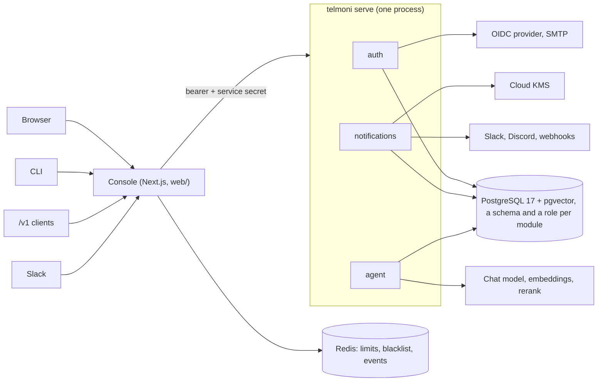

# Architecture

How Telmoni is built, and why. These pages are for people and agents changing the code. What the product does for a customer is documented in [`telmoni/docs`](https://github.com/telmoni/docs).

Telmoni is a multi-tenant foundation. It provides:
- organizations and projects;
- members and roles;
- API tokens;
- notifications, delivered to Slack, Discord and webhooks;
- a hash-chained audit log;
- a read-only console agent.

It is **one Rust binary**, `telmoni`, and a **Next.js console** beside it, deployed together to GKE with one Helm chart.

## Pages

| Page | Covers |
|---|---|
| [server.md](server.md) | The binary: modules in one process, assembly, boot, routing, seams, errors, logging, configuration, shutdown, subcommands, the wire contract |
| [identity.md](identity.md) | Sign-in (password, OIDC, device), the opaque-token sessions, the console's cookie, API tokens, abuse limits, mail |
| [tenancy.md](tenancy.md) | Organizations and projects, roles, the permission matrix, `Acting`, scoped transactions, row-level security, maintenance lanes, database roles, transfers |
| [data.md](data.md) | Schemas, migrations, audit partitions, the audit hash chain, retention windows |
| [background.md](background.md) | Every loop and job, and how replicas share them: leader locks, leases, chunks |
| [deletion.md](deletion.md) | Organization, project and person deletion across modules, and the organization export |
| [notifications.md](notifications.md) | Feeds, the delivery queue, connectors, envelope encryption, webhook signatures, the egress guard |
| [agent.md](agent.md) | The console agent: model access, the turn loop, tools, prompt injection, hybrid search, the indexer, erasure |
| [console.md](console.md) | `web/`: what runs where, talking to the server, `proxy.ts`, Redis, live events, relays, extension slots |
| [deploy.md](deploy.md) | Images, the Helm chart, configuration and secrets, probes, policies, ingress, ordering, compose, CI |

## The system



**The crates:**
- **`auth`**: identity, sessions, organizations, projects, members, invitations, transfers, API tokens, flags, export, deletion, `/v1`.
- **`notifications`**: feeds, connectors, deliveries.
- **`agent`**: the console agent.
- **`shared`**: the errors, RBAC, scopes, seams, audit writer, envelope encryption and egress guard that every module uses.
- **`migrator`**: runs every module's migration and the grants.
- **`telmoni`**: the binary that links them all.

**The console's position.** It renders pages, holds the session, and relays everything a browser, the CLI, a `/v1` client or Slack sends. It has no database access and no business logic.

## A request, end to end

A person opens a project's members page:

1. **`proxy.ts`** checks that the session cookie unseals, and sets a CSP nonce ([console](console.md#proxyts)).
2. **The page's Server Component** reads the session. If the bearer is near expiry it refreshes it ([identity](identity.md#the-consoles-side)).
3. **The console calls `/me`.** Auth decides which organization is active, and who the person is there.
4. **The console calls `GET /internal/projects/{id}/members`** with `Authorization: Bearer <opaque token>`, `x-service-secret`, `x-organization-id`, `x-project-id` and `x-request-id`, through `fetchWithTimeout` ([console](console.md#talking-to-the-server)).
5. **The server checks the service secret, then looks the bearer up by its hash.** That lookup refuses a revoked session or a person who is being deleted ([identity](identity.md#resolving-a-request)).
6. **The handler** (`handler::member::list_members`) checks access:
   - `acting_project` opens a transaction scoped to the project, which binds `app.project_id`, and reads the person's role from the rosters in that same transaction.
   - `authorize` then asks `can(role, Read, Member)` ([tenancy](tenancy.md)).
   - To read the roster, the handler binds the owning organization as well (`enter_owner_scope`).
7. **Row-level security admits only that tenant's rows.** The query also names the project in its own `WHERE`.
8. **The answer comes back as JSON**, or as an RFC 9457 problem ([server](server.md#errors)). The page maps a refusal to a role notice, and an outage to a retryable screen.

A write takes the same path through a Server Action. Its audit row is written in the same transaction as the change ([data](data.md#the-audit-log)). Afterwards, a notice may be raised through the notifications seam ([notifications](notifications.md#raising-a-notice)).

## Rules that hold everywhere

These are the load-bearing decisions. Each page explains its part.

1. **One process, separate modules.** Modules never read each other's tables and never call each other over the network. They ask through Rust traits in `crates/shared/src/seam.rs`. ([server](server.md#seams))
2. **One database role per module.** Row-level security and grants hold inside the one process as if the modules were separate services. Work that spans tenants switches to the module's own maintenance lane, never to a wildcard. ([tenancy](tenancy.md#maintenance-lanes))
3. **The tenant is bound to every transaction.** The binding is part of the transaction's type, and RLS is forced, so a transaction reads only its tenant's rows. A few queries also name their tenant in their own `WHERE`: the export and the agent's search. Most rely on RLS. A connection that bypasses RLS, such as the compose quickstart's superuser, is only as safe as those queries ([tenancy](tenancy.md#when-everything-connects-as-a-superuser)).
4. **Auth decides who is asking, and does so on every request.** No role or identity claim travels between processes. Tokens are opaque and stored as hashes, so ending a session takes effect on the next request. ([identity](identity.md#one-issuer))
5. **One permission matrix.** `can(role, verb, resource)` in `crates/shared/src/rbac.rs` decides for every module, and every cell is pinned by a test. ([tenancy](tenancy.md#the-matrix))
6. **The audit row commits with the change.** `emit_audit` is the only writer, inside the handler's transaction. The chain is per organization, append-only and verified daily. ([data](data.md#the-audit-log))
7. **Everything in the background is safe to repeat and safe to stop.** Every loop takes a leader lock, leases its rows, or works in idempotent transactions. Deletions are finished by a sweep. ([background](background.md))
8. **Secrets and personal data never reach a log or an error.** Secrets are held in `Redacted`, logs carry ids only, and errors are mapped to problems that carry no internals. ([server](server.md#logging))
9. **Configuration comes only from the environment.** The server checks it at boot and refuses to start when it is unsafe for a deployed tier. ([server](server.md#configuration))
10. **The console is a thin proxy.** It holds the session and relays. Every rule lives in Rust. ([console](console.md))

## Map of the code

```text
crates/
  telmoni/        the binary: App, Module, serve, subcommands, the sweeps' timers
  auth/           sign-in, sessions, tenancy, invitations, transfers, tokens, flags,
                  export, deletion, the sweeps, /v1
    src/issuer.rs, person.rs, seam.rs, sweep.rs, handler/, db/, password/, oidc/
  notifications/  feeds, connectors, delivery, retention
    src/delivery.rs, connector/, handler/, db.rs
  agent/          model adapters, embeddings, index, search, turn loop, tools
    src/turn.rs, tools.rs, retrieve.rs, index/, model/, db.rs, seam.rs
  shared/         errors, RBAC, Acting, scoped transactions, seams, audit writer,
                  envelope encryption, egress guard, logging, config, Redacted
    src/seam.rs, rbac.rs, acting.rs, db/tenant_session.rs, audit.rs, envelope/,
        net_guard.rs, error.rs, logging.rs
    tests/        the cross-module suites: tenancy, RLS, roles, contracts, catalogs
  migrator/       the migration runner, rotation, the audit schema, roles and grants
    sql/          role_hardening.sql, object_grants.sql, dev_roles.sql, dev_extensions.sql
web/              the console
  proxy.ts        sign-in gate, CSP
  app/            routes: (app) console, (auth) sign-in, api/, v1/, cli/, connect/
  lib/            logic and its tests: api/, auth/, server/entities/, events/, agent/,
                  extension/
  components/     UI, untested by rule
contract/         generated: wire-contract.json, openapi.json
deploy/           charts/telmoni (GKE), compose (self-host)
```

## Glossary

| Term | Meaning |
|---|---|
| **Acting** | Auth's answer to "who is this and what may they do here": the person, the organization, both roles, the session. `crates/shared/src/acting.rs`. |
| **Seam** | A trait one module implements for the others to call, in process. `crates/shared/src/seam.rs`. |
| **Scope** | A transaction with tenant keys bound (`app.organization_id`, `app.project_id`, `app.user_id`), typed as `Scoped<Binding>` |
| **Lane** | A module's maintenance role (`auth_maintenance`, …), entered with `SET LOCAL ROLE` for work that spans tenants |
| **Service secret** | The shared secret that proves a request came from inside the platform. It says nothing about who is asking. |
| **Bearer** | A person's short-lived opaque access token, stored as its hash |
| **Organization feed / project feed** | The two kinds of notification feed: an organization's own, and each project's |
| **Delivery** | One notice queued for one connection. It is leased, retried with backoff, and recorded per attempt. |
| **Fence** | A row and a lock the agent's erasure puts down, so an answer being written while the erasure runs is withheld, not saved |
| **Deployed tier** | A process running in Kubernetes (`KUBERNETES_SERVICE_HOST` set), where unsafe settings refuse to boot |
| **Pending deletion** | An organization or a person marked for deletion: refused everywhere, finished by the sweep |

## Keeping these pages true

- **A change that alters what a page says updates that page in the same change.** The pages follow the crates, so the page to check is the one named after the code being changed.
- **Name the constant, don't copy the value.** Pages name tunables (`TURN_BUDGET`, `FEED_RETENTION_DAYS`) and the file that holds them, so a changed value cannot leave a page wrong.
  - Contract values (the vector width, the default port, the golden vectors) live in code and tests. The customer docs copy those, not these pages.
- **Say why.** A rule worth writing down here is one whose reason is not obvious from the code: what broke, or what would break. The ⚠ comments in the source are where most of these come from.
- **Features belong in the customer docs.** These pages explain how the code works and why; [`telmoni/docs`](https://github.com/telmoni/docs) explains what the product does.
