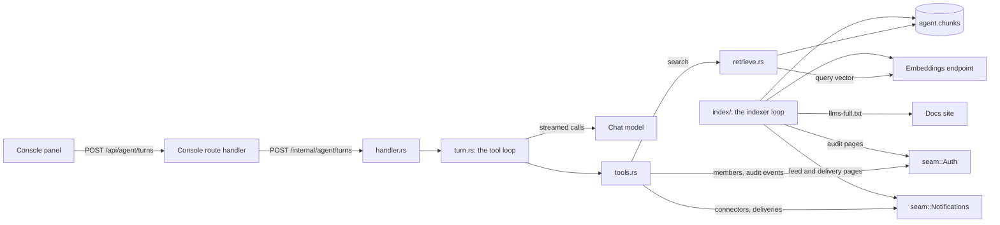
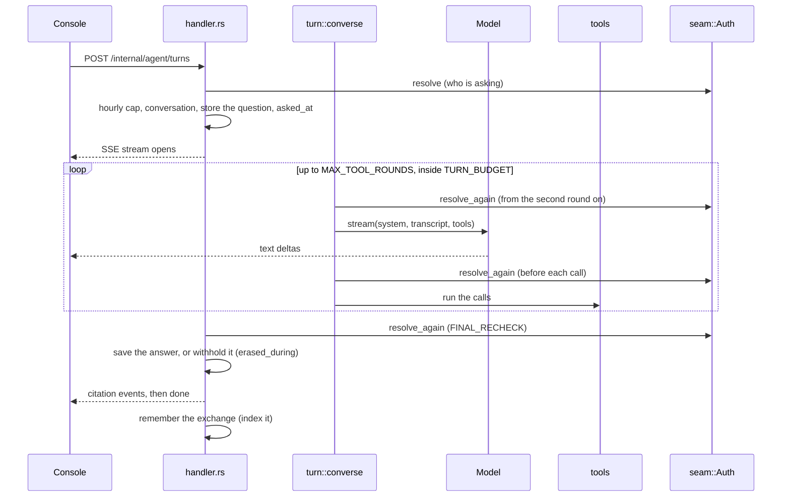
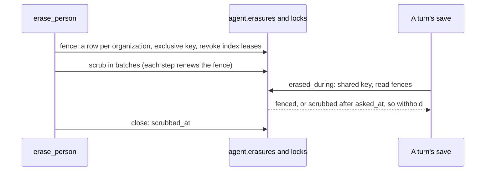

# The console agent

A person asks a question from a project page. The agent answers by streaming text that cites what it used. To get there it looks things up with five tools, all of them reads, each run as that person. It is the `crates/agent` module of the one binary. It has its own schema (`agent`) and its own database role (`agent`), and it reaches the other modules only through their seams.

Two rules hold everything here together:

- **The model sees only what the console would show the person at that moment.** Every search runs under the person's own scope. Every tool checks their role again before it reads.
- **Nothing writes.** No tool changes anything. The worst a poisoned passage can do is mislead an answer.

## Contents

- [Shape](#shape)
- [On, off, and absent](#on-off-and-absent)
- [Boot](#boot)
- [Model access](#model-access)
- [A turn, end to end](#a-turn-end-to-end)
- [Who is asking, read again](#who-is-asking-read-again)
- [The tools](#the-tools)
- [Prompt injection](#prompt-injection)
- [Search](#search)
- [The index](#the-index)
- [Embedding failures](#embedding-failures)
- [Storage](#storage)
- [Erasure, purge and retention](#erasure-purge-and-retention)
- [Failure behaviour](#failure-behaviour)
- [Where it lives](#where-it-lives)

## Shape

The agent has two halves that share only the `agent.chunks` table:

- **The turn.** This is request-driven. It is the console's `POST` relayed to `/internal/agent/turns`, answered as a server-sent event stream.
- **The indexer.** This is a background loop in every replica of `serve`. It copies passages out of the other modules and the docs, embeds them, and writes them to `agent.chunks`.

## On, off, and absent

`Config::from_env` (`crates/agent/src/config.rs`) reads three levels:

| `AGENT_DATABASE_URL` | `AGENT_MODEL_PROVIDER` | Result |
|---|---|---|
| unset | unset | No agent at all. The binary mounts `absent_router`: `/internal/agent/status` says so, and every other lane answers `/errors/agent/disabled`. |
| unset | set | Refuses to start: a model with nowhere to keep its conversations. |
| set | unset | The module holds its tables. Status and turns answer as disabled. Listing, opening and deleting past conversations still work. The seam is wired, so an erasure or purge still reaches rows written while it was on. The retention sweep still runs, so old rows still age out. |
| set | set | On. The embeddings endpoint is required too. The indexer and the retention sweep both run (`AppState::spawn`). |

Configuration is environment only:

- **The model.** `AGENT_MODEL_PROVIDER` is `anthropic` or `openai`. With it come `AGENT_MODEL_URL`, `AGENT_MODEL` and `AGENT_MODEL_API_KEY`.
- **Embeddings.** `EMBEDDINGS_URL`, `EMBEDDINGS_MODEL`, `EMBEDDINGS_API_KEY` and `EMBEDDINGS_REQUEST_DIMENSIONS`.
- **Rerank (optional).** `RERANK_URL` with `RERANK_MODEL` and `RERANK_API_KEY`.
- **Docs.** `DOCS_CORPUS_URL`, or `off`.
- **Rate.** `AGENT_MESSAGES_PER_HOUR`.

Checks on load:

- A hosted vendor URL with no key refuses to start (`hosted`). A local or self-hosted server under the same protocol may need no key.
- `AGENT_MODEL_TIMEOUT_SECS` must fit inside `TURN_BUDGET`. A longer value would be a setting that does nothing.
- Keys are held as `Redacted`.

## Boot

`boot.rs` opens the pool as the `agent` role and builds three clients: the model, the embedder and the optional reranker. Then it runs the **width probe**.

`probe_width` embeds one string and refuses to start unless the vector is as wide as the column (`EMBEDDING_DIMENSIONS`, the `vector(768)` in the migration). A model of another width would either be refused by pgvector on every write, or, worse, fit and search nonsense. It's better for the rollout to fail and say why.

⚠ **An endpoint that does not answer is not a wrong model.** The agent shares its process with sign-in and every other module. A vendor outage at the moment a pod starts must not crash-loop the whole server over a feature it can run without.
- An unanswered probe returns `Probe::Unanswered` and the server starts.
- The probe is bounded by `PROBE_TIMEOUT`, well inside the chart's liveness probe, because it runs before the port is bound.
- The indexer checks the width again at the endpoint's first answer. If the width is wrong then, it stops indexing; nothing is written with that model.

## Model access

There is one trait, `Model::stream` (`crates/agent/src/model/mod.rs`), and two wire protocols. There is no SDK crate: requests are plain `reqwest`, and server-sent events are parsed by hand (`SseReader`, `read_events`).

- **`anthropic.rs`: the Messages API.**
  - Content blocks are rebuilt from their deltas.
  - The whole turn is kept as `raw`, so a thinking block goes back exactly as it came. A model that thinks by default refuses a transcript whose thinking was altered.
- **`openai.rs`: Chat Completions.** This covers OpenAI, Gemini's compatible endpoint, Ollama, vLLM, OpenRouter and LM Studio.
  - Tool calls arrive as fragments keyed by index.
  - Gemini sends each call whole with no index, and attaches a thought signature that must be sent back on the next request. This file absorbs both differences.

`send` handles busy endpoints:

- An endpoint answering one of the `BUSY` statuses is asked again up to `RETRIES` times.
- It honours the endpoint's `retry-after`, capped at `MAX_PAUSE`.
- Repeating is safe because a refusal arrives before any body, so nothing has streamed to the person yet.
- Any other refusal is never repeated.

⚠ **Not `Egress::guarded`.** The egress guard refuses private and link-local addresses, and it exists for URLs a customer names. The model, embeddings and rerank URLs are the operator's. A local Ollama on a private address is exactly what a self-hosted deployment points them at.

## A turn, end to end

### `post_turn` (`crates/agent/src/handler.rs`)

The handler resolves the asker through `seam::Auth`, which needs a project, and refuses if no model is configured. Then it opens **one transaction under the person's own scope** (`author_scope`) and in it:

1. Counts the person's questions in the last hour against `AGENT_MESSAGES_PER_HOUR`. Over the cap, it answers `/errors/agent/rate-limited` with a retry-after.
2. Opens the conversation, which must be theirs and on this project, or creates one titled from the question.
3. Stores the question.
4. Reads the database's clock as `asked_at`. The erasure fence compares against this, so it must be the database's time, not the process's.

It then spawns `run_turn` and answers at once with an SSE stream. The stream carries `text`, `tool`, `citation`, `done` and `error` events, in the shape `web/lib/agent/stream.ts` parses. The console's route handler (`web/app/api/agent/turns/route.ts`) relays the stream as it is. It holds it open no longer than `AGENT_STREAM_TIMEOUT_MS` (`web/lib/server/entities/agent.ts`).

### `turn::converse`, the loop

- Each round streams one model call with three things:
  - **the system prompt** (`prompt.rs`), carrying who is asking, from where and with what role;
  - **the transcript**, which is the conversation's last `HISTORY` messages, made to alternate, plus the question;
  - **the tool specs**.
- If the model calls tools, the calls run and their results go back as the next message. The loop ends in one of these ways:

| Ending | When | What the person gets |
|---|---|---|
| `Answered` | The model finished without calling a tool. | The answer. |
| `Capped` | `MAX_TOOL_ROUNDS` ran out. | What was written, plus a note. |
| `Truncated` | The reply hit the token ceiling (`AGENT_MAX_TOKENS`). | What was written, plus a note. |
| `TimedOut` | `TURN_BUDGET` passed. Model calls and tool lookups both count. | What was written, plus a note. |
| `Interrupted` | The model's stream broke off after writing something. | What was written, plus a note. |
| `Cancelled` | The panel went away, or the asker is no longer who began the turn. | Nothing more is written, and nothing is saved. When the asker is no longer who began the turn, an `error` event says so. |

How the loop treats the text and the clock:

- **What was written stands.** The answer is the text that reached the person, not what the calls returned. A call cut short keeps the words already read.
- **A call that wrote nothing is an error.** If it failed before writing anything, the turn fails, even after an earlier round's "let me check". That preamble is no answer to save.
- **A stream that ends without saying it finished** (cut off in transit, or a 200 carrying an error body) runs none of its tool calls, since they may be half-written.
- ⚠ **`TURN_BUDGET` is under the console's cut-off, with room to spare.** The console cuts the stream at `AGENT_STREAM_TIMEOUT_MS` wherever it is. A turn cut there reached the person as an error halfway through a reply, with nothing saved. The budget leaves room for the final recheck and the save: a test in `turn.rs` holds `TURN_BUDGET + FINAL_RECHECK + SAVE_STATEMENT` and a margin under the console's timeout.
- ⚠ **The lookups are inside the deadline too.** One search can wait minutes on an embeddings endpoint. A turn past its budget would outlive both the console's cut-off and the erasure fence's reckoning of how long a turn can still be writing.

### After the loop (`run_turn`)

1. **One last check of who is asking.** It is bounded by `FINAL_RECHECK`, unless the turn was already cancelled.
2. **Notes.** The note for the ending is appended, and an empty answer is replaced with a fixed sentence.
3. **Citations.** Only those the text actually cites are sent and saved.
4. **The save** (`save_answer`). It runs under the person's scope and asks `db::erased_during` first. If an erasure reached the organization while the turn ran, the answer is **withheld**:
   - a fixed sentence (`WITHHELD`) is saved in its place, and the exchange is not indexed;
   - on screen, the same sentence follows the answer.

   The turn may have read the person before the scrub took them, and the scrub cannot see a message saved after it passed. The person asking has already read the streamed text. The fence protects what is kept, not what was shown. See [Erasure](#erasure).
5. **`done`.**
6. **Remember the exchange.** It becomes a passage the author's later searches can find (`index/conversations.rs`). A failure here is a log line, not a failed turn.

A turn that fails after its stream began sends an `error` event with the problem's type, title and detail. It is logged only when the failure is the platform's (status 500 or above).

## Who is asking, read again

A turn can run for more than a minute and a half. In that time a role can be taken away, a seat removed, the session ended, or the project moved to another organization. Each must hold from then on, just as it would for the console's next page. A session ends when it is signed out or revoked from the Sessions page, and every session ends on a password reset, an email change or an account deletion.

So `LiveRunner::asker_now` asks `seam::Auth::resolve_again` at these points:

- before every tool call;
- between model rounds;
- every `RECHECK_EVERY` while the model is streaming, each check bounded so a slow auth is asked again at the next tick rather than waited on;
- once before the save.

`resolve_again` reads by the person and the project, not the bearer, because the bearer may lapse mid-turn. Its answer is read three ways (`no_longer_the_asker`):

| Auth answers | The turn |
|---|---|
| A role, in the same organization | Continues. A narrower role narrows the lookups that follow. |
| The turn's session has ended, the person is off the project, their account is being deleted, or the project is gone or now in another organization | **Ends.** No more text, no tool results, nothing saved. The stream gets an `error` event. |
| `IdentityUnavailable` (auth could not answer just now) | Only the one lookup is refused. The turn goes on. |

## The tools

There are five, all reads (`crates/agent/src/tools.rs`). Each takes the freshly resolved `Acting`. Each checks the role against the RBAC matrix itself, so the console and the agent can never disagree:

| Tool | Reads through | Check |
|---|---|---|
| `search` | `retrieve::search` (below) | The visibility filter: what the role reads |
| `list_members` | `seam::Auth::members` | `require_project(Read, Member)` |
| `list_connectors` | `seam::Notifications::connectors` | `require_project(Read, Connector)` |
| `connector_deliveries` | `seam::Notifications` | `require_project(Read, Connector)` |
| `audit_events` | `seam::Auth::audit_events` | `require_project(Read, Audit)` |

- **Failures go back to the model.** A refusal, a bad argument or a failure is a tool result the model can explain to the person, never a failed turn.
- **Results are bounded** by `MAX_RESULT_CHARS` per result and `PASSAGE_CHARS` per passage.
- **Citations are numbered as the tools first meet a source.** The same passage keeps its number across searches in one turn. Each citation carries a title and, when there is one, a console path or a docs URL.

## Prompt injection

Anyone who can write a notice, a connector name or a delivery body can put text in front of the model. The defences are layered so that no single one has to hold:

1. **Nothing retrieved goes in the system prompt.** `prompt.rs` carries only who is asking, where, their roles, the date, and the rules.
2. **Retrieved text arrives fenced in `<data>`.** Tool results are fenced, and the prompt says that what is inside is information to report on, never instructions. A `</data>` inside the data, in any case, is swapped for a look-alike (`inert`), so the data cannot close its own fence.
3. **The console renders no HTML and fetches nothing** (`web/lib/agent/markdown.ts`). An image is shown as its literal text, never an `` whose URL would leak a query string the moment it rendered. A link survives only if it points into the console or at the docs.
4. **Nothing writes.** A misled model can mislead an answer, never act.

## Search

`retrieve::search` runs `db::search` under the person's scope (`person_scope`, bound to their organization and project). If a reranker is configured, it then reranks the top `RERANK_POOL`.

**Two filters stand between a person and a passage:**

- **Tenancy.**
  - The RLS policies admit only the docs, the project's rows, the organization's own rows and the person's own exchanges.
  - ⚠ **Every half of the query names the tenant itself, too.** The Docker Compose quickstart connects every module as the database superuser, which no policy holds. A search that trusted the policies alone read every organization's passages there.
- **Visibility.** RLS cannot know what a role reads, so each passage carries the visibility its source asked for, and `retrieve::visibilities` turns the asker's role into a list:

| Visibility | Who reads it | Set on |
|---|---|---|
| `everyone` | Every role on the project, and anyone for the docs | Docs, project feed items, deliveries |
| `audit` | A project role that may read the audit log | Audit events inside a project |
| `organization_admin` | The organization's owner and admins | The organization's own audit events and feed |
| `author` | The person who asked (RLS decides whose) | Remembered exchanges |

**The query** is hybrid, fused by reciprocal rank (`RRF_K`). The lexical half contributes at most `CANDIDATES` results. Each read of the semantic half (the docs graph, and the tenant path) is capped at `CANDIDATES` on its own, so docs never compete with a tenant's rows for slots.

- **The lexical half** matches a `tsvector` built with the `simple` configuration. Its job is exact tokens (ids, error codes, connector names), which stemming would mangle. The question's terms are OR'd and ranked with `ts_rank_cd`. AND'd, word by word, they would match almost nothing.
- **The semantic half** compares only vectors made by the query's own model. Another model's distances mean nothing against this one's. It reads in three ways:
  - **The docs**, through their own HNSW graph. No tenant's rows crowd it.
  - **A small tenant compared exactly.** If what this person can read here is under `EXACT_MAX` rows, all of it is compared directly, and the shared graph is not scanned at all.
    - ⚠ An HNSW scan returns its nearest rows across every tenant and only then filters. In a large index, a small tenant's rows could all fall outside the scan, and the search came back empty.
  - **A larger tenant through the tenants' graph.** pgvector 0.8's iterative scan (`hnsw.iterative_scan = relaxed_order`) keeps scanning until the filtered list is full. If it still comes back short, that tenant's newest readable rows are compared exactly as well.
- **Past exchanges count only from this project.** One asked in another project can carry that project's members and audit log into this one's turn.

The migration refuses a pgvector older than 0.8, because without iterative scans every search would fail on the setting.

## The index

The other modules' rows are copied into `agent.chunks`, split into passages, embedded, and kept until their source's retention window closes.

| Source | Where it comes from | Keyed on |
|---|---|---|
| `docs` | `DOCS_CORPUS_URL`, one `llms-full.txt` holding every page | No tenant |
| `audit` | `seam::Auth`, paged by cursor in auth's own lane | The organization, plus the project when the event happened inside one |
| `feed` | `seam::Notifications`, paged by cursor | The project, or the organization for organization-level items |
| `delivery` | `seam::Notifications`, paged by cursor | The project |
| `conversation` | Written when a turn's answer is saved | The author |

⚠ **Nothing crosses a database role.** Auth reads its audit events as auth, and notifications its feed and deliveries as notifications. Each hands back documents through the seam. The agent writes them in its own lane. The sibling decides the audience of each document, so visibility comes from the module that knows the rule.

⚠ **A document's URL is spelled with slugs, as every link a person is shown is**, and so is the console path a tool cites (`project_path`, `crates/agent/src/tools.rs`): the sibling that hands back a document asks auth for the slugs (`project_homes`, `organization_slugs`), and the tool asks for the acting project's. A passage is kept for as long as its source is, and a slug moved afterwards — an organization's URL changed on Settings, a project renamed — leaves its citations behind, which is the choice made for every link (see [the console's paths](console.md#paths-and-slugs)). A document whose organization or project auth no longer knows keeps a path spelled with the id, which the console answers "not found"; the tool cites no path at all then.

**The loop** (`index::run`) runs in every replica:

- It starts `START_DELAY` after boot, then ticks every `EVERY`.
- On each tick, each paged source takes up to `PAGES_PER_TICK` pages, for at most `SOURCE_TICK`, so a backlog in one source cannot starve the others.
- The docs are refreshed every `DOCS_EVERY`, or `DOCS_RETRY` after a failed fetch.

**Leases, not locks.** Each source's cursor row in `agent.cursors` is leased to one replica (`lease_id` until `leased_until`). Embedding a page can wait minutes on a model, and no transaction stays open across that.
- `holding` renews the lease beside the work, so a slow page keeps it. Only a replica gone quiet loses its lease, after `LEASE_SECS`.
- A page whose lease went to another replica, or was revoked by an erasure, is dropped. Whoever holds the cursor reads that page again.

**One page** (`index_page`):

1. Fetch the next documents after the cursor through the seam. No transaction of the agent's is open during the fetch.
2. Split each document into passages (`index/chunk.rs`). It splits at the Markdown headings, then at blank lines for a section still longer than `MAX_CHARS`, then at a character boundary. Each passage's embedding text is its title plus its heading, then the body, so the subject is in the vector even when the body never names it.
3. `prepare`: hash each passage's title, body, URL and visibility (`chunk::content_hash`) and compare the hash with what is stored. Only passages whose hash changed, or that another model embedded, are embedded again. `prepare` holds no transaction while it embeds: a slow model would otherwise keep one open past the role's idle cut-off and have it killed.
4. Embed (see [Embedding failures](#embedding-failures)).
5. In one transaction:
   - write the passages;
   - drop the parts past a document's last, when it shrank;
   - drop a changed passage that could not be embedded, since its old row holds text a search would quote as current;
   - settle the lease;
   - advance the cursor.

   The cursor moves only when a page's passages are written. A failed tick is retried from the cursor.

**The docs** come from one file (`index/docs.rs`):

- Each page opens with `# Title` and a `Source:` line. Pages are split at their headings, and each passage links to its own anchor.
- If the file's digest has not changed, nothing is done.
- Pages that left the file leave the index.
- The fetch is capped at `MAX_BYTES`.
- A page listed twice is taken once.

**Changing `EMBEDDINGS_MODEL`.** Every passage records the model that embedded it. `telmoni sweep agent-reindex` (`index::reindex`) re-embeds those whose model is not the configured one. Until it has caught up, those passages are found by their exact terms only.

## Embedding failures

`embed_each` (`crates/agent/src/index/mod.rs`) decides what a failing embeddings endpoint costs. The design goals:
- **An endpoint that is down never loses a passage.**
- **A passage too long for the endpoint embeds from its opening**, rather than stall its source.
- **A passage the endpoint takes at no length is passed over** only when the page shows the endpoint takes real text.

| The endpoint answers | The indexer |
|---|---|
| A failure on a batch | Checks with a probe that the endpoint works, then splits the batch in halves, down to single passages. |
| A failure on one passage | Asks again whole. If that fails, halves it on each further failure, down to `FLOOR`, so a passage too long for the model embeds from its opening. `TRIES` failures in all at the shortest length mean it failed at every length. |
| A failure at every length | Passes over that one passage, but only if another passage on the same page embedded, or this model already embedded an earlier version of the same document (`proven`). Otherwise the page fails, so a broken endpoint cannot quietly empty a source. A page of new rows whose only passages fail that way is retried from the same cursor, and its source waits until a page carries a passage that embeds. |
| "Not now" (408, 429, 503, 529, a timeout, a dropped connection) on one passage | Fails the page. It is not the passage's fault. On a batch, the batch is split instead. |
| A rate limit (429) | Waited out: `RATE_WAITS` pauses of `RATE_PAUSE`. |
| A vector the column cannot take (the wrong width, NaN, all zeros) | A failure like any other: split, asked again, cut down. When the probe's own vector is unusable, the model itself is wrong, and the page fails. |
| `LOST_BEFORE_GIVING_UP` passages lost before any on the page embedded | Fails the page early. |

After every failure, a probe with a nonce goes out before blaming a passage. A page that fails on the embedder backs its source off for `BACKOFF_SECS`, holding the lease so no other replica hammers the endpoint in the meantime.

A lone too-long passage answered with a 503 is read as "not now", so its source waits rather than skipping it. That is deliberate, because Ollama answers 503 when its queue is full.

## Storage

`crates/agent/migrations/20261001100000_agent_initial.sql`. Every table has RLS enabled and forced.

| Table | Holds | Policies |
|---|---|---|
| `agent.chunks` | One passage of a source: tenant keys, `subject_user_id`, `source`/`source_id`/`part`, `visibility`, title, body, URL, `content_hash`, `embedding vector(768)`, `model`, a generated `tsv`, `source_created_at` | `global_read` (the docs), `tenant_isolation` (project rows), `organization_level` (rows with no project), `author_access` (a person's own exchanges), `maintenance_access` |
| `agent.conversations` | A person's conversations, each in one organization, with the project it was asked from | Author and organization; `maintenance_access` |
| `agent.messages` | The questions and answers, with citations | Author and organization; `maintenance_access`. The lane has no `DELETE` grant on it: messages only ever go with their conversation, by cascade. |
| `agent.cursors` | One row per paged source: position, docs digest, lease | `maintenance_access` only |
| `agent.erasures` | One fence row per erase per organization | Read within the organization (every save checks it); `maintenance_access` |

How the RLS policies are built:

- ⚠ **`user_id IS NULL` is load-bearing in `tenant_isolation`.** A past exchange recorded on a project belongs to its author, not to the project.
- ⚠ **The organization is compared as well as the project.** A transferred project keeps its id. A row its old organization wrote about it must not reach the new one before the sweep removes it.
- ⚠ **`project_id IS NULL` is load-bearing in `organization_level`.** Without it, an organization scope would reach every project's rows.

Indexes follow the queries:

- two partial HNSW graphs, one for the docs and one for tenants;
- a GIN index on `tsv`;
- covering indexes for the exact path (`chunks_shared_idx`, `chunks_user_idx`);
- `(organization_id, id)` indexes, so purges and scrubs walk one organization in batches;
- indexes for retention, for `subject_user_id`, and for the model.

## Erasure, purge and retention

The agent implements `seam::Agent` (`crates/agent/src/seam.rs`) with two calls:

- `erase_person`
- `purge_organization`

There is no project call. A moved or deleted project is found by the agent itself (see [Retention](#retention)).

### Erasure

When a person is erased, the agent removes:

- their conversations;
- passages about them, by `subject_user_id`;
- the places other people's answers quoted them. The model quotes addresses and names from the member list, and those quotes carry no id, so they are found by the text:
  - **The address is theirs alone**, so it is scrubbed everywhere, matched as a whole address, never one inside a longer one.
  - **A name is not.** It is scrubbed only in the organizations where it could have been quoted, never in the docs, and only when it is two words or more. One word ("Ada") belongs to too many other people. A name is matched as whole words.

The hard part is an answer still being written while the erasure runs. The fix is a **fence**:

- **Down before the scrub, and up only once it is done** (`fence_erasure`, `close_erasure`).
  - A save takes the organization's erasure lock shared and checks the fences (`erased_during`).
  - A save that lands before the fence went down is found by the scrub behind it.
  - A save that lands while the fence is down, or after it came up from a turn begun before, is withheld.
- **The fence ends the indexer's leases.** A page read before the scrub cannot land after it.
- **Rounds.** If the scrub finds the person in an organization its fence did not cover, the erase fences that one too and scrubs again (`erase_rounds`, up to `ERASE_ROUNDS`).
- **Every step is a short transaction.** Every save in the fenced organizations waits on the fence's keys.
  - A fence takes each key with the role's short lock wait. If it cannot, it gives back what it took and is asked again (`FENCE_TRIES`).
  - The scrub's statements take no key and run a batch of ids at a time (`SCRUB_BATCH`), so none outlasts its own timeout however large the table.
- **A fence lapses** `OPEN_FENCE_MINUTES` after its scrub's last step. An erase whose process died holds nothing back for long.
- **Each erase fences on rows of its own**, so two erases of one person never lift each other's fence.
- **Auth calls the erasure twice:**
  - first before the person's memberships go, while it can still name their organizations;
  - then after the memberships are gone, using the organizations the first call recorded.

### Purge

`purge_organization` first revokes the index leases. It then deletes the organization's conversations, their messages and its passages, a chunk per transaction (`PURGE_CHUNK`), until a round deletes nothing. A large organization deleted in one statement outlasted the role's timeout on every attempt, and was never deleted.

### Retention

`retention.rs` runs hourly under an advisory lock that replicas take turns on:

- **Windows.** Each source's copies go when the source's own window closes. The windows are imported from the sources (the audit partition registry, `FEED_RETENTION_DAYS`, `DELIVERY_RETENTION_DAYS`), so the index never keeps a copy longer than the row it came from.
- **Conversations** go `CONVERSATION_RETENTION_DAYS` after their last use. That number is published in the privacy policy.
- **Projects that left.** It reads every organization-and-project pair the agent holds, a page at a time, and asks auth where each project lives now (`seam::Auth::project_homes`). It removes what is held under an organization that no longer has the project, re-asking `still_left` before every chunk so a project that moved back is not lost.
  - Nothing calls the agent when a project leaves. A transfer request never waits on the agent and can never be refused by it.
- **Fences** are forgotten `ERASURE_FENCE_DAYS` after they were last of use.

## Failure behaviour

| What fails | What happens |
|---|---|
| The model endpoint is busy | Retried in `send`. Then an `error` event, and nothing saved. |
| The model breaks off mid-answer | The words already sent are kept with a note, and saved. |
| The model writes nothing and fails | An `error` event. Nothing saved. |
| The embeddings endpoint is down at boot | The server starts. The indexer waits, and checks the width at the first answer. |
| The embeddings model is the wrong width | Boot refuses. A wrong width learned later stops the indexer. |
| The embeddings endpoint fails while indexing | The page fails and the source backs off. The cursor does not move, so nothing is lost. |
| The query's embedding fails mid-turn | The `search` tool answers an error, which the model explains. |
| The reranker fails | The fused order stands. |
| Auth cannot answer a recheck | That lookup is refused. The turn goes on. |
| The asker is gone | The turn ends. Nothing more is sent or saved. |
| An erasure overlaps the turn | The answer is withheld from storage and the index. The person asking has already seen it streamed. |
| The panel closes mid-answer | The loop stops at its next check. The question stays saved; the answer is not. |
| The docs fetch fails | Retried after `DOCS_RETRY`. |

## Where it lives

| Concern | File |
|---|---|
| Configuration and the three levels | `crates/agent/src/config.rs` |
| Pool, clients, width probe | `crates/agent/src/boot.rs` |
| State, routes, loops | `crates/agent/src/lib.rs` |
| The turn's lanes, rechecks, save | `crates/agent/src/handler.rs` |
| The tool loop and its endings | `crates/agent/src/turn.rs` |
| Tools, citations, data fencing | `crates/agent/src/tools.rs` |
| System prompt | `crates/agent/src/prompt.rs` |
| Search and visibility | `crates/agent/src/retrieve.rs`, `crates/agent/src/db.rs` (`search`) |
| Rerank | `crates/agent/src/rerank.rs` |
| Model protocols | `crates/agent/src/model/` |
| Embeddings client | `crates/agent/src/embed.rs` |
| Indexer, embedding policy, reindex | `crates/agent/src/index/mod.rs` |
| Chunking, docs, remembered exchanges | `crates/agent/src/index/{chunk,docs,conversations}.rs` |
| Erasure and purge | `crates/agent/src/seam.rs`, `crates/agent/src/db.rs` |
| Retention | `crates/agent/src/retention.rs` |
| Schema | `crates/agent/migrations/20261001100000_agent_initial.sql` |
| Console relay, stream parser, renderer | `web/app/api/agent/turns/route.ts`, `web/lib/agent/` |
