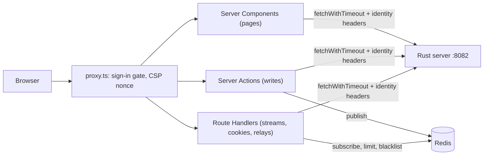

# The console

`web/` is a Next.js application (App Router), built as a standalone server. Its job is to be a **thin proxy**: it renders pages, holds the person's session in a sealed cookie, and calls the Rust server for everything else.

It has **no database access and no business logic**. Every rule, query and permission lives in the server. The console's own logic is presentation, sessions, rate limiting at its edge, and relaying.

## Contents

- [Shape](#shape)
- [Paths and slugs](#paths-and-slugs)
- [Talking to the server](#talking-to-the-server)
- [proxy.ts](#proxyts)
- [Same-origin checks](#same-origin-checks)
- [Redis](#redis)
- [Live events](#live-events)
- [Relays](#relays)
- [Extension slots](#extension-slots)
- [Logging](#logging)
- [Tests and image](#tests-and-image)
- [Where it lives](#where-it-lives)

## Shape

**Routes** (`web/app/`):

| Path | What |
|---|---|
| `page.tsx` | The public splash, in the paper shell: the hero (`components/splash-hero.tsx`: the product's claim as the one heading, with the column beside it kept for a screenshot of the console, still to be taken), then the three goals it is built for, the open platform, developers and agents, why, how to start, and the questions a visitor asks first — numbered sections, each heading with one phrase marked (`components/mark.tsx`, a stroke drawn as the heading comes into view), their cells a hairline grid and the hero on a dotted field (`globals.css`, *The public pages' surfaces*). The hero's blocks rise in on load, and each section head and grid as it scrolls into view, where the browser can time an animation by the viewport (`globals.css`, *The splash's motion*). Its container, `max-w-6xl px-3.5 py-8`, is the one a console built on this one gives its own public pages |
| `docs/` | The book: every page under `web/content/docs` (MDX, Fumadocs), served by `[[...slug]]` inside the paper shell, with Fumadocs' sidebar and table of contents and its navbar off, since the shell carries one. `lib/source.ts` loads the pages; each folder's `meta.json` orders them and ends in `...`, so a console built on this one lays its own pages — the operator's legal documents, its billing page — into the same tree without replacing a file. `api/search/` answers the sidebar's search; `llms.txt` and `llms-full.txt` serve the book as Markdown, the latter the corpus the console agent reads |
| `(app)/` | The console shell: `[organization]` (its overview: its name, its notices to its owner and admins, and Leave), `[organization]/…` (its own pages: projects, members, audit log, settings), `[organization]/[project]/…` (a project's overview, its name alone for now; traces, sessions, users, alerts and dashboards, placeholders until telemetry fills them; API keys, connectors, members, audit log, settings), `account/…`. See [paths and slugs](#paths-and-slugs). |
| `(auth)/auth/` | Sign-in, sign-up, forgot, reset, verify and device pages, and the sign-in route handlers (`login`, `login/external`, `signup`, `callback`, `logout`) |
| `console/` | Redirects to the overview of the organization `/me` answers, asking nothing first — never a project, as Vercel opens on a team's overview |
| `invite/[token]` | A public invitation page |
| `connect/[provider]/` | Slack and Discord OAuth: start and callback |
| `api/` | Route handlers: events, agent turns, heartbeat, health, the Slack relay, the test session |
| `v1/[...path]`, `cli/[...path]` | Front doors for the public API and the CLI |

**The chrome** (`(app)/layout.tsx`, `components/console-header.tsx`, `console-sidebar.tsx`, `console-shell.tsx`) is one background with rules between its regions, as a product dashboard is drawn:
- **The header** is three cells across the top, with a rule under it. The first cell is the rail's column — the rail's width, and from `md` the rail's rule on its right, which the rail continues below, so one line runs from the top of the window to the bottom — and holds the brand and the rail's toggle: open, the mark and the name at the left and the control that closes the rail at the right; closed, the mark alone, centred, which is itself the control that opens the rail and shows the panel icon with the pointer anywhere in the cell. Closed, the whole column is a way to open the rail, as Gemini's is: the cell and the rail below show an open-rail cursor — a bar and an arrow drawn as an SVG cursor, black with a white outline as the system pointer is and the same in both themes (`--cursor-expand`, `cursor-expand` in `globals.css`), as Gemini's is — and a press anywhere off a control or a row opens it, so nobody has to aim at one button. The second cell is where you stand (the switcher); the third, the search and the account's buttons. The public pages' header (`components/site-header.tsx`) draws the brand on the same pixels — the same 60px row, the mark at the same x, the same 17px name — so the step from the splash into the console moves nothing but the page.
- **The rail** stands flush with the window's edge, 256px open and 60px closed — one 36px square with a 12px inset on each side — and keeps a 14px inset for its open rows. Its rows are the docs sidebar's (Fumadocs, `/docs`): 36px tall, 2px apart, 8px corners, muted at rest, the sidebar accent at half under the pointer, and the primary colour at a tenth behind primary text where you are; menus take the same height and spacing with half the accent. Open, each row's icon keeps a 32px box at the row's edge, so its centre is the closed square's, and the header's mark keeps that centre, so nothing slides when the rail toggles, as Gemini's rail behaves; a row's label and the header's name start on one edge. Its rows come in blocks: an unheaded block after the first stands 24px clear of the one above, or behind a rule when the rail is closed; a headed one takes the shape sidebars commonly give a section — 16px clear of the rows above, a 32px heading row with the label centred, and its first row straight under — so the label sits closer to its rows than to the block before. Account's rail is one unheaded block, the way back under it saying what it is; a project's Observability block — Traces, Sessions, Users, Alerts and Dashboards, placeholder pages until telemetry's replace them — and its Project block, the housekeeping rows, are, as an organization's own rows are headed Organization under its Overview; only the first block of a rail, Overview alone, goes unheaded. Below `md` it is a drawer under the header, opened from a hamburger the header's first cell shows there alone.
- **The page** sits beside the rail with no gutter: `<main>`'s own padding, 14px all round, the rail's inset, is the whole inset, and the header keeps the same one, so the organization's name starts on the pixel the page title does and the account's buttons end where the cards end.
- **The agent's window** (`components/agent/agent-window.tsx`, its geometry in `lib/agent/window.ts`) floats over the console without shutting it off, painted over the header and under every dialog, menu and toast.
  - It opens at the right, under the header (a banner above the header moves it down), moves by its title bar, and sizes from any edge or corner. It never leaves the screen and never shrinks below `WINDOW_MIN`.
  - Its header's full-size control, or a double press on the title bar, fills the screen to the console's 14px edge, with the conversation in one centred column. Where it was left, and whether it filled the screen, are kept in `localStorage`.
  - On a screen too small to float on (`isCompact`), it fills what a phone's keyboard leaves visible, with nothing to drag.
  - ⚠ **A non-modal dialog, marked `aria-modal="false"`.** The letter keys, the rail's drawer and ⌘J ask `MODAL_SELECTOR` (`lib/keys.ts`) what is in front of the page, and that leaves the window out: the page beside it keeps its keys and its presses.
- **Corners** are the account menu's second switch beside the theme, and the site footer's beside the theme switch there, one control in two places (`lib/corners.ts`, `lib/use-corners.ts`, `components/corners-toggle.tsx`): `sharp` puts `theme-sharp` on `<html>`, which a rule in `globals.css` keys on to square every `rounded` class, and a boot script in `app/layout.tsx` sets it before first paint so a sharp console never renders rounded and snaps.
- **Accessibility settings** are the person's own, on Account › Accessibility (`lib/accessibility.ts`, `lib/use-accessibility.ts`, `app/(app)/account/accessibility/`): letter-key shortcuts (WCAG 2.1's 2.1.4, level A; off, every bare-key handler ignores keys and every keycap that advertises one, `data-letter-key`, hides), Show focus (a ring in the text colour on `:focus-visible`, the one way back from the unlayered `*:focus` rule that otherwise draws none, short of 2.4.7), Reduce motion and Increase contrast (each System, On or Off, System following `prefers-reduced-motion` and `prefers-contrast`; more contrast lifts edges past 3:1 against the page and cards — giving a dark field the border it otherwise lacks — and secondary text past 9:1 against the page and 6.5:1 on every surface, in all four palettes). Each is a class on `<html>`, set before first paint by the same nonce'd boot script as corners, kept in `localStorage`, and synced across tabs.

**What runs where:**
- **Server Components by default.**
  - The `(app)` layout loads the session, `/me`, the projects and the announcement together.
  - With no session, the layout signs the person out.
  - A person with no organization sees an account-only screen.
- **`"use client"` only at interactive leaves:** forms, the agent's window, the realtime listener, the session heartbeat.
  - The client store has no module-level fallback object. A client module still evaluates on the server, and one object there would be shared across requests.
- **Server Actions do the writes.** Each follows the same steps:
  1. read the session;
  2. apply a per-person rate limit;
  3. build the identity context;
  4. call the server;
  5. answer `{error}`;
  6. publish a live event;
  7. `revalidatePath`.
- **Route Handlers** do what an action or a page cannot:
  - **streams**, because an action answers once;
  - **cookie writes on a GET**, because a Server Component cannot write cookies (a Server Action can: two set the organization cookie and leaving an organization clears it, under the cookie below);
  - **relays.**
- **Secrets stay on the server.** `web/lib/env.ts` and `web/lib/server/data.ts` import `server-only`, so importing either from client code fails the build.

## Paths and slugs

The path names the organization, and the project under it, by slug:

| Path | What |
|---|---|
| `/{organization}` | The organization's overview, titled by its name, cleared of its sections on 2026-10-08 while it is rethought: the organization's notices to an owner or admin when there are any, and Leave to anyone but the owner, the two with no other home. No project is created here. |
| `/{organization}/{page}` | The organization's own pages |
| `/{organization}/{project}` | A project's overview, titled by the project's name and nothing else for now (2026-10-08), as the organization's is |
| `/{organization}/{project}/{page}` | A project's pages |

- ⚠ **A word no project may take is what keeps the two levels apart.** An organization's own pages sit beside its projects, each at a word auth never hands a project (`slug::PROJECT_RESERVED`), so a project called Settings goes by `settings-2` and never lands on its organization's Settings. `consolePlace` reads a second segment on that list as a page and any other as a project; read without it, every organization page drew the project rail, for a project that did not exist. The list holds the pages a console built on this one serves there, or may yet: one that adds a page there puts its word on the list first.
- **`web/lib/slug.ts` spells the scheme** (`organizationPath`, `projectPath`), and `consolePlace` (`web/lib/console-nav.ts`) reads it back. Nothing else builds or splits a console path.

**Auth mints every slug** (`crates/shared/src/slug.rs`, `crates/auth/src/db/`). The console derives none.
- **An organization's name and its URL are two settings**, as a Vercel team's are (`PATCH /internal/organization`, `crates/auth/src/handler/organization.rs`). An organization takes its slug when it is made — the one asked for in the switcher's **New organization**, or else the first free one the name it is born with reads as — and from then on a rename moves nothing: the slug changes only when an owner or admin changes the URL on Settings. **A project's slug follows its name**: creation, a rename, and a move into another organization each pick one.
- ⚠ **An organization is born named, and the console opens straight onto it**, as Vercel and Cloudflare name a new account after its holder. Provisioned at first sign-in, it is called after the first word of its owner's name — "Ada's organization", or "My organization" for somebody who gave none — and never anything read off their address (`default_organization`, `crates/auth/src/identity.rs`); it goes by the slug that name reads as (`adas-organization`). Nothing is asked first: `/console` lands on its overview, and the first project is made from its Projects page or the switcher's project menu, since provisioning makes none, as a Vercel team starts empty. The owner renames it, and moves its URL, on Settings. A holder's name with no Latin letter or digit in it gives no slug (the possessive alone would read `s-organization`), so the organization takes a placeholder (`org-` and ten random characters) until a URL is chosen; a project takes a placeholder of its own. A name is never empty (`auth.organizations.name` is `NOT NULL`), so every label is the name: the console's `organizationLabel`, and auth's mail.
- **An organization's slug is unique across every organization**, pending ones included, so a link to one still in its grace never lands on another. ⚠ The purge frees it: another organization may take `acme` afterwards, and a link spelled with it lands there. **A project's is unique within its organization.**
- A name that reads as a slug already taken gets the next number (`slug::candidates`). ⚠ An organization's numbers run out for a common name, its namespace being everybody's: its last candidate is the name with a random tail, so the slug still reads as the name. A URL chosen on Settings, or asked for when an organization is created, is taken as written: another organization's is a 409, a word the console keeps, a blocked word or a string that is no slug a 400.
- **A slug and an id never look alike.** A slug has no underscore and a minted id always has one, so a path segment is never both: the layouts look one up as a slug, then as an id.
- **Reserved words** (`slug::ORGANIZATION_RESERVED`) are the console's own first path segments, the ones a console built on it serves or may yet, and the ones Next answers itself. No organization goes by one. **A project's** (`slug::PROJECT_RESERVED`) are its organization's own pages, and the ones a console built on it serves there or may yet; a project's name that reads as one gets the next number, as a taken slug does. The console's copies (`RESERVED_ORGANIZATION_SLUGS`, `RESERVED_PROJECT_SLUGS`) are pinned to the wire contract, and `web/app/organization-slugs.test.ts` checks every route under `web/app/` against the first and every page under `[organization]/` against the second.
- **Blocked words** (`slug::BLOCKED`, `slug::offends`): profanity and slurs no slug of either scope may hold, matched as whole words — a hyphen-separated run, the slug with its hyphens out (with or without the number on its end), or single letters spelled apart within it — read as written and with disguising digits read as letters, one place at a time, never inside a longer word, so "Scunthorpe" passes; a run mostly of digits is a number (`600k`), not a word in disguise. Words that are also names or ordinary words ("dick", "dyke", "niger", French "retard") are left off. A name whose slug offends gets a placeholder at creation and keeps its slug on a rename (`slug::candidates` gives none, as numbering does not unblock a word), and a cut to 48 characters goes back to the last whole word, so half a word never reads as a blocked one. A URL asked for with one is a 400 that does not repeat the word, typed `/errors/auth/bad-url`, as every refusal of an asked URL for what it is — its shape, a word the console's own paths use, a blocked word — while one another organization holds stays a 409; so the create form puts it under URL rather than Name. Auth's alone: the console needs no copy, since no slug it routes can hold one.

**Which organization a request acts in:**
1. **The path decides.** `proxy.ts` reads the first segment and hands it to the server as a request header (`ORGANIZATION_HEADER`, `web/lib/proxy/organization.ts`). It drops a client's own copy.
2. **`getServerContext` sends it to `/me`** as `x-organization-slug`. Auth answers with that organization only when the person is in it.
3. **Every read checks the answer.** Auth falls back to the person's default organization (see [tenancy](tenancy.md)) rather than refuse, which is right for a stale cookie and wrong for a path. So when the path names an organization auth did not answer with, the context says so (`organizationNotFound`):
   - `activeOrganization()` and `identityContext()` answer nobody, so no fetcher and no action has an organization to name;
   - every organization page calls `notFound()`;
   - `fetchProjectBySlug`, which every project page reads its project through, does the same, and also for a slug the organization's listing does not hold.
   - ⚠ **Not once, in a layout.** The router keeps a layout across a move between the pages under it, so a check there does not run again. A page also renders beside its layout, not after it. The two layouts only redirect (below) and seed the store.
- So a page, and every Server Action posted from it, acts in the organization the page shows. Two tabs on two organizations do not interfere.
- **Off an organization's path** (Account, `/console`, the route handlers) a cookie stands in (`ACTIVE_ORGANIZATION_COOKIE`): the organization of the last page on screen. `getServerContext` sends it to `/me` as `x-organization-id`, and never beside the path's slug.
  - **It holds the id, not the slug.** It outlives the page that wrote it, and a URL change moves a slug.
  - ⚠ **The browser writes it** (`OrganizationSync`), **never the proxy.** Only a page on screen may move it — and one Server Action sets it, for an organization no page of the person's has shown yet: an invitation's accept (`invite/[token]/actions.ts`), so `/console` opens what it brought into reach rather than the cookie's last organization; leaving an organization clears it (`[organization]/members/actions.ts`). The proxy cannot tell one from a prefetch: Next strips the headers that mark a prefetch before the proxy runs, and the router prefetches every link it draws.
  - So it is not `HttpOnly`. That costs nothing: it claims nothing, and auth honours it only for an organization the person is in.
  - ⚠ **A sign-in clears it** (`auth/callback/route.ts`), as a sign-out does (`lib/auth/session.ts`): with nothing remembered, `/me` answers the person's default organization, so signing in opens its overview, as a Vercel sign-in opens the default team. A session that ended any other way — expired, revoked from another device — would otherwise have left it naming wherever the last one stood. Within a session, `/console` still opens where the console last stood.
- ⚠ **A route handler that is handed a project resolves it by id, in whichever organization holds it** (`fetchProjectAnywhere`), and names that organization to the server. Its path names none, and the cookie follows whichever tab opened a page last.

**Ids name the row in every lane, header, cookie and foreign key; slugs spell every link.**
- Server Actions take the ids their page rendered. The services key on ids. The cookie that remembers an organization and the connect handshake's cookie hold ids.
- ⚠ **Every link a person is shown or sent is spelled with slugs, as Vercel spells its own** — a page's links, a notice's link, an indexed document's URL and a tool's citation (`crates/auth/src/seam.rs`, `crates/notifications/src/seam.rs`, `crates/agent/src/tools.rs`, which ask auth for the slugs through `project_homes` and `organization_slugs`), the Stripe return page of a console built on this one. A URL changed on Settings afterwards leaves such a link behind: it answers "not found", as on Vercel. That is the choice made, for a product with no users yet, over links that redirect through an id and show one in the address bar.
- **The layouts still redirect an id to its slug**, keeping the rest of the path and the query, and a slug typed with a capital the same way: a fallback for an id somebody pasted, and the one address the console spells with ids itself — the connect handshake's callback (`web/app/connect/[provider]/callback/route.ts`) redirects by id, since its cookie is up to ten minutes old and a rename or a URL change since would have moved the slugs. A project's id follows it into another organization it was handed to.

**A moved slug moves the page.**
- The organization's URL form and the project's rename form answer the slug the row goes by now (`movedTo`), and replace the path with it. They revalidate nothing in that case: the path they were posted from names nothing any more.
- **Everybody else with a page under the old slug open follows too.** The action publishes `slug:moved` on the organization's channel. `RealtimeListener` replaces the path where it is spelled with the old slug (`movedPath`), and asks for the rest again, since every link on screen was drawn with it.
- A tab that missed the event finds the old path not found, and a form it posts is told the address is gone rather than to try again (`unplacedOrganization`, `web/lib/server/identity.ts`): `identityContext` places the caller in no organization, and the context says why. `/console` finds the organization again, by the cookie's id.
- A project handed to another organization moves the same way: the accept action publishes `ownership:changed` to both organizations with the slugs its new address is spelled with, and a tab showing the project goes there, or finds this path not found when it is somebody not in the new organization.

**Moving between organizations** is a link like any other. The router keeps the `(app)` layout across it, so two things follow the path:
- `[organization]/layout.tsx` hands the client store the seed for the organization arrived in (`StoreSeed`, `storeSeed`);
- `OrganizationSync` refreshes the `(app)` layout when it was rendered for another organization than the path names.

**The switcher** (`web/components/resource-selector.tsx`, in the header) is two menus: the organization, with whatever a console built on this one draws beside its name (`components/extension/organization-badge.tsx`: the plan, on the hosted service), and, after a slash, the project — inside a project its name, and on the organization's own pages a muted **Select a project**, so a project is a click away without a trip to Projects; below `md` the prompt's words go and its chevron stays. The organizations menu lists every organization the person can stand in, the active one first, each with a gear to its settings where they are a member of it; the projects menu lists the active organization's projects, each with a gear to its settings, and none checked on the organization's pages. The one you stand in carries a check after its name rather than a fill, so hover and current never look alike; under the pointer the whole row, name and gear, fills. Each menu's foot holds the one thing it creates: **New project**, for the owner and admins of the organization you stand in (`useCanCreateProjects`), and **New organization**, for everybody while the `signup` flag is on: with it off the row is gone, as a switched-off feature is from the rail, rather than offered and refused.
- **New organization** (`createOrganizationAction`, `web/app/(app)/actions.ts`) names no organization: the new one has no id until auth mints it, so the action sends the person's own headers, as choosing a default organization does, and moves no default. A blank URL is left to auth to derive.
- Refusals land as the organization's Settings place them: a taken URL under URL, a 400 under its field, and a `signup` flag switched off while the dialog was open as the flag's sentence.
- ⚠ **The dialog opens the new organization's Overview, not the action.** The switcher lives in the `(app)` layout, which the move keeps, so a `redirect()` from the action would have left the dialog open over the page it moved to.
- The person's other tabs list it once they read `/me` again, which `ownership:changed` makes them do, as it does when an organization changes hands. It goes on the person's own channel, as an offer made to them does, since no tab subscribes to the new organization's yet.
- The host ahead of the URL is `AUTH_URL`'s, as on Settings: the `(app)` layout hands it down through the header.

## Talking to the server

**Every call goes through `fetchWithTimeout` or `tryFetchWithTimeout`** (`web/lib/api/fetch.ts`):
- ⚠ **The timeout covers the body as well as the headers.** A timer on the headers alone once let a stalled body hold a render for minutes.
- **`cache: "no-store"` is the default**, so a page that could be prerendered never bakes in a build-time answer.
- **`tryFetchWithTimeout`** answers `null` on failure, and logs it.
- **ESLint bans a bare `fetch`** in `app/`, `lib/`, `proxy.ts` and `instrumentation.ts`. A test checks that every `"use server"` file falls under that rule.

**Identity headers** (`web/lib/server/entities/identity-context.ts`):

| Builder | Carries |
|---|---|
| `organizationHeaders`, `projectHeaders` | Bearer, service secret, organization (and project), request id |
| `personHeaders` | No organization: for invitations and account deletion |
| `accountHeaders` | The organization only when one is active. The Sessions page's lanes use it. |
| `sessionHeaders` | The bearer, plus an organization (and project) the caller names itself: API-key actions, answers to ownership offers |

- ⚠ **No role or identity claim travels.** The bearer names the person, and auth works out the rest.
- **`identityContext()` answers `null` when `/me` fails, and never falls back.** A fallback could name the wrong tenant.

**`/me`** (`getServerContext`, `web/lib/server/entities/organization.ts`) runs once per request (React `cache`).
- It sends the person's bearer and the organization to act in: the slug of the one the path names, else the id the cookie remembers (see [paths and slugs](#paths-and-slugs)).
- **Auth decides which organization is active.** It honours either only for a real membership, so neither the path nor the cookie claims anything.

**How failures reach the screen:**
- Entity fetchers validate the server's answers with zod, and answer `ok`, `forbidden` or `unavailable`.
- Pages map those answers to distinct screens:
  - a retryable "service unavailable";
  - a whole-page "access denied";
  - a section-level role notice;
  - `notFound()`.
- **A page that is not found keeps the console's chrome** (`(app)/not-found.tsx`), **and has no rail of its own.**
  - The rail is spelled from the path (`buildConsoleNav`), so a path that names nothing would spell a rail of links to more "not found".
  - The page marks itself (`data-console-not-found`), and the rail's rows answer the mark in CSS: the address's rows are hidden, and the way back that Account draws is shown.
  - ⚠ **In CSS, not from the store or from state.** Only the page knows it was not found: an outage leaves the same empty store a dead address does. And the page renders after the rail, so state would be right only once the console had hydrated; a class is right in the server's HTML.
- Actions flatten the server's RFC 9457 problem into one message (`extractProblem`).
- ⚠ **An action that changes an organization carries the organization its page rendered.** It is refused (`SWITCHED_ORGANIZATION`) when its request resolves another one: the page has gone stale, by a URL change on an organization's path or by another tab off it.
- Anything uncaught reaches the error boundaries. `instrumentation.ts` logs it, with the digest and the route's pattern. ⚠ Never the path: it spells an organization and a project by their slugs, which count as names, and may carry an invitation's token or a callback's code.

**Sessions** live in a sealed cookie, refreshed by the server components and a client heartbeat. See [identity](identity.md#the-consoles-side).

## proxy.ts

`web/proxy.ts` runs on every request except static assets. It does four things, and `next.config.mjs` adds a fifth:

1. **Legal redirects.** `/legal/*` gets a 308 to the deployment's `LEGAL_URL`. Without one, it is a 404.
2. **The sign-in gate.**
   - "Signed in" means the session cookie unseals with `AUTH_SECRET` and names a person.
   - A protected path without a session gets a JSON 401 under `/api/*`, and otherwise a redirect to `/auth/login?returnTo=…`.
   - Expiry, refresh and the blacklist are left to `getSession`.
   - Public paths are listed in `web/lib/proxy/public-paths.ts`, plus whatever a console built on this one adds (see [extension slots](#extension-slots)).
3. **Content Security Policy, with a nonce per request.** It is set on the request and the response. The root layout hands the nonce to its inline boot script.
   - Scripts are `'self'` and the nonce only.
   - Frames are refused (`frame-ancestors 'none'`).
   - `connect-src` is `'self'`.
   - `form-action` adds the identity providers' origins (`AUTH_PROVIDER_ORIGINS`). ⚠ Signing out from the account menu is a form post that ends in a redirect to the provider, which this directive governs; sign-in, and the sign-out links elsewhere, are links, which it does not.
4. **The organization the path names**, handed to the server as a request header, with the path itself for the layouts to redirect from (see [paths and slugs](#paths-and-slugs)). It writes no cookie.
5. **Static security headers**, from `next.config.mjs`'s `headers()`, not the proxy: HSTS with preload, `X-Frame-Options: DENY`, `nosniff`, a referrer policy and a permissions policy.
   - Next applies them ahead of the proxy, and keeps them on whatever the proxy answers itself: its redirects and its 401 carry them too.
   - ⚠ **One list.** A copy set in the proxy is applied after it, so it would silently win over a change made here.

## Same-origin checks

Same-origin checks are made per route, on `Sec-Fetch-Site`, not in the proxy:

| Route | Rule |
|---|---|
| `/api/events`, `/api/agent/turns`, `/api/auth/heartbeat` | Only same-origin, or no header |
| `/api/auth/heartbeat` | Above. ⚠ Its 401 deletes the cookie, so a cross-site post could otherwise sign a person out. |
| `GET /auth/logout` | A cross-site request goes home without signing out |
| `/cli/*` | Any browser is refused |
| Server Actions | Next's own `Origin` check |

`safeReturnTo` refuses `//` and `/\` paths. ⚠ Callers resolve the value again, and `/..//evil.example` normalizes to a protocol-relative URL.

## Redis

Only the console uses Redis. The server never does. It is required in production (`REDIS_URL`; `REDIS_CA_CERT` for TLS), and it has four uses:

| Use | Keys | Without Redis |
|---|---|---|
| **Rate limits.** A sliding window as one Lua script (`web/lib/api/rate-limit.ts`). | Per person and action, per source address and scope, per hashed `/v1` and CLI token | A per-instance limiter takes over and logs that it has, so a ceiling never silently becomes "times the replica count" unnoticed |
| **Session blacklist.** Signed-out sessions, refused at once (`web/lib/auth/session-blacklist.ts`). | `bfsb:<session>`, with a TTL; plus a message on `bfev:session:<session>` that closes open streams | Each instance's memory. Auth still refuses the revoked bearer itself. |
| **Live-event bus** (`web/lib/events/`) | `bfev:user:<HMAC of the email>`, `bfev:organization:<id>` | Publishes fail quietly. Streams stay open and hear only keepalives. |
| **The announcement banner** | `telmoni:announcement` | The environment's value |

Why the code is shaped this way:
- ⚠ **The limiter reads Redis's own clock (`TIME`).** Replicas with skewed clocks still share one window.
- ⚠ **A person's channel is an HMAC of their email under `AUTH_SECRET`**, so `PUBSUB CHANNELS` cannot list customers. Rotating `AUTH_SECRET` moves every person channel. Organization and session channels are named by id.
- **The client is tuned for Memorystore on GKE** (`web/lib/redis.ts`):
  - ⚠ A keepalive, because the VPC firewall drops idle connections, which would leave the subscriber silently deaf.
  - ⚠ A command timeout, because a node that is connected but silent would hang the inline limiter.
  - ⚠ Reconnecting on `READONLY` after a high-availability failover.
- **The client address** used by the limiter is the `X-Forwarded-For` entry `TRUSTED_PROXY_HOPS` back from the end (`trustedClientIp`): each proxy in front appends the address it saw the request come from, so that entry is the first one no caller wrote. Google's load balancer appends the client's address and then its own, so the chart sets `web.trustedProxyHops: 2`; the compose stack assumes one reverse proxy (1); `0` means nothing is in front, the limiter takes the caller's word, and boot warns.
  - ⚠ **No other header is read for it.** `cf-connecting-ip` and its like are set by an edge this deployment does not have, so here they are whatever the caller sends. Read first, one let any caller choose a fresh bucket per request, past every per-address ceiling.

## Live events

**`GET /api/events`** is a server-sent event stream (`web/app/api/events/route.ts`).

**Checks, in order:**
1. same-origin;
2. the session;
3. the blacklist;
4. a rate limit on how often a person opens a stream;
5. `/me`. If it fails, the answer is 503 with `Retry-After`.

**What the stream carries:**
- It subscribes to the person's channel and to one channel per organization they are in.
- It forwards `ownership:changed`, `membership:removed`, `membership:changed`, `slug:moved` and `invite:*` events, validated with zod. **Notices from the feed are not pushed** (see [notifications](notifications.md#live-updates-in-the-console)).
- ⚠ **A `slug:moved` event's slugs are held to a slug's shape** (`web/lib/events/types.ts`), because the browser spells a path with them.
- A revocation message on the session's channel closes the stream with a `close` event.
- A keepalive comment goes out on an interval. Each time, it also re-checks the blacklist.

**Subscribing.** Each process holds one shared subscriber, with reference-counted channels.
- ⚠ A failed `SUBSCRIBE` leaves a channel silently deaf, so the whole table is subscribed again after a short delay, and on every reconnect.

**`RealtimeListener`** (`web/components/realtime-listener.tsx`) is the browser's `EventSource`.
- It updates the store and calls `router.refresh()`, so the server components render again.
- It moves the page when the page's own address has moved: out of a project or an organization the person was removed from, or that was deleted, after a project handed to another organization, and after a moved slug (an organization's URL changed, a project renamed). A changed role only renders the page again.
- It reconnects after a delay, or when the tab becomes visible or comes back online.
- It stops on `close`.

## Relays

| Route | Relays | Notes |
|---|---|---|
| `POST /api/agent/turns` | The agent's turn stream | Same-origin, session, a per-person limit, a capped and zod-checked body. The project must be one of the person's. It forwards `request.signal`, so Stop, or closing the agent's window, stops the turn. Held no longer than `AGENT_STREAM_TIMEOUT_MS`, which is longer than the server's turn budget. The body is piped through unchanged, and refusals pass the server's problem through. |
| `/v1/*` | The public API | GET and HEAD only, until auth serves a write and `AUTH_WRITES` lists it (a contract test holds the two together). Forwards only `authorization`, `accept`, `content-type` and `content-length`, adding the service secret and a request id. Meters each token and each source. Answers are `no-store, private`. ⚠ Auth refusing the service secret is answered as a `503` `/errors/upstream-unavailable`, never as the `401` that tells a caller its key was refused. |
| `/cli/*` | The CLI's device sign-in and session lanes | ⚠ An allowlist. Refuses browsers, caps and re-encodes bodies, meters each source and each bearer. See [identity](identity.md#the-cli). |
| `POST /api/webhooks/slack` | Slack's events | The raw bytes, untouched, because the signature covers them. No service secret: the server checks Slack's signature. ⚠ A deadline well under Slack's three seconds, so Slack retries rather than counting a slow success as a failure. |

**The agent window's renderer** (`web/lib/agent/markdown.ts`) turns the model's markdown into nodes, never HTML.
- An image is shown as text.
- A link survives only if it points into the console or at the docs.
- A link to the docs opens in a new tab (`opensInConsole`). Followed in place, it left the console's layout, which unmounted the window and the conversation with it.

See [the agent](agent.md#prompt-injection).

## Extension slots

A console built on this one overlays a few files with its own copies. All of them ship empty here, and nothing in this repo performs the overlay:

| Slot | Fills |
|---|---|
| `web/lib/extension/nav.ts` | Extra rail items (`EXTRA_NAV_ITEMS`) |
| `web/lib/extension/site-nav.ts` | Extra primary navigation |
| `web/lib/extension/footer.ts` | Extra footer links (`EXTRA_FOOTER_LINKS`), each joining one of the footer's columns by name, before the link it names, or `Legal`, the line at the foot |
| `web/lib/extension/public-paths.ts` | Extra public path prefixes for the proxy |
| `web/components/extension/banner.tsx` | A banner in the console shell. It may be an async server component. |
| `web/components/extension/organization-badge.tsx` | A badge beside the organization's name in the header's switcher. It may be an async server component. |

⚠ **Overlays import only from `web/lib/extension/ui.ts` (client-safe) and `web/lib/extension/server.ts` (`server-only`).** That keeps the modules behind those two files free to move. `knip` treats `web/lib/extension/*.ts` as entry points.

## Logging

All logging goes through `@/lib/logger` (pino), never `console.*`:
- **In production:** JSON on stdout, with `severity` and `message` keys to match the server's Cloud Logging format.
- **In development:** readable output.
- **In tests:** silent.

**What is redacted.** The logger's redact paths are `*.authorization`, `*.cookie`, `*["x-service-secret"]`, `*.accessToken`, `*.refreshToken`, `*.idToken` and `*.token`. Pino's `*` matches exactly one level: `{ headers: { authorization } }` is censored, but a top-level or deeper field, or one of another name, is not. Log ids, never the objects that carry secrets.

**A slug counts as a name.** A project's follows one, an organization's was chosen like one, and a path spells two. So nothing here logs a path or a slug: `instrumentation.ts` logs the route's pattern, the route handlers log the lane and the request id, and the server's request span (`crates/shared/src/middleware/http.rs`) carries the server's own path, which names an organization by header and a project by id. What this does not reach: the load balancer's access log, a browser's history and a Playwright report carry the console's paths, which is why no slug is ever derived from an address.

**Analytics.** `track()` logs events, and sends them on only with explicit consent.

## Tests and image

**Tests live in `web/lib/` and `web/app/`, never `web/components/`.**
- **Vitest** runs in Node by default. A suite that needs a DOM opts into jsdom per file.
- **Playwright** (`web/e2e/`) starts a debug build of the server and the dev console, with the test session door open, and signs in through it.

**The image** (`web/Dockerfile`) builds on Node and runs the standalone `server.js` on a distroless, non-root Node image.
- ⚠ The build and runtime images must share a Node major version.
- The console's origin is `AUTH_URL`, read at request time (`robots.ts`, `sitemap.ts`, the structured data, the organization URL form and the switcher's New organization, and `metadataBase` in the root layout's `generateMetadata`, so a social image a console built on this one adds resolves to the deployment rather than to the build host). No `NEXT_PUBLIC_` variable names a host, so the one published image serves every deployment; `robots.txt` and `sitemap.xml` are therefore rendered per request rather than at build.
- ⚠ `.next/cache` is created and handed to the runtime user at build time, because a distroless image cannot `mkdir`.

## Where it lives

| Concern | File |
|---|---|
| Middleware | `web/proxy.ts`, `web/lib/proxy/` |
| Paths and slugs | `web/lib/slug.ts`, `web/lib/console-nav.ts`, `web/lib/proxy/organization.ts`, `web/lib/server/identity.ts`, `web/components/organization-sync.tsx`, `web/app/(app)/[organization]/layout.tsx`, `web/app/(app)/[organization]/[project]/layout.tsx` |
| Headers, redirects, build output | `web/next.config.mjs` |
| Server calls | `web/lib/api/fetch.ts` |
| Identity and `/me` | `web/lib/server/entities/identity-context.ts`, `web/lib/server/entities/organization.ts` |
| Entities the pages read | `web/lib/server/entities/` |
| Session, heartbeat, sign-out, blacklist | `web/lib/auth/`, `web/app/api/auth/heartbeat/`, `web/app/(auth)/auth/` |
| Rate limits, Redis | `web/lib/api/rate-limit.ts`, `web/lib/redis.ts` |
| Live events | `web/app/api/events/`, `web/lib/events/`, `web/components/realtime-listener.tsx` |
| Agent relay, parser, renderer, starters, window geometry | `web/app/api/agent/turns/`, `web/lib/server/entities/agent.ts`, `web/lib/agent/` |
| Agent window and panel | `web/components/agent-panel.tsx`, `web/components/agent/` |
| Front doors | `web/app/v1/`, `web/app/cli/`, `web/app/api/webhooks/slack/` |
| Extension slots | `web/lib/extension/`, `web/components/extension/` |
| The public splash and the footer | `web/app/page.tsx`, `web/components/site-footer.tsx`, `web/lib/footer.ts` |
| The book | `web/content/docs/`, `web/lib/source.ts`, `web/components/mdx.tsx`, `web/app/docs/`, `web/app/api/search/`, `web/app/llms.txt/`, `web/app/llms-full.txt/` |
| Environment | `web/lib/env.ts`, `web/.env.local.example` |
| Logging | `web/lib/logger.ts`, `web/instrumentation.ts` |
| Image | `web/Dockerfile` |
