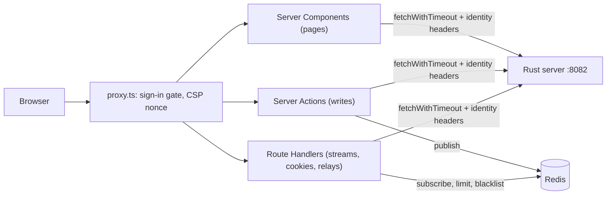

# The console

`web/` is a Next.js application (App Router), built as a standalone server. Its job is to be a **thin proxy**: it renders pages, holds the person's session in a sealed cookie, and calls the Rust server for everything else.

It has **no database access and no business logic**. Every rule, query and permission lives in the server. The console's own logic is presentation, sessions, rate limiting at its edge, and relaying.

## Contents

- [Shape](#shape)
- [Talking to the server](#talking-to-the-server)
- [proxy.ts](#proxyts)
- [Same-origin checks](#same-origin-checks)
- [Redis](#redis)
- [Live events](#live-events)
- [Relays](#relays)
- [Extension slots](#extension-slots)
- [Logging](#logging)
- [Tests and image](#tests-and-image)
- [Where it lives](#where-it-lives)

## Shape

**Routes** (`web/app/`):

| Path | What |
|---|---|
| `(app)/` | The console shell: `[projectId]/…` (overview, API keys, audit log, connectors, members, settings), `organization/…`, `account/…` |
| `(auth)/auth/` | Sign-in, sign-up, forgot, reset, verify and device pages, and the sign-in route handlers (`login`, `login/external`, `signup`, `callback`, `logout`) |
| `console/` | Redirects to the right first page |
| `invite/[token]` | A public invitation page |
| `connect/[provider]/` | Slack and Discord OAuth: start and callback |
| `api/` | Route handlers: events, agent turns, heartbeat, health, the Slack relay, the test session |
| `v1/[...path]`, `cli/[...path]` | Front doors for the public API and the CLI |

**What runs where:**
- **Server Components by default.**
  - The `(app)` layout loads the session, `/me`, the projects and the announcement together.
  - With no session, the layout signs the person out.
  - A person with no organization, or outside the beta, sees an account-only screen.
- **`"use client"` only at interactive leaves:** forms, the agent panel, the realtime listener, the session heartbeat.
  - The client store has no module-level fallback object. A client module still evaluates on the server, and one object there would be shared across requests.
- **Server Actions do the writes.** Each follows the same steps:
  1. read the session;
  2. apply a per-person rate limit;
  3. build the identity context;
  4. call the server;
  5. answer `{error}`;
  6. publish a live event;
  7. `revalidatePath`.
- **Route Handlers** do what an action or a page cannot:
  - **streams**, because an action answers once;
  - **cookie writes**, because a Server Component cannot write cookies;
  - **relays.**
- **Secrets stay on the server.** `web/lib/env.ts` and `web/lib/server/data.ts` import `server-only`, so importing either from client code fails the build.

## Talking to the server

**Every call goes through `fetchWithTimeout` or `tryFetchWithTimeout`** (`web/lib/api/fetch.ts`):
- ⚠ **The timeout covers the body as well as the headers.** A timer on the headers alone once let a stalled body hold a render for minutes.
- **`cache: "no-store"` is the default**, so a page that could be prerendered never bakes in a build-time answer.
- **`tryFetchWithTimeout`** answers `null` on failure, and logs it.
- **ESLint bans a bare `fetch`** in `app/`, `lib/`, `proxy.ts` and `instrumentation.ts`. A test checks that every `"use server"` file falls under that rule.

**Identity headers** (`web/lib/server/entities/identity-context.ts`):

| Builder | Carries |
|---|---|
| `organizationHeaders`, `projectHeaders` | Bearer, service secret, organization (and project), request id |
| `personHeaders` | No organization: for invitations and account deletion |
| `accountHeaders` | The organization only when one is active. The Sessions page's lanes use it. |
| `sessionHeaders` | The bearer, plus an organization (and project) the caller names itself: API-key actions, an organization's restore, answers to ownership offers |

- ⚠ **No role or identity claim travels.** The bearer names the person, and auth works out the rest.
- **`identityContext()` answers `null` when `/me` fails, and never falls back.** A fallback could name the wrong tenant.

**`/me`** (`getServerContext`, `web/lib/server/entities/organization.ts`) runs once per request (React `cache`).
- It sends the person's bearer and the `telmoni-active-organization` cookie as the requested organization.
- **Auth decides which organization is active.** It honours the cookie only for a real membership, so writing the cookie claims nothing.

**How failures reach the screen:**
- Entity fetchers validate the server's answers with zod, and answer `ok`, `forbidden` or `unavailable`.
- Pages map those answers to distinct screens:
  - a retryable "service unavailable";
  - a whole-page "access denied";
  - a section-level role notice;
  - `notFound()`.
- Actions flatten the server's RFC 9457 problem into one message (`extractProblem`).
- ⚠ **An action that changes an organization carries the organization its page rendered.** It is refused (`SWITCHED_ORGANIZATION`) if another tab has switched organization since.
- Anything uncaught reaches the error boundaries. `instrumentation.ts` logs it, with the digest and the route.

**Sessions** live in a sealed cookie, refreshed by the server components and a client heartbeat. See [identity](identity.md#the-consoles-side).

## proxy.ts

`web/proxy.ts` runs on every request except static assets. It does three things, and `next.config.mjs` adds a fourth:

1. **Legal redirects.** `/legal/*` gets a 308 to the deployment's `LEGAL_URL`. Without one, it is a 404.
2. **The sign-in gate.**
   - "Signed in" means the session cookie unseals with `AUTH_SECRET` and names a person.
   - A protected path without a session gets a JSON 401 under `/api/*`, and otherwise a redirect to `/auth/login?returnTo=…`.
   - Expiry, refresh and the blacklist are left to `getSession`.
   - Public paths are listed in `web/lib/proxy/public-paths.ts`, plus whatever a console built on this one adds (see [extension slots](#extension-slots)).
3. **Content Security Policy, with a nonce per request.** It is set on the request and the response. The root layout hands the nonce to its inline boot script.
   - Scripts are `'self'` and the nonce only.
   - Frames are refused.
   - `connect-src` is `'self'`.
   - `form-action` adds the identity providers' origins (`AUTH_PROVIDER_ORIGINS`). ⚠ Sign-in and sign-out leave the site through redirects that this directive governs.
4. **Static security headers**, from `next.config.mjs`'s `headers()`, not the proxy: HSTS with preload, `X-Frame-Options: DENY`, `nosniff`, a referrer policy and a permissions policy.

## Same-origin checks

Same-origin checks are made per route, on `Sec-Fetch-Site`, not in the proxy:

| Route | Rule |
|---|---|
| `/api/events`, `/api/agent/turns`, `/api/auth/heartbeat` | Only same-origin, or no header |
| `/api/auth/heartbeat` | Above. ⚠ Its 401 deletes the cookie, so a cross-site post could otherwise sign a person out. |
| `GET /auth/logout` | A cross-site request goes home without signing out |
| `/cli/*` | Any browser is refused |
| Server Actions | Next's own `Origin` check |

`safeReturnTo` refuses `//` and `/\` paths. ⚠ Callers resolve the value again, and `/..//evil.example` normalizes to a protocol-relative URL.

## Redis

Only the console uses Redis. The server never does. It is required in production (`REDIS_URL`; `REDIS_CA_CERT` for TLS), and it has four uses:

| Use | Keys | Without Redis |
|---|---|---|
| **Rate limits.** A sliding window as one Lua script (`web/lib/api/rate-limit.ts`). | Per person and action, per source address and scope, per hashed `/v1` and CLI token | A per-instance limiter takes over and logs that it has, so a ceiling never silently becomes "times the replica count" unnoticed |
| **Session blacklist.** Signed-out sessions, refused at once (`web/lib/auth/session-blacklist.ts`). | `bfsb:<session>`, with a TTL; plus a message on `bfev:session:<session>` that closes open streams | Each instance's memory. Auth still refuses the revoked bearer itself. |
| **Live-event bus** (`web/lib/events/`) | `bfev:user:<HMAC of the email>`, `bfev:organization:<id>` | Publishes fail quietly. Streams stay open and hear only keepalives. |
| **The announcement banner** | `telmoni:announcement` | The environment's value |

Why the code is shaped this way:
- ⚠ **The limiter reads Redis's own clock (`TIME`).** Replicas with skewed clocks still share one window.
- ⚠ **A person's channel is an HMAC of their email under `AUTH_SECRET`**, so `PUBSUB CHANNELS` cannot list customers. Rotating `AUTH_SECRET` moves every person channel. Organization and session channels are named by id.
- **The client is tuned for Memorystore on GKE** (`web/lib/redis.ts`):
  - ⚠ A keepalive, because the VPC firewall drops idle connections, which would leave the subscriber silently deaf.
  - ⚠ A command timeout, because a node that is connected but silent would hang the inline limiter.
  - ⚠ Reconnecting on `READONLY` after a high-availability failover.
- **The client address** used by the limiter is the second-to-last `X-Forwarded-For` entry (`trustedClientIp`). Google's load balancer appends the address it saw the client at, then its own, so earlier entries, which the client can write, are ignored.

## Live events

**`GET /api/events`** is a server-sent event stream (`web/app/api/events/route.ts`).

**Checks, in order:**
1. same-origin;
2. the session;
3. the blacklist;
4. a rate limit on how often a person opens a stream;
5. `/me`. If it fails, the answer is 503 with `Retry-After`.

**What the stream carries:**
- It subscribes to the person's channel and to one channel per organization they are in.
- It forwards `ownership:changed` and `invite:*` events, validated with zod. **Notices from the feed are not pushed** (see [notifications](notifications.md#live-updates-in-the-console)).
- A revocation message on the session's channel closes the stream with a `close` event.
- A keepalive comment goes out on an interval. Each time, it also re-checks the blacklist.

**Subscribing.** Each process holds one shared subscriber, with reference-counted channels.
- ⚠ A failed `SUBSCRIBE` leaves a channel silently deaf, so the whole table is subscribed again after a short delay, and on every reconnect.

**`RealtimeListener`** (`web/components/realtime-listener.tsx`) is the browser's `EventSource`.
- It updates the store and calls `router.refresh()`, so the server components render again.
- It reconnects after a delay, or when the tab becomes visible or comes back online.
- It stops on `close`.

## Relays

| Route | Relays | Notes |
|---|---|---|
| `POST /api/agent/turns` | The agent's turn stream | Same-origin, session, a per-person limit, a capped and zod-checked body. The project must be one of the person's. It forwards `request.signal`, so closing the panel stops the turn. Held no longer than `AGENT_STREAM_TIMEOUT_MS`, which is longer than the server's turn budget. The body is piped through unchanged, and refusals pass the server's problem through. |
| `/v1/*` | The public API | GET and HEAD only, until auth serves a write and `AUTH_WRITES` lists it (a contract test holds the two together). Forwards only `authorization`, `accept`, `content-type` and `content-length`, adding the service secret and a request id. Meters each token and each source. Answers are `no-store, private`. |
| `/cli/*` | The CLI's device sign-in and session lanes | ⚠ An allowlist. Refuses browsers, caps and re-encodes bodies, meters each source and each bearer. See [identity](identity.md#the-cli). |
| `POST /api/webhooks/slack` | Slack's events | The raw bytes, untouched, because the signature covers them. No service secret: the server checks Slack's signature. ⚠ A deadline well under Slack's three seconds, so Slack retries rather than counting a slow success as a failure. |

**The agent panel's renderer** (`web/lib/agent/markdown.ts`) turns the model's markdown into nodes, never HTML.
- An image is shown as text.
- A link survives only if it points into the console or at the docs.

See [the agent](agent.md#prompt-injection).

## Extension slots

A console built on this one overlays a few files with its own copies. All of them ship empty here, and nothing in this repo performs the overlay:

| Slot | Fills |
|---|---|
| `web/lib/extension/nav.ts` | Extra rail items (`EXTRA_NAV_ITEMS`) |
| `web/lib/extension/site-nav.ts` | Extra primary navigation |
| `web/lib/extension/public-paths.ts` | Extra public path prefixes for the proxy |
| `web/components/extension/banner.tsx` | A banner in the console shell. It may be an async server component. |

⚠ **Overlays import only from `web/lib/extension/ui.ts` (client-safe) and `web/lib/extension/server.ts` (`server-only`).** That keeps the modules behind those two files free to move. `knip` treats `web/lib/extension/*.ts` as entry points.

## Logging

All logging goes through `@/lib/logger` (pino), never `console.*`:
- **In production:** JSON on stdout, with `severity` and `message` keys to match the server's Cloud Logging format.
- **In development:** readable output.
- **In tests:** silent.

**What is redacted.** The logger's redact paths are `*.authorization`, `*.cookie`, `*["x-service-secret"]`, `*.accessToken`, `*.refreshToken`, `*.idToken` and `*.token`. Pino's `*` matches exactly one level: `{ headers: { authorization } }` is censored, but a top-level or deeper field, or one of another name, is not. Log ids, never the objects that carry secrets.

**Analytics.** `track()` logs events, and sends them on only with explicit consent.

## Tests and image

**Tests live in `web/lib/` and `web/app/`, never `web/components/`.**
- **Vitest** runs in Node by default. A suite that needs a DOM opts into jsdom per file.
- **Playwright** (`web/e2e/`) starts a debug build of the server and the dev console, with the test session door open, and signs in through it.

**The image** (`web/Dockerfile`) builds on Node and runs the standalone `server.js` on a distroless, non-root Node image.
- ⚠ The build and runtime images must share a Node major version.
- ⚠ `NEXT_PUBLIC_APP_URL` is inlined at build time, so it must be a build argument.
- ⚠ `.next/cache` is created and handed to the runtime user at build time, because a distroless image cannot `mkdir`.

## Where it lives

| Concern | File |
|---|---|
| Middleware | `web/proxy.ts`, `web/lib/proxy/` |
| Headers, redirects, build output | `web/next.config.mjs` |
| Server calls | `web/lib/api/fetch.ts` |
| Identity and `/me` | `web/lib/server/entities/identity-context.ts`, `web/lib/server/entities/organization.ts` |
| Entities the pages read | `web/lib/server/entities/` |
| Session, heartbeat, sign-out, blacklist | `web/lib/auth/`, `web/app/api/auth/heartbeat/`, `web/app/(auth)/auth/` |
| Rate limits, Redis | `web/lib/api/rate-limit.ts`, `web/lib/redis.ts` |
| Live events | `web/app/api/events/`, `web/lib/events/`, `web/components/realtime-listener.tsx` |
| Agent relay, parser, renderer | `web/app/api/agent/turns/`, `web/lib/server/entities/agent.ts`, `web/lib/agent/` |
| Front doors | `web/app/v1/`, `web/app/cli/`, `web/app/api/webhooks/slack/` |
| Extension slots | `web/lib/extension/`, `web/components/extension/` |
| Environment | `web/lib/env.ts`, `web/.env.local.example` |
| Logging | `web/lib/logger.ts`, `web/instrumentation.ts` |
| Image | `web/Dockerfile` |
