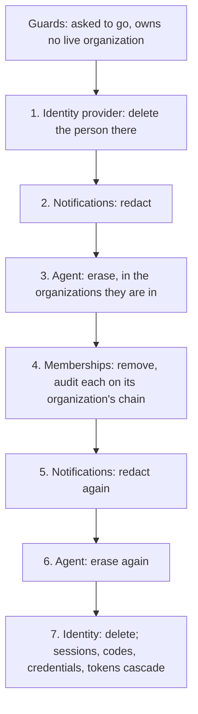

# Deletion and export

Three things can be deleted, and each goes a different way:

| What | Shape |
|---|---|
| **An organization** | Soft first. It is marked pending, with a window in which it can be restored. Then the deletion sweep purges every module's data and deletes the row. |
| **A project** | Hard, at once. Only the organization's owner can do it. The modules beside auth are cleaned up after. |
| **A person** (an account) | Confirmed with a code, then erased across every module in a fixed order: inline if it can be, otherwise by the sweep. |

Every step is safe to repeat. A deletion that stops halfway is finished by the next sweep tick.

This page also covers **export**, the organization's own record, for its owner and admins.

## Contents

- [Organization deletion](#organization-deletion)
- [Project deletion](#project-deletion)
- [Person deletion](#person-deletion)
- [Export](#export)
- [Where it lives](#where-it-lives)

## Organization deletion

```mermaid
stateDiagram-v2
  [*] --> active
  active --> pending: owner confirms a code / operator terminate / account deletion takes it
  pending --> active: restore (owner inside the window, operator any time; never an account deletion)
  pending --> purging: sweep, once erase_after passes
  purging --> [*]: hook, notifications, agent, hook again, then delete the row
```

### Requesting it

The owner first asks for a confirmation code, then sends `DELETE /internal/organization` with it (`crates/auth/src/handler/organization.rs`):

1. **Membership is checked before the organization's lock is taken**, so strangers cannot queue on the lock.
2. **Ownership is read again under the lock.** ⚠ Otherwise a code minted before an ownership transfer could still be used to delete.
3. **The code is spent.**
4. **The organization is marked pending** (`mark_pending_deletion`): its status, when deletion was requested, and `erase_after`. The window is `RESTORE_WINDOW_SECONDS`, measured on the database's clock.
5. **Ownership offers are withdrawn.**
6. **The request is audited**, and the transaction commits.
7. **The inline tail runs.** It calls the deployment's `PurgeHook` and records that it ran.
   - It is bounded by `DELETION_TAIL_BUDGET_MS`, under the console's own timeout. It never fails the request.
   - ⚠ **It is awaited, never spawned.** A spawned tail would die with the pod.

The answer is a 202, carrying `erase_after`.

**While an organization is pending:**
- Every lane refuses it (`acting_organization`).
- Its API keys stop working, since validation requires an active organization. They are not revoked, so a restore brings them back.

**Restoring it.**
- **The owner** can restore an organization they asked to delete, while `erase_after` is still ahead on the database's clock, the same clock the sweep reads. Restoring clears every deletion column and is audited. Whatever the purge hook already dropped is not brought back.
- **The operator** can run `telmoni terminate <org_id>` and `telmoni restore <org_id>`. These are audited as `service:operator`. An operator's restore works past the window too. They take the organization's id, never its slug: a slug moves with a rename, and may be another organization's by the time the command runs.
- **An organization taken by an account deletion is never restored.**

### Finalizing it

⚠ **Why the row waits for the sweep.** A request authorized just before the mark may still be writing. For example, a connector handshake can be waiting on a vendor's OAuth exchange and a KMS call. So the modules' purges and the row's deletion happen only at finalize, never in the request.

The deletion sweep (see [background work](background.md#leadership)) lists pending organizations, soonest first.
- **Not yet due:** if its purge hook has not run yet, the sweep runs it and records it.
- **Due** (`erase_after` has passed): the sweep finalizes it (`crates/auth/src/handler/deletion.rs`):

1. **The purge hook**, if it never ran. ⚠ It runs first so that a failure in a later step cannot leave, say, a subscription still charging.
2. **Notifications' purge.**
   - Connectors are torn down at their vendors, best effort. A Slack app is uninstalled only if no connection outside the organization uses its workspace.
   - Then connections, deliveries, attempts, handshake states and the feed are deleted.
3. **The agent's purge.**
   - First it revokes the indexer's leases, so a page fetched earlier cannot be written afterwards.
   - Then it deletes conversations and passages, a chunk per transaction.
4. **The purge hook again.**
5. **The row is deleted**, under the organization's lock, **only if it is still pending and due.**
   - ⚠ An operator's restore that lands during the purges therefore deletes nothing.
   - The delete cascades to the roster, invitations, projects, seats, API tokens, the organization's codes and its flags.
   - The deletion is audited as `service:auth` in the same transaction.

What stays:
- **People's accounts.** An organization's members are people with their own accounts, which survive it.
- **The audit chain.** It outlives the organization.

**A step that fails** stops the sequence before the next step and before the delete. The committed mark keeps the organization pending. The next tick starts again from the listing, and every step is idempotent.

## Project deletion

`DELETE /internal/projects/{id}` (`crates/auth/src/handler/projects.rs`):

- **Only the owner may delete a project.** Admins may do everything else to a project, except offer it for transfer, which is also the owner's alone.
- **It is immediate.** There is no window and no restore.
  - The project row is deleted, and its seats, invitations and API tokens cascade.
  - The deletion is audited in the same transaction, with `in_project`. The project's audit history survives, because `in_project` has no foreign key.
- **After the commit, notifications purges the project**, best effort, within `PROJECT_PURGE_BUDGET`. A failure is logged. Whatever is left waits for the organization's own purge.
- **The agent is not called.** Its hourly retention sweep removes whatever it holds for a project that auth no longer places in that organization (see [the agent](agent.md#retention)).

A project transfer purges the project's notifications the same way, but before auth commits, and a failed purge refuses the transfer (see [tenancy](tenancy.md#transfers)).

## Person deletion

### Requesting it

The person asks for a confirmation code, then sends `DELETE /internal/me` with it (`crates/auth/src/handler/account.rs`):

1. **Locks are taken in a fixed order:** the person first, then the organizations they own, by id. ⚠ Every lane takes locks in that order, which is what keeps them from deadlocking (`crates/auth/src/db/locks.rs`).
2. **If they own an active organization that has other members**, the answer is 409, naming each one. It rolls back, so the code stays usable. They must transfer ownership first.
3. **In one transaction:**
   - The code is spent.
   - Every organization they own is taken with them: marked pending as an account deletion, with a short `FINALIZE_GRACE_SECONDS`, and its keys revoked. One already pending is switched to an account deletion, and its `erase_after` is brought forward if that is later.
   - The person is marked as deleting, and every session they hold is revoked.
4. **After the commit**, each revoked session's bearers and refresh tokens are deleted, best effort. The revoked session rows already refuse them.

From the mark on, every bearer the person holds is refused.

**Inline**, within the same budget as an organization's tail:
- The purge hook runs for each organization they owned.
- **If they owned any**, the answer is 202. Their erasure waits for those organizations' rows to go.
- **Otherwise** `erase_person` runs, and the answer is 200. If it fails or runs out of time, the answer is 202 and the sweep finishes it.

### `erase_person`

`crates/auth/src/handler/deletion.rs`. It is shared by the request and the sweep, so the two cannot drift.

0. **Guards.**
   - ⚠ It refuses anyone who has not asked to be deleted. The sweep calls it for whoever its listing names, and a bug there must not erase a live person.
   - It waits (409) while they still own a pending organization.
1. **The identity provider first.**
   - ⚠ The provider's delete (`delete_user`) runs before any local row goes. If it fails, the erasure stops there, and the sweep retries it.
   - The password provider deletes the credentials and tokens.
   - An OIDC provider's default deletes nothing upstream, and logs that. The person still exists at the provider and can sign in again.
2. **Notifications, redacted.**
   - The `member_added` notices naming them are rewritten to name "a former member", along with those notices' deliveries and failed attempts.
   - ⚠ A notice of any other kind that still carries their id is an error. That stops the erasure until the code knows how to rewrite that kind.
   - Copies already sent to Slack, Discord or a webhook are beyond reach.
3. **The agent, erased** in the organizations they are in.
   - ⚠ This happens before the memberships go, because those organizations are where their name must be scrubbed.
   - See [the agent's erasure](agent.md#erasure).
4. **Memberships removed**, under the person's lock and each organization's lock:
   - seats, organization memberships and stray seats;
   - each removal audited on that organization's chain, as the deletion saga;
   - invitations they accepted, which hold their address.
5. **Notifications, redacted again.** This catches notices written while they were still a member.
6. **The agent, erased again**, over every organization the first erase reached. An answer that was being written during the first erase is scrubbed now or was withheld.
7. **The identity last.** Sessions, codes, credentials and tokens cascade. A membership added in the meantime blocks the delete, and the sweep retries.

**Stragglers.** The deletion sweep takes pending people oldest first, after the organizations in the same tick. It skips a person who still owns a pending organization, who would otherwise fail on every tick until that organization's grace period ends.

**What survives an erasure:**
- audit rows that carry the person's user id;
- audit metadata of invitations and email changes, which holds addresses;
- invitations sent to their address that they never accepted, until retention removes them after they expire or are withdrawn;
- copies already delivered outside the platform.

## Export

`GET /internal/organization/export` (`crates/auth/src/handler/export.rs`) is the organization's own record.

**Who may export.**
- The owner and admins of an active organization. Members are refused.
- **There is no personal export.** The file carries nothing about the person who takes it beyond what the organization's own record holds.

**How it is built.** One transaction, scoped to the person and the organization, with each project bound and cleared in turn.
- ⚠ **Every query names its tenant in its own `WHERE`.** The row policies OR together, and an export that relied on them alone once wrote other organizations' rosters into the file.
- ⚠ **Every column is listed**, so token and invitation hashes and provider ids can never appear.

**The format** is one JSON object, built in Postgres (`json_agg`) and returned whole. It holds:
- the organization and its projects;
- for each project: its members, pending invitations and API-token metadata;
- the organization's roster, by id and role, without addresses;
- the organization's live invitations;
- the newest audit events, up to `AUDIT_LIMIT`, with a flag saying whether the list was cut.

Hashes and `seq` are not included, so the chain cannot be verified from the file.

**The export is audited** (`Exported Organization`) in the same transaction, so every file that was served has its record.

## Where it lives

| Concern | File |
|---|---|
| Organization deletion request, restore | `crates/auth/src/handler/organization.rs` |
| Finalize, the inline tail, `erase_person` | `crates/auth/src/handler/deletion.rs` |
| Account deletion request | `crates/auth/src/handler/account.rs` |
| Lock order | `crates/auth/src/db/locks.rs` |
| The deletion sweep, `terminate`, `restore` | `crates/auth/src/sweep.rs` |
| Organization state | `crates/auth/src/db/organizations.rs` |
| Notifications' purge and redaction | `crates/notifications/src/handler/mod.rs`, `crates/notifications/src/db.rs` |
| The agent's erasure and purge | `crates/agent/src/seam.rs`, `crates/agent/src/db.rs` |
| The seams involved | `crates/shared/src/seam.rs` (`Notifications`, `Agent`, `PurgeHook`) |
| Export | `crates/auth/src/handler/export.rs` |
