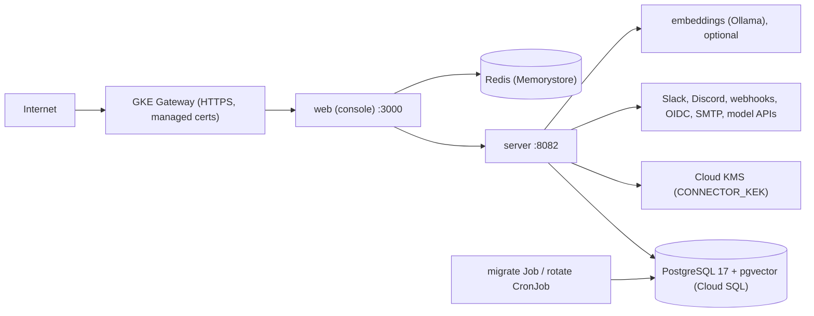

# Deployment

Telmoni ships as **two images**:
- **the server**: one binary, every command;
- **the console**.

It deploys in two ways:
- to **GKE Standard** with the Helm chart in `deploy/charts/telmoni`;
- on one machine with the self-host Docker Compose file in `deploy/compose`.

PostgreSQL and Redis are backing services. Neither is part of the chart.

This page covers the topology and the reasons behind it. The customer docs cover how to install it.

## Contents

- [Topology](#topology)
- [Images](#images)
- [The Helm chart](#the-helm-chart)
- [Configuration and secrets](#configuration-and-secrets)
- [Probes, scaling and disruption](#probes-scaling-and-disruption)
- [Network policies and pod security](#network-policies-and-pod-security)
- [Ingress](#ingress)
- [Ordering](#ordering)
- [Self-host Docker Compose](#self-host-docker-compose)
- [Local development](#local-development)
- [CI](#ci)
- [Where it lives](#where-it-lives)

## Topology

- **Only the console is exposed.** The server takes traffic only from the console (see [the console](console.md#relays) for what the console relays).
- **Each process is stateless.** All state lives in Postgres. The console's Redis holds only what can be lost.
- **Configuration and backing services come from the environment.** Both processes bind `PORT`, drain on `SIGTERM`, and log JSON to stdout.

## Images

**The server** (`crates/telmoni/Dockerfile`):
- **The build.** It compiles a static musl binary, using cargo-chef to cache dependencies. Its Rust image is the version `rust-toolchain.toml` pins. ⚠ The build never reads that file, so the two must be bumped together by hand.
- **The runtime image** is `distroless/static`, non-root.
- **The allocator.** The binary uses mimalloc, because musl's allocator serializes threads on one lock.
- **The migrations.** The image copies every module's migrations into `/app/migrations/<schema>`. An image built `FROM` this one adds its own module's set beside them.
- **One image runs every command.** The default command is `serve`. A Job overrides it with `migrate`, `rotate`, `sweep …` or `terminate`.

**The console** (`web/Dockerfile`):
- It builds the standalone Next.js server and runs it on a distroless, non-root Node image on port 3000.
- It bakes in no origin: the console reads `AUTH_URL` at request time, so one image serves every deployment.

**Publishing** (`.github/workflows/publish.yml`): once CI has passed on `main`, both images are built for `linux/amd64` and pushed to `ghcr.io/telmoni/server` and `ghcr.io/telmoni/web`, tagged `latest` and with the commit's SHA. The compose file and the chart (`global.imageRegistry`) pull those names by default. The workflow holds only its own `GITHUB_TOKEN`; a registry push is where it ends.

## The Helm chart

`deploy/charts/telmoni` creates:

| Object | Notes |
|---|---|
| `server` Deployment and Service (8082) | `args: ["serve"]` |
| `web` Deployment and Service (3000) | `SERVER_URL=http://server:8082` |
| `migrate` Job | `args: ["migrate"]`. A Helm `pre-install,pre-upgrade` hook, with no retries and a deadline. |
| `rotate` CronJob | `args: ["rotate"]`, daily, `concurrencyPolicy: Forbid`. ⚠ Rotation is DDL that runs as the migrator, so it is a job, never part of `serve`. |
| `embeddings` Deployment and Service | Optional (`embeddings.enabled`). An Ollama that pulls `embeddings.model` before it reports ready, with its own network policies. |
| ConfigMap `telmoni-tier` | Non-secret configuration, loaded by server, web, migrate and rotate |
| ServiceAccounts `server`, `web`, `migrator` | No Workload Identity annotation. The `migrator` account carries Helm hook annotations, so it exists before the migrate Job. Pods mount no token. |
| HPA and PDB for server and web | When `highAvailability.enabled` |
| NetworkPolicies | Default deny, then each allowed path |
| Gateway, HTTPRoutes, health check and backend policies | When `ingress.enabled` |

The object names are literals (`server`, `web`, `rotate`, `telmoni-tier`). Only the migrate Job's name follows the release.

**Not in the chart:**
- **Postgres** (Cloud SQL in production). The server requires `DATABASE_CA_CERT` inside a pod and connects with `verify-ca`. A database superuser installs the `vector` extension and runs `role_hardening.sql` once (see [data](data.md#migrations)).
- **Redis** (Memorystore).
- **The KMS key and its IAM binding.** The server takes its KMS bearer from the metadata server, so the pod's identity needs permission to encrypt and decrypt with the key. The chart does not set up that identity.

## Configuration and secrets

| Source | Holds | Loaded by |
|---|---|---|
| ConfigMap `telmoni-tier`, from `config.*` in `values.yaml` | `APP_URL`, `AUTH_URL`, sign-in gates, branding, `MAIL_FROM`, `CONNECTOR_KEK` (a KMS key *name*), `AGENT_MODEL_*`, `EMBEDDINGS_*`, `RERANK_*`, `DOCS_CORPUS_URL` and the rest | server, web, migrate, rotate (`envFrom`) |
| Secret `server-secrets` (operator-created) | Each module's DSN, `SERVICE_SECRET`, the admin seed, the OIDC client, `SMTP_URL`, the Slack and Discord apps, model, embeddings and rerank keys, `DATABASE_CA_CERT` | server |
| Secret `migrator-secrets` (operator-created) | `MIGRATOR_DATABASE_URL`, `DATABASE_CA_CERT` | migrate, rotate |
| Secret `web-secrets` (operator-created) | `AUTH_SECRET`, `SERVICE_SECRET`, `REDIS_URL` (and `REDIS_CA_CERT` for TLS) | web |
| Explicit `env` | `PORT`, `SERVER_URL`, then `extraEnv` | each |

How secrets are handled:
- **The chart never templates a secret.** The operator creates the Secrets.
- **Rotating `SERVICE_SECRET` without downtime** uses `SERVICE_SECRET_NEXT`. The server accepts both while the console moves over.
- ⚠ **A pod refuses five things.** The server treats `KUBERNETES_SERVICE_HOST` as "deployed tier", and there it refuses:
  - a missing `DATABASE_CA_CERT`;
  - `ALLOW_TEST_SESSION`;
  - a `local:` connector key;
  - an `OIDC_ISSUER` that is not `https`;
  - an `SMTP_URL` that is neither TLS (`smtps://`, `?tls=required`) nor loopback.

  `CONNECTOR_KEK` in a cluster must therefore be a Cloud KMS key name (see [notifications](notifications.md#secrets-at-rest)). The chart's default `config.connectorKek` is a `local:` placeholder, so a server pod installed with the default values does not start until it is set.

## Probes, scaling and disruption

**Server probes:**
- **Liveness is `/livez`, which does no I/O.** ⚠ A liveness probe that failed on a database stall would restart every replica at once.
- **Readiness is `/health`**, which asks every module for one keyed read of its own tables. ⚠ A role that has lost a grant is then a pod that takes no traffic, rather than one that answers 500.

**Other probes:**
- **The console** answers liveness and readiness at `/api/health` with a constant answer. ⚠ It deliberately reports no dependency state; a Redis status once leaked there.
- **Embeddings** turns ready only once its model has been pulled.

**High availability** (`highAvailability.enabled`):
- An HPA for each of server and web, with a PDB keeping at least one pod available.
- ⚠ The Deployments then leave `replicas` unset, so an upgrade does not reset the autoscaler.

**Replicas are safe by construction.** Every loop in `serve` either elects a leader per tick, leases its rows, or works in idempotent chunks (see [background work](background.md)).

**Draining.** The server drains HTTP on `SIGTERM` (see [server](server.md#shutdown)). The chart sets no `preStop` hook and no grace period of its own.

## Network policies and pod security

**NetworkPolicies** (`templates/network-policies.yaml`):
- Default deny for ingress and egress, except DNS.
- The server accepts traffic only from web, on 8082.
- Web accepts traffic from anywhere on 3000. It may reach only the server and Redis's ports.
- **The server and the migrator may reach anywhere.** ⚠ A policy cannot tell the database's private address from any other private address. The server's own egress guard is what refuses private addresses for customer URLs (see [notifications](notifications.md#the-egress-guard)).
- Embeddings accepts traffic only from the server, and reaches out only on 443, to pull its model. The server's path to it is a pod-selector rule of its own. ⚠ An address block cannot be relied on to match a pod's address.

**Pod security**, on every pod:
- runs as a non-root user;
- `seccomp` at `RuntimeDefault`;
- every capability dropped, and no privilege escalation;
- no mounted service-account token;
- no service links;
- a read-only root filesystem, except for web.

## Ingress

`templates/ingress.yaml` uses the GKE Gateway API:

- **A global external managed Gateway** on a reserved static address, with listeners on 443 and 80. Its certificate map comes from an annotation.
- **An HTTPRoute to web**, and a redirect from HTTP to HTTPS.
- **A health check** on `/api/health`.
- **A backend policy** with a long request timeout, request logging and connection draining. The long timeout leaves the console's server-sent event streams open past the load balancer's short default.

Only the console is behind the Gateway. The server has no route from outside.

## Ordering

**On install or upgrade:**
1. **The migrate Job runs first.** It is a `pre-install,pre-upgrade` hook.
   - It needs only the migrator's credentials and the CA certificate, because `migrate` never builds the server.
   - ⚠ A pre-install hook runs before the release's ordinary objects exist. So the ConfigMap and the `migrator` ServiceAccount are themselves hooks, at an earlier weight, and are kept afterwards.
2. **Then the Deployments roll.**
3. **Nothing orders web after server.** Until the server is ready, the console's pages show "service unavailable".

With the hook disabled, the Job is an ordinary object, with no ordering against the Deployments.

**Compose orders by health instead.** The server waits for `migrate` to complete successfully. Web waits for the server to start and for Redis to be healthy.

## Self-host Docker Compose

`deploy/compose/docker-compose.yml` (project `telmoni-selfhost`) runs everything on one machine. Its services:
- `postgres` (pgvector), with the extension installed at init;
- `redis`, without persistence;
- a one-shot `migrate`;
- `server`;
- `web`, published on 3000;
- `ollama`, behind the `agent` profile.

How it differs from the chart:
- **Every module and the migrator connect as one database user**, the superuser. Row-level security and the per-module grants therefore do not apply. Only the queries that name their tenant themselves still keep tenants apart there. Most queries rely on row-level security (see [tenancy](tenancy.md#when-everything-connects-as-a-superuser)).
- **`CONNECTOR_KEK` has no default**: connectors stay off until the operator mints a `local:` key, which is fine outside Kubernetes and a secret to back up beside the database.
- **Partition rotation is run by hand**, or from cron: `docker compose … run --rm migrate rotate`.
- **The server's deployed-tier refusals do not fire**, because there is no `KUBERNETES_SERVICE_HOST`.

## Local development

- **The dev `docker-compose.yml`** at the repo root runs only backing services: Postgres, Redis, Mailpit, and Ollama behind the `ollama` profile. Every port is bound to `127.0.0.1`.
  - ⚠ The Postgres init creates the extensions, the four login roles and the role hardening, so local work runs under the same grants and row-level security as production.
  - ⚠ Ollama is opt-in, because a native Ollama on the Mac holds the same port.
  - ⚠ The compose project name is pinned to `telmoni`, so renaming the checkout does not orphan the containers.
- **`make up`** checks the environment, ports, dependencies, roles and schema, builds the binary, and runs `scripts/up.sh`. That script runs the server on 8082 and `npm run dev` on 3000, and stops both when either exits.
- **The two compose files share container names and ports**, so they cannot run side by side.

## CI

`.github/workflows/ci.yml` runs on pushes, pull requests and the merge queue:

- **Rust:**
  - rustfmt, clippy with warnings denied, and rustdoc with warnings denied;
  - cargo-deny and typos;
  - the tests against `pgvector/pgvector:pg17`: install the extensions, run `telmoni migrate` with `MIGRATION_SETS` from the Makefile, then run the tests.
- **Web:** `npm ci`, typecheck, lint, knip, vitest and `next build`.
- **`ci-status`** is the one required check. It counts a skipped job as a failure.

A daily workflow (`audit.yml`) checks advisories. Dependabot keeps Actions and Docker digests current. `publish.yml` runs when CI completes on `main`, and only if it passed: it builds both images and pushes them to GHCR (§ Images).

Deliberately absent from CI: end-to-end tests and deploys.

## Where it lives

| Concern | File |
|---|---|
| Server image | `crates/telmoni/Dockerfile` |
| Console image | `web/Dockerfile` |
| Chart values | `deploy/charts/telmoni/values.yaml` |
| Workloads | `deploy/charts/telmoni/templates/{server,web,migrator,embeddings}.yaml` |
| ConfigMap, service accounts, helpers | `deploy/charts/telmoni/templates/{configmap,service-accounts,_helpers}.{yaml,tpl}` |
| Scaling, policies, ingress | `deploy/charts/telmoni/templates/{high-availability,network-policies,ingress}.yaml` |
| Self-host compose | `deploy/compose/docker-compose.yml` |
| Dev compose, local roles | `docker-compose.yml`, `crates/migrator/sql/` |
| Local runner | `Makefile` (`up`, `first-run`, `db-reset`), `scripts/up.sh` |
| CI | `.github/workflows/` |
