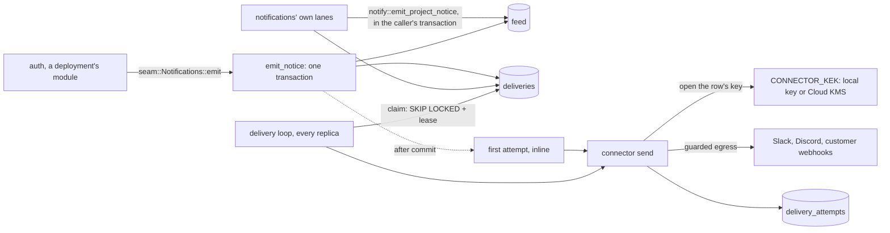

# Notifications

`crates/notifications` does three jobs:

- **It keeps two kinds of feed:** each project's, and each organization's own.
- **It delivers each notice** to the channels a project connected (Slack, Discord, webhooks), through a durable queue.
- **It holds those channels' secrets** under envelope encryption.

Other modules raise notices through one seam call, `seam::Notifications::emit`. The module owns the `notifications` schema and connects as the `notifications` role.

## Contents

- [Shape](#shape)
- [The feeds](#the-feeds)
- [Raising a notice](#raising-a-notice)
- [The delivery queue](#the-delivery-queue)
- [Connectors](#connectors)
- [Secrets at rest](#secrets-at-rest)
- [Webhook signatures](#webhook-signatures)
- [The egress guard](#the-egress-guard)
- [Live updates in the console](#live-updates-in-the-console)
- [Erasure and purge](#erasure-and-purge)
- [Retention](#retention)
- [Failure behaviour](#failure-behaviour)
- [Where it lives](#where-it-lives)

## Shape

## The feeds

`notifications.feed` holds one row per notice. Each row carries:
- the organization;
- the project, or none;
- `subject_user_id`, the person the notice is about;
- `kind`, `title`, `body` and `metadata` (JSON);
- `read_at`;
- `dedup_key`.

The ids are UUIDv7, minted in Rust.

**There are two feeds, not one filtered view.**
- A row with a project belongs to that project's feed. Any role auth admits on the project reads it.
- A row without a project belongs to the organization's own feed. The owner and the admins read it (`require_organization_admin`).
- The RLS policy `organization_level` admits those rows. ⚠ Its `project_id IS NULL` is load-bearing: without it, an organization scope would reach every project's rows.

**Kinds** are fixed by a `CHECK` and by `NotificationKind` (`crates/shared/src/types/notification_kind.rs`):

| Kind | Raised by |
|---|---|
| `member_added` | auth, when a project invitation is accepted. Accepting an organization invitation raises nothing. |
| `member_left` | auth, when a member leaves or is removed from a project |
| `connector_connected` | notifications, in the same transaction as the new connection |
| `connector_disconnected` | notifications, when a connection is retired: by the delivery loop, by a test send or manual resend that gets a terminal answer, or by Slack's uninstall and token-revoked events |
| `organization_alert` | nothing in this repository; a deployment's own module raises it through the seam |

- **`read_at` is shared.** Marking a feed read clears it for everyone who sees that feed. Nothing is addressed to one person.
- **`subject_user_id` exists for erasure only.**
- **A read returns a page, newest first,** and counts the unread total separately, rather than from the capped page.

**In the console:**
- The project feed is the project overview's recent activity.
- The organization feed is on the organization overview.
- The header's bell is not the feed: it shows invitations and ownership offers.

## Raising a notice

`emit_notice` (`crates/notifications/src/handler/mod.rs`) is what `seam::Notifications::emit` calls. It is how other modules raise notices. Notifications raises its own with `notify::emit_project_notice` (`crates/notifications/src/notify.rs`), which writes the same feed row and fan-out directly inside the caller's transaction.

**Checks first.** It bounds the title, body, dedup key and metadata (`TITLE_MAX_CHARS`, `BODY_MAX_CHARS`, `DEDUP_KEY_MAX_CHARS`, `METADATA_MAX_BYTES`). The metadata must be a JSON object, because it is served to the browser as it is.

**Then one transaction**, bound to the project, or to the organization for an organization notice:
1. Insert the feed row, with `ON CONFLICT DO NOTHING` on the dedup key.
2. One `INSERT … SELECT` queues a delivery for each active connection the notice reaches:
   - for a project notice, that project's connections;
   - for an organization notice, every project's connections in the organization.

   A webhook that chose its kinds receives only those.

**After the commit, the first attempt runs inline**, at most `FIRST_ATTEMPT_INFLIGHT` per process. The caller never waits on a vendor. Anything over that limit is left to the loop.

**Dedup.** A unique index on `(organization_id, dedup_key, project_id) NULLS NOT DISTINCT` turns a replay into a no-op: it returns the first feed id and queues nothing.
- ⚠ Without `NULLS NOT DISTINCT`, an organization notice's `NULL` project would never collide with its own replay.

**Each delivery row copies the notice's text and subject.** A composite foreign key ties it to `(connection_id, project_id, organization_id)`.
- ⚠ The enqueue policies check only the bound key. Without the composite key, a delivery could carry one tenant's text into another tenant's channel.

**Where notices come from:**
- **`member_added`** is emitted by auth (`crates/auth/src/notify.rs`) after its own transaction commits. A failed emit is logged and swallowed, so a membership and its notice are not atomic.
- **`connector_connected`** is written with the connection and its audit row. Its fan-out includes the new connection, so a channel's first message is the news that it is connected.
- **`connector_disconnected`** is written in the transaction that retires the connection, in the module's lane.
- **Auditing.** An emit is not audited here. The module that caused it audits its own act.

## The delivery queue

**Tables:**
- **`deliveries`.** One row per notice per connection. It carries:
  - `status`: `pending`, `delivered` or `failed`;
  - `attempts`;
  - `next_attempt_at`;
  - `lease_until`;
  - `last_error`.

  A partial index covers pending rows by due time.
- **`delivery_attempts`.** One row per send: whether it was scheduled or manual, the outcome, the status code, the duration and the error. An attempt handed back unspent is not recorded.

**The loop** (`crates/notifications/src/delivery.rs`) runs in every replica.
- It ticks every `NOTIFICATIONS_DELIVERY_POLL_SECS`.
- **It reads the global `connectors` flag first.** If the flag is off, the loop leaves the queue in place. If the flag can't be read, the tick fails rather than send. The flag gates only the loop and new connections. With it off, a fresh notice's inline first attempt, a test send and a manual resend still post to the vendor.
- It drains up to `NOTIFICATIONS_DELIVERY_DRAIN_ROUNDS` batches of `NOTIFICATIONS_DELIVERY_BATCH`. It stops early at a short batch.

**Claiming work.** One statement does all of this:
- picks rows that are pending, due and unleased, with `FOR UPDATE SKIP LOCKED`;
- increments `attempts`;
- sets `lease_until` (`LEASE_SECS`).

That transaction commits before anything is sent.
- ⚠ There is no `ORDER BY`. It once cost a large sort on every tick of a backlog. Rows drain in physical order instead, so heavy sustained overload can delay some rows behind others.

**Sending.**
- A batch's connections are read once, and each row's key is unwrapped once per connection.
- Up to `NOTIFICATIONS_DELIVERY_CONCURRENCY` sends run at a time.
- Nothing paces sends per vendor. A far end's `Retry-After` is the only brake.

**Recording.** All of a batch's outcomes are written in one transaction, then the attempt log in another.
- ⚠ The log must never undo an outcome. A failed log write loses log rows, never outcomes.
- ⚠ The log insert takes `FOR KEY SHARE` on its deliveries. A delivery deleted mid-batch once failed the whole insert, and every tenant's rows were re-sent.

**Each send ends in one of five outcomes:**

| Outcome | Meaning | Effect |
|---|---|---|
| Delivered | 2xx | `delivered` |
| Transient | The far end is busy or unreachable: 5xx, 429, a network failure, a timeout, and 408 from Slack. For a webhook, any non-2xx but `410`. | Retried after the backoff |
| Held | The key service could not answer | The attempt is handed back, so a KMS outage spends no row's budget, and the tick stops |
| Spent | Terminal for this row: for example a refused body, or a Discord 4xx it does not recognize | `failed`. The connection is untouched. |
| Retire | The channel is gone (uninstalled, revoked, deleted, a webhook's `410`) | The connection becomes `revoked` or `errored`, its pending rows fail, and `connector_disconnected` is raised |

**Backoff** is `NOTIFICATIONS_DELIVERY_BACKOFF_SECS × 4^(attempts − 1)`, capped at a day.
- A far end's `Retry-After` can lengthen the wait, never shorten it.
- After `NOTIFICATIONS_DELIVERY_MAX_ATTEMPTS`, the row is `failed`.
- The doc comment states the aim: five attempts outlast a fifteen-minute deploy.

**The breaker (webhooks only).** After `BREAKER_AFTER` consecutive failed sends, the connection becomes `errored`. Any success resets the count. The threshold is set so one bad hour cannot trip it, but two lost notices can.

**Several replicas.**
- No leader is elected. `SKIP LOCKED` plus the lease keep two replicas from sending the same row.
- A sender that dies mid-send leaves its row leased. After the lease lapses, the row is sent again, with that attempt already counted.
- So delivery is **at least once**. Webhook receivers dedupe on the `Telmoni-Delivery-Id` header, which is the delivery's id.
- ⚠ Inline first attempts are never cancelled mid-send. A timeout there once dropped the task after the far end already had the message, and it was sent twice.
- ⚠ The loop is raced against the HTTP server in `serve`. If the loop ends, the process exits, and the restart is the recovery (see [server](server.md)).

**A manual resend** is for webhooks only, because a chat channel would show the message twice.
- It takes its own short lease (`REDELIVERY_LEASE_SECS`) and spends none of the retry budget.
- It is capped (`MAX_MANUAL_RESENDS`), recorded as `manual`, and audited.
- It settles only while it still holds its lease.
- It moves `updated_at` only when the status changes, because `updated_at` is the retention clock.

**The queue's depth is logged every minute** as `connector queue depth`. ⚠ A deployment's alert matches that exact message.

## Connectors

**Which connectors are on comes from configuration** (`crates/notifications/src/config.rs`):
- **Slack** is on when its client id and secret are set.
  - Boot refuses Slack without its signing secret: without it, an uninstall from Slack's side could never retire a connection.
  - Boot also refuses Slack without `CONNECTOR_KEK`.
- **Discord** is on when its client id and secret are set. Boot refuses it without `CONNECTOR_KEK`.
- **Webhooks** are on exactly when `CONNECTOR_KEK` is set.

**Who may change them.** Owners and admins may change connectors; members read them (the matrix's `Connector` resource). Starting a new connection also needs the global `connectors` flag.

**The OAuth handshake (Slack and Discord):**
1. Authorize mints a random `state` and stores only its SHA-256, for `STATE_TTL_SECS`.
2. The console carries the raw state in a sealed, short-lived cookie (`web/app/connect/[provider]/`), and compares it before relaying the callback.
3. The callback spends the state once. It requires the same person, project and provider.
4. The redirect URI is built only from `APP_URL`.

**Slack** (`connector/slack.rs`):
- It asks only for the `incoming-webhook` scope. A bot posting with `chat:write` fails in channels it has not joined, and its token is per workspace.
- It stores the incoming-webhook URL, plus the bot token, which is kept only to uninstall.
- `POST /webhooks/slack` sits outside the service-secret layer and verifies Slack's own signature instead. An uninstall or token revocation retires every connection into that workspace, across tenants.

**Discord** (`connector/discord.rs`):
- It asks for `webhook.incoming` and stores the webhook URL. The access token is not kept.
- Teardown deletes the webhook.

**Webhooks** (`connector/webhook.rs`):
- The URL must be `https`, carry no credentials, pass the egress guard, and stay under `MAX_URL_LEN`.
- Only `host:port` is ever shown back. The URL's SHA-256 is the uniqueness key, because the URL itself is sealed.
- The signing secret is shown once, then sealed.
- A connection with no chosen kinds receives every kind, including kinds added later.

**Teardown** upstream is best effort:
- When a person disconnects a connector, teardown runs after the row is gone.
- In a purge, teardown runs first, and the rows are deleted after.

Slack's uninstall is sent only when no other connection shares the workspace, because it kills all of them.

## Secrets at rest

`crates/shared/src/envelope/` provides **envelope encryption**:

- **The data key.** Each connection row has its own random data key (DEK).
- **The fields.** Every secret field (the target URL, the token, a rotated-out secret) is sealed with AES-256-GCM, using a fresh nonce and **the row's id as associated data**.
- **The wrap.** The DEK is wrapped by the key-encryption key (`Kek`), again with the row id as associated data. A sealed value moved to another row does not open.
- **Reconnects.** Because the row id is bound in, a reconnect reads the existing row first rather than upserting.
- **Reads.** Plaintext leaves only as `Redacted`, wiped on drop. `grep '\.expose()'` finds every read.

What it protects against:
- A database dump yields ciphertext and wrapped keys only.
- Disabling the KMS key version makes every row inert at once.
- A compromised running service can still decrypt, because it is allowed to.

⚠ **Envelope is a library, never a service endpoint.** Internal hops are gated by the shared service secret, which says nothing about who is asking. A seal-and-open service behind it would let any holder of that secret open every row, and the audit log would name the service instead of the real caller.

**`CONNECTOR_KEK`** takes one of two forms (`crates/shared/src/envelope/kek.rs`):

| Form | Use |
|---|---|
| `local:<64 hex>` | A local AES-256-GCM key, for development and self-hosting. Boot refuses it inside Kubernetes (`KUBERNETES_SERVICE_HOST` set). |
| `projects/…/cryptoKeys/<key>` | A Cloud KMS key, the production form. |

How the KMS form works:
- **A key name, never a version.** A `cryptoKeyVersions/…` name is refused, because a pinned version cannot open rows wrapped under the one before it.
- **The bearer** comes from the metadata server and is cached until just before it expires. A cold pod fetches it once, under a lock.
- **No data key is ever cached.**
- **The client.** KMS and metadata calls use the module's unguarded platform client. The metadata server is a link-local address the egress guard rightly refuses.

Rotation:
- **KMS key-version rotation needs nothing.** KMS opens what any of the key's versions wrapped.
- **Webhook signing secrets** rotate under the row's existing DEK. The old secret can keep signing for an overlap of up to `MAX_OVERLAP_HOURS`. The update is conditional on the secret that was read, so a racing second rotation is refused.

## Webhook signatures

Every webhook request carries:
- **`telmoni-signature: t=<unix>,v1=<hex>`.** The hex is an HMAC-SHA256 of `"{t}.{body}"` under the connection's secret (Stripe's shape). During a rotation's overlap, the header carries two `v1` values, the new secret's first.
- **`telmoni-delivery-id`**, the receiver's dedup key.
- **A JSON body** of `{id, kind, title, body, sent_at}`.

Each attempt is signed when it is sent, so a retry still lands inside the receiver's replay tolerance.

**Responses.** Only `410 Gone` retires a webhook. Every other non-2xx is transient, because a 404 in the middle of a deploy comes back. The backoff and the breaker end a webhook that never answers.

⚠ **The golden vector is a contract.** It lives in `crates/notifications/src/connector/webhook.rs` and `web/lib/webhook-signature.ts`, both tested, and the customer docs print it. Changing it breaks every receiver written against the docs.

## The egress guard

`crates/shared/src/net_guard.rs` is the one SSRF defence for every lane that dials a host somebody else chose.

⚠ **The guard is code or it is nothing.** Pods leave through an unrestricted NAT, and NetworkPolicies govern only what may connect in.

It checks three times:

1. **At registration.** `host_is_dialable` runs on the host before a row exists.
2. **At dial.** The same check runs on the URL as it leaves the vault, because hyper sends an IP-literal host straight to the socket without resolving it.
3. **At connect.** `GuardedResolver` drops every non-global address from each DNS answer. A name that resolves, or later re-resolves, to a private address is never dialled. That defeats DNS rebinding.

Redirects are never followed.

What it refuses:
- **Names:** `localhost`, `.local` (which covers `.cluster.local`) and `.internal` (which covers the metadata server's name).
- **Addresses:** every non-global address, including:
  - private and loopback;
  - link-local, which covers `169.254.169.254`;
  - carrier-grade NAT, multicast and the reserved ranges;
  - the IPv6 equivalents.

  An IPv4 address written in IPv6 form is judged as the IPv4 address.

Its limit: sibling services stay unreachable only while the cluster's pod and Service ranges are private.

Every vendor and customer hop goes through it: sends, OAuth exchanges and teardowns. A refusal ends one of two ways:
- **Refused at dial time** (the URL's host is refused outright): `BadTarget`. The connection becomes `errored`, and the refusal is recorded as an attempt.
- **Refused at connect time** (a name whose answers the resolver drops): a send error, which is transient. It is retried with backoff, and for a webhook it counts toward the breaker.
- **Error text** never carries the URL (`without_url()`). A far end's response body is read only to a small cap, trimmed, and stripped of NUL bytes. ⚠ One NUL once failed a whole batch's write.

The agent's model, embeddings and rerank URLs are deliberately **not** guarded: they are the operator's, not a customer's (see [the agent](agent.md#model-access)).

## Live updates in the console

**Notices are not pushed.** No Rust crate uses Redis.

- The console's `/api/events` server-sent event stream subscribes to Redis channels for:
  - the person, an HMAC of their email so channel names cannot list customers;
  - each organization they are in.
- It forwards only ownership and invitation events, which the console's own Server Actions publish.
- A new notice shows up when a server component renders again: on navigation, or on a refresh triggered by one of those events. Nothing polls the feed.

See [the console](console.md#live-events).

## Erasure and purge

**Erasing a person.** Auth calls `redact_person` twice in a person's erasure (see [deletion](deletion.md)). One redaction is one lane transaction, which:
- rewrites the `member_added` notices about the person to name "a former member";
- rewrites those deliveries' subject, body and last error;
- replaces the error text of their failed attempts, because a receiver may echo the notice back in its refusal. The lane may update only that column;
- clears `subject_user_id`.

⚠ **If a feed or delivery row still carries their `subject_user_id` afterwards, the redaction errors and the erasure stops.** That happens with a notice kind the redaction does not know how to rewrite. The sweep retries it. Free text that names them without carrying their id is not detected.

Copies already delivered to Slack, Discord or a webhook are beyond reach.

**Purging an organization** (`purge_organization`, called by auth's deletion finalize):
1. Grants are torn down upstream. A Slack workspace is uninstalled only if no connection outside the organization uses it.
2. One transaction deletes the connections, handshake states and feed rows. Deliveries and attempts go by cascade.
3. An error stops the finalize, which is retried.

**Purging a project** (`purge_project`) does the same for one project:
- **On a project transfer**, it runs before auth commits, inside `PROJECT_PURGE_BUDGET`. A failure refuses the transfer. Otherwise the old organization's grants would post the new owner's events into the old owner's channels.
- **After a project is deleted**, it runs best effort. Anything left goes with the organization's purge.

## Retention

An hourly loop in `serve` (`crates/notifications/src/retention.rs`) removes:

- feed rows older than `FEED_RETENTION_DAYS`, read or not;
- delivered and failed deliveries older than `DELIVERY_RETENTION_DAYS`, by `updated_at`, with their attempts. A row a resend currently holds is skipped, and pending deliveries never age out;
- handshake states past their expiry;
- rotated webhook secrets whose overlap has ended.

How it runs:
- Chunks are bounded (`SWEEP_CHUNK`, at most `SWEEP_MAX_ROUNDS` per run). ⚠ The role's statement timeout would end an unbounded delete.
- Each chunk takes a transaction-scoped advisory lock. A replica that finds it held stops its run, and leaves the sweep to the replica holding it.
- The windows live in `crates/shared/src/db/retention.rs`. The agent imports the same constants, so its copies never outlive their source.

## Failure behaviour

| What fails | What happens |
|---|---|
| Slack or Discord answers 5xx or 429 (or 408, from Slack), or the network fails | Transient. Retried with backoff until the attempts run out, then `failed`. The connection stays active (only webhooks have a breaker). |
| Slack says the install is gone | The connection becomes `revoked`. Its queue fails. |
| A webhook endpoint hangs | Cut off at the connector timeout. Transient, and counted toward the breaker. After `BREAKER_AFTER` in a row, the connection becomes `errored`. |
| The KMS is unreachable or refuses | Rows are held, attempts are handed back, and the tick stops. New installs are refused (`key-unavailable`), and nothing is stored. |
| The KEK is the wrong key | Every delivery fails at once. The connection stays active, and the breaker does not count it. |
| A malformed `CONNECTOR_KEK`, a `local:` key inside Kubernetes, Slack or Discord configured without a key, or Slack without its signing secret | Boot refuses. |
| Writing a batch's outcomes fails | The rows stay leased and are sent again after the lease, which is at least once. |
| The delivery loop itself ends | The process exits, and the restart recovers it. |

## Where it lives

| Concern | File |
|---|---|
| State, routes | `crates/notifications/src/lib.rs` |
| Configuration, which connectors are on | `crates/notifications/src/config.rs`, `crates/notifications/src/boot.rs` |
| Feed and emit | `crates/notifications/src/handler/mod.rs`, `crates/notifications/src/db.rs` |
| Connector lanes and the OAuth handshake | `crates/notifications/src/handler/connectors.rs`, `web/app/connect/` |
| Slack events | `crates/notifications/src/handler/slack_events.rs` |
| Each connector | `crates/notifications/src/connector/{slack,discord,webhook}.rs` |
| Delivery loop, outcomes, breaker | `crates/notifications/src/delivery.rs` |
| Retention | `crates/notifications/src/retention.rs`, `crates/shared/src/db/retention.rs` |
| The seam | `crates/notifications/src/seam.rs`, `crates/shared/src/seam.rs` |
| Envelope and KEK | `crates/shared/src/envelope/` |
| Egress guard | `crates/shared/src/net_guard.rs` |
| Webhook signature, console side | `web/lib/webhook-signature.ts` |
| Schema and policies | `crates/notifications/migrations/20261001100000_notifications_initial.sql` |
