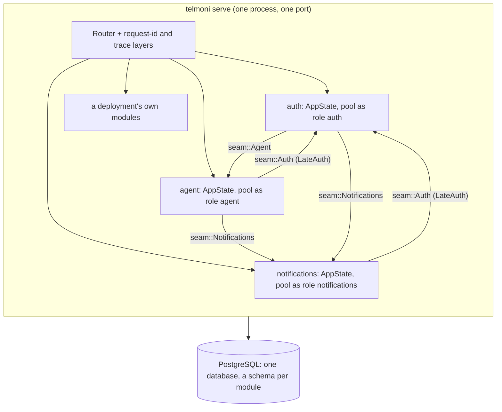

# The server

The server is one process, `telmoni serve`, built from library crates:

- **Auth, notifications and the agent are modules.** Each has its own configuration, its own database pool connected as its own role, its own routes and its own background loops.
- **The `telmoni` crate is the binary.** It links the modules, hands each the others through the seams, mounts their routes under one listener on `PORT`, and runs their loops as tasks of the same process.

This page covers how the process is put together. The pages for each module cover what the modules do.

## Contents

- [Modules in one process](#modules-in-one-process)
- [Assembling the process](#assembling-the-process)
- [Boot](#boot)
- [Routing](#routing)
- [Seams](#seams)
- [Errors](#errors)
- [Logging](#logging)
- [Configuration](#configuration)
- [Shutdown](#shutdown)
- [Subcommands](#subcommands)
- [The wire contract](#the-wire-contract)
- [Where it lives](#where-it-lives)

## Modules in one process

⚠ **A module never reads another module's tables, and never calls another over the network.** Every question between modules is a Rust trait call (`crates/shared/src/seam.rs`). Every module still connects to Postgres as its own role. Row-level security and the grants therefore hold inside one process exactly as they did when these were separate services (see [tenancy](tenancy.md#database-roles)). No module may add a port or an internal HTTP lane to reach another.

## Assembling the process

`crates/telmoni/src/lib.rs` is both the binary's code and the API that a deployment's own binary is built with.

| Item | What it is |
|---|---|
| `Parts` | Everything the process is built from: each module's configuration and pool, auth's providers (the issuer, the password form, an external identity provider, mail), the agent's parts (or none), and an optional `PurgeHook` |
| `App::from_env()` | Builds `Parts` from the environment, with no purge hook, and assembles them |
| `App::assemble(Parts)` | Builds every module's state and wires the seams between them |
| `Module` | A deployment's own module: `name`, `router`, `ready` (one keyed read of its own tables, for the readiness probe) and `spawn` (its loops) |
| `App::mount(module)` | Adds a module after `assemble`. It reaches the core through `app.auth` (`seam::Auth`) and the notifier. |
| `run(command, build)` | The whole of a `main` once the arguments are parsed. `build` is called only for commands that need the process; `migrate` and `rotate` never build it. |

**What a deployment's binary can replace:**
- the external identity provider, through `AuthProvider` (`crates/auth/src/provider.rs`);
- the mail transport, through `MailSender` (`crates/shared/src/mail.rs`);
- the `PurgeHook`, which is called when an organization is purged;
- whether there is an agent at all;
- extra modules.

**What it cannot replace:**
- the issuer;
- the core's routes and request layers;
- the loops' cadences;
- the subcommands. `Command` is a closed enum.

**`LateAuth` breaks a construction cycle.**
- Auth needs the notifications and agent seams when it is built: it emits notices and asks for purges and erasures.
- Notifications and the agent need `seam::Auth` when they are built.

So those two are given a `LateAuth`, an empty slot that `assemble` fills as soon as auth exists. A call that came before the fill would answer `IdentityUnavailable` (503). Filling it twice is an error.

## Boot

`main` loads `.env` if one is present, installs logging and parses the command. `App::from_env` then builds, in order:
1. auth's configuration, then notifications';
2. the HTTP clients and the mail transport;
3. each module's pool, reading the agent's configuration together with its pool;
4. auth's providers, which includes seeding the first admin from `ADMIN_EMAIL` if no identity holds that address;
5. `assemble`.

`serve` then:

1. **Refuses `ALLOW_TEST_SESSION` on a deployed tier.**
2. **Runs the agent's embedding width probe**, and starts the agent's loops.
3. **Starts notifications' retention sweep and the delivery loop.**
4. **Starts auth's sweeps**, unless `RUN_SWEEPS=false` hands them to scheduled `telmoni sweep` jobs.
5. **Starts each mounted module's loops.**
6. **Binds `0.0.0.0:PORT`** and serves until a shutdown signal, raced against the delivery loop (see [Shutdown](#shutdown)).

**What a missing or broken dependency does at boot:**

| Problem | Effect |
|---|---|
| A required variable unset or blank | The process exits, naming the variable, before the port binds |
| A variable set but malformed (a boolean that is not `true`/`false`, a number that doesn't parse) | Exits, naming it |
| Postgres unreachable | Exits. Pools connect eagerly. |
| `DATABASE_CA_CERT` missing in a pod | Exits, rather than trust the server's certificate blindly. Connections use `verify-ca`: Cloud SQL's certificates name the instance, not its address. |
| A module's role missing a grant | The process starts, but `/health` answers 503. Each readiness check reads one of the module's own tables, because a bare ping answers healthy while the grant is missing. |
| The embeddings model is the wrong width | Exits. |
| The embeddings endpoint not answering | Starts. The agent checks the width later (see [the agent](agent.md#boot)). |
| The chat model, OIDC, SMTP or KMS unreachable | Not contacted at boot. Each is reached on first use, so an outage there degrades its feature, not the process. |

**"Deployed tier"** means `KUBERNETES_SERVICE_HOST` is set (`envelope::on_deployed_tier`). It was chosen because Kubernetes always sets it, so nobody has to remember a flag. On a deployed tier the server refuses:
- the test session door;
- a `local:` connector key;
- an OIDC issuer that is not `https`;
- plaintext SMTP.

## Routing

`App::router` merges, in this order:
1. the probes;
2. `/internal/log-level`;
3. auth's routes;
4. notifications' routes;
5. the agent's routes, or its `absent_router`;
6. each mounted module's routes.

Then it adds two layers, once, around everything:
- **`trace_layer`.** A span per request, carrying the method, the path without its query, and the request id.
- **`request_id_layers`.** Keeps an inbound `x-request-id` or mints one, and echoes it on the response.

| Routes | Gate |
|---|---|
| `GET /health` (readiness), `GET /livez` (liveness) | None. Liveness does no I/O: a liveness probe that failed on a database stall would restart every replica at once. |
| `/internal/log-level` | Service secret |
| `/internal/*` person lanes: sessions, projects, members, invitations, tokens, audit, transfers, the organization and creating another, `/me/*`, approving or denying a CLI device, notifications' feed and connectors, the agent | Service secret, then the person's bearer. Auth checks the bearer with `require_person_token`. Notifications and the agent resolve it through `seam::Auth::resolve`. |
| `/internal/*` service lanes: auth's configuration, starting and exchanging a sign-in, the CLI's device start and poll, refresh, logout, the password lanes, invitation look-up, token validation | Service secret only. Most run before anyone is signed in. |
| `POST /me` | Service secret, then the bearer |
| `/v1/*` | Service secret, then a `telmoni_` API token (`require_token`) |
| `POST /test/session` | Mounted only with `ALLOW_TEST_SESSION`. Service secret. |
| `POST /webhooks/slack` | No service secret. Slack's own signature is verified in the handler. |

Rules the routes follow:

- ⚠ **The service secret proves that a request came from inside the platform, not who is asking.** The person comes from the bearer, verified on every request. A new route therefore belongs in the person lanes by default.
- **`x-service-secret` is compared in constant time** against `SERVICE_SECRET`, and against `SERVICE_SECRET_NEXT` while a rotation is under way.
- ⚠ **`require_person_token` is a `route_layer`, not a `layer`.** As a plain layer, every unknown path answered 401 instead of 404.

**Not in the server's middleware:**
- **CORS.** No browser calls the server. The console relays everything that comes from outside: browsers, the CLI (`web/app/cli/`), `/v1` clients (`web/app/v1/`) and Slack's events (`web/app/api/webhooks/slack/`).
- **Global rate limits, body limits and request timeouts.** These live where the cost is known:
  - the console meters sign-in, `/v1` and the CLI door (see [the console](console.md));
  - auth limits password, code and link attempts in its handlers;
  - the agent caps questions per hour;
  - lanes cap their own inputs;
  - the database roles' statement and lock timeouts bound every query.

## Seams

`crates/shared/src/seam.rs` defines what the modules may ask of each other.

The premise is that in one process there is nothing to secure or cache between modules. An answer is the current row, read through the owning module's own pool, lane and rules.

| Trait | Implemented by | Methods, and who calls them |
|---|---|---|
| `Auth` | `crates/auth/src/seam.rs` | `resolve`: notifications' and the agent's lanes. `resolve_again`: the agent, mid-turn. `project_homes`: the agent's retention and citations, and notifications' document links. `organization_slugs`: notifications' document links, and a deployment's modules. `global_flags`: the delivery loop and connector lanes. `members`, `audit_events`: the agent's tools. `audit_documents`: the agent's indexer. `organization_standing`: for a deployment's modules. |
| `Notifications` | `Notifier`, `crates/notifications/src/seam.rs` | `emit`, `purge_organization`, `purge_project`, `redact_person`: auth. `activity_documents`, `connectors`, `connector_deliveries`: the agent. |
| `Agent` | `AgentSeam`, `crates/agent/src/seam.rs` | `erase_person`, `purge_organization`: auth's deletion |
| `PurgeHook` | A deployment's own code | Called when an organization's deletion is confirmed (in the request's inline tail), again by the sweep until a run is recorded, and again at finalize. The row is kept until the hook answers `Ok`. ⚠ It runs during the grace, before the organization is erased, and nothing brings an organization back, so what it purges stays purged. |
| `AgentObserver` | Nothing yet: the telemetry module, once it exists, set on `AgentParts::observer` | `observe`: the agent, as each question ends (`crates/agent/src/observe.rs`). A record carries ids, timings and token counts, never what anyone wrote ([agent](agent.md#recording-the-agents-own-questions)). |

Rules the seams follow:

- ⚠ **The per-person reads default to refusing rather than answering empty.** A seam that was never wired must not look like a module with nothing in it. The exceptions are the indexer's document feeds (`audit_documents`, `activity_documents`), which default to empty. An `Auth` or `Notifications` of a deployment's own that leaves them out gives an agent that quietly indexes nothing.
- ⚠ **`global_flags` fails closed.** A set of flags that can't be read is an error, never "everything on". A kill switch that failed open during the outage it was thrown for would be no kill switch.
- **The data a seam carries is decided by the owning module.** For example, notifications decides which audience a feed document has, and the agent only stores what it is told.

## Errors

Every handler returns `TelmoniError` (`crates/shared/src/error.rs`). Its nested `AuthError`, `AuthzError` and `TenantError` each map to an [RFC 9457](https://www.rfc-editor.org/rfc/rfc9457) problem: a `type` URI under `/errors/…`, a title, a status, a detail and extensions. `IntoResponse` (`crates/shared/src/middleware/problem.rs`) writes it as `application/problem+json`, and adds `Retry-After` to rate-limited and feature-off answers.

**Redaction is part of the mapping:**
- **Database errors** become a bare 500 with no detail. A unique violation becomes a 409 with a fixed sentence.
- **`Internal`** becomes a bare 500. The cause goes only to the log, at `error`.
- **A model provider's failure** is logged, not returned, because providers echo fragments of the request in their refusals.
- **`IdentityUnavailable` is a 503, never a 401.** A bearer nobody could look at is not a refused one, and must not sign the person out.

**Other conventions:**
- The `Json` and `Query` extractors turn every rejection into a 400 problem (`crates/shared/src/extract.rs`).
- **The error catalog.** Every `type` needs a row in the customer docs' `errors.mdx`. `crates/shared/tests/error_catalog.rs` checks the types `error.rs` builds and every `/errors/…` literal in `crates/*/src` against that page, the console's own `web/content/docs/errors.mdx`, both ways. Only the types the console mints itself — its relays' `/errors/method-not-allowed` and `/errors/upstream-unavailable`, and the CLI door's `/errors/not-found` — are beyond the test's reach.

**Panics.**
- Lints deny `unwrap`, `expect`, `panic!`, indexing and string slicing outside tests, so a panic is a bug the lints missed.
- There is no catch-panic layer. A handler that panics drops its connection without writing a response, so nothing internal reaches the caller.

## Logging

`crates/shared/src/logging.rs`:

- **JSON on stdout** when stdout is not a terminal; a human format when it is.
  - ⚠ The JSON uses Cloud Logging's field names: `severity`, `message`, `timestamp`, and `sourceLocation`. Tracing's own JSON writes `level`, which Cloud Logging does not read, so every error landed at INFO.
  - Span fields, the request id among them, are flattened into every line.
- **The starting level** comes from `RUST_LOG`, else `LOG_LEVEL`, else `info`.
- **`PUT /internal/log-level`** changes the level at runtime, on one pod, for a bounded time.
  - ⚠ A raised level always expires, because the way a debug session fails is somebody forgetting it.
  - A newer change cancels an older one's revert.

**Secrets and personal data never reach a log line.** This is a hard rule (AGENTS.md), enforced by types rather than by a filter:
- **`Redacted`** (`crates/shared/src/types/redacted.rs`) holds every secret:
  - service secrets;
  - OIDC and vendor secrets;
  - the admin password;
  - the SMTP URL;
  - the connector key;
  - model keys.

  It prints `***` and wipes its bytes on drop. It gives up its value through `.expose()`, so `grep '\.expose()'` finds most reads, or by conversion into a `String` or `Arc<str>`. The service secret is converted that way into `ServiceSecrets`, and kept as a plain `Arc<str>` with a masked `Debug` for the life of the process.
- **Mail errors** carry the server's reply code but never its text, which can echo the recipient's address.
- **A refused bearer** is logged by a reason word, never by any part of the token.
- **Log lines name ids**, never emails, names or free text.

## Configuration

All configuration comes from the environment (twelve-factor), read once at boot through the helpers in `crates/shared/src/config.rs`:

| Helper | Behaviour |
|---|---|
| `require` | The value, verbatim. Unset or blank is an error naming the key. |
| `optional` | Blank counts as unset. |
| `optional_base_url` | Strips a trailing `/`. |
| `env_parse` | The default when unset. A value that doesn't parse is an error naming the key and the type expected. Booleans accept only `true` or `false`. |

Every failure stops the process before it binds a port.

**Requirements depend on each other.** They are checked at boot, not on first use:
- the OIDC client id and secret, when `OIDC_ISSUER` is set;
- `ADMIN_EMAIL` and `ADMIN_PASSWORD`, both or neither;
- `DISABLE_LOGIN_FORM`, which needs an external provider and no admin seed;
- the connector key, when any connector app is configured;
- the agent's endpoint and key pairs.

`.env.example` (the server) and `web/.env.local.example` (the console) document every variable.

## Shutdown

`shutdown_signal` (`crates/shared/src/shutdown.rs`) fires on `SIGTERM` or `SIGINT`.
- ⚠ Listening for Ctrl-C alone once meant every rollout dropped in-flight requests.

On the signal:
- **axum's graceful shutdown** stops accepting connections and lets in-flight requests finish.
- **The background loops are not told to stop.** They end with the runtime. Each is built to lose nothing when that happens:
  - **The delivery loop:** a row being sent stays leased, and another replica, or this one restarted, takes it once the lease lapses. That is at least once.
  - **Auth's sweeps:** the leader's advisory lock dies with its connection, and every step is safe to repeat.
  - **The retention sweeps:** notifications' and the agent's commit a chunk at a time, so what was committed stays committed. Auth's is one transaction, run again in full next time.
  - **The agent's indexer:** the cursor moves only when a page is written, and the lease lapses.

⚠ **The delivery loop is raced against the server.** If it ever ends, the process exits, and the orchestrator's restart is the recovery. A Ready pod with a dead delivery loop would leave every delivery pending forever. The retention sweeps are left detached on purpose: a stalled sweep only keeps rows too long.

See [background work](background.md) for every loop's cadence and leadership.

## Subcommands

`crates/telmoni/src/cli.rs`. The same image runs every command. In the chart:
- `serve` is the server Deployment;
- `migrate` is a hook Job;
- `rotate` is a CronJob.

The sweeps and `terminate` are run by hand, or by an operator's own jobs.

| Command | Does |
|---|---|
| `serve` | The server, above. The image's default command. |
| `migrate` | Runs every module's migrations as `MIGRATOR_DATABASE_URL`, then the object grants. It never builds the process. See [data](data.md#migrations). |
| `rotate` | Creates the partitions ahead of time as the migrator. It drops only partitions whose table has dropping enabled, and none does today. See [data](data.md#partitions). |
| `sweep deletion` | One leadered deletion tick. Organizations come first: the purge hook for those still in their grace, finalize for those past it. Then people whose erasure is pending. |
| `sweep audit-verify` | Walks every audit chain and logs any break. It never repairs. |
| `sweep retention` | Auth's retention, once |
| `sweep agent-reindex` | Re-embeds every passage a different embedding model made |
| `sweep audit-exports` | Deletes every audit export's file past its week, then builds again the exports a restart dropped |
| `terminate <org_id>` | Marks an organization for deletion, as the operator, audited as the operator. By id, never by slug. |

## The wire contract

`contract/` holds two generated files. They are never edited by hand.

- **`wire-contract.json`.** What the console must agree with: the enums (roles, organization status, notification kinds and flags), and the words no organization's slug may be.
  - `crates/shared/tests/wire_contract.rs` writes it under `make contract` and checks it otherwise.
  - Adding a variant without listing it is a compile error.
  - The console's side is `web/lib/types/enums.ts` and `web/lib/slug.ts`, written by hand and held to the file by `contract.test.ts`.
- **`openapi.json`.** The public `/v1` API. `V1_LANES` (`crates/auth/src/handler/v1.rs`) builds both the router and the document, so a lane the document does not describe is a lane the service does not serve. `crates/shared/tests/openapi_contract.rs` checks it, and its rules for what the public API may contain.

After a change to either: `make contract`, then update `enums.ts` (and `web/lib/slug.ts`, which it also pins) until `contract.test.ts` passes.

## Where it lives

| Concern | File |
|---|---|
| The binary, `App`, `Module`, `LateAuth`, `serve`, `run` | `crates/telmoni/src/lib.rs` |
| Commands | `crates/telmoni/src/cli.rs`, `crates/telmoni/src/main.rs` |
| Auth's sweeps on timers | `crates/telmoni/src/sweeps.rs` |
| Seams | `crates/shared/src/seam.rs` |
| Errors | `crates/shared/src/error.rs`, `crates/shared/src/middleware/problem.rs`, `crates/shared/src/extract.rs` |
| Service secret, request ids, tracing | `crates/shared/src/middleware/` |
| Logging | `crates/shared/src/logging.rs` |
| Configuration helpers | `crates/shared/src/config.rs` |
| Pools and TLS | `crates/shared/src/db.rs` |
| Shutdown | `crates/shared/src/shutdown.rs` |
| Secrets in memory | `crates/shared/src/types/redacted.rs` |
| Contract | `contract/`, `crates/shared/tests/{wire_contract,openapi_contract}.rs`, `crates/shared/src/openapi.rs` |
| Image | `crates/telmoni/Dockerfile` |
