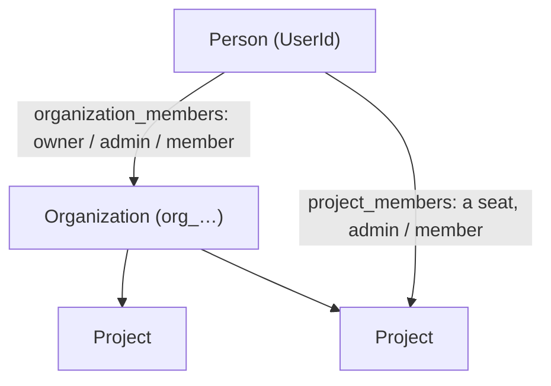

# Tenancy and access

Every row belongs to one of three things: an organization, a project inside it, or a person. Access is decided in three layers, and each layer assumes the others might fail:

1. **Auth decides the role.** It reads the person's role from two roster tables and hands it to whoever asks, as an `Acting`.
2. **The matrix decides what the role may do.** That is `can` in `crates/shared/src/rbac.rs`, one function for every module.
3. **Postgres holds every query to one tenant.** Each transaction binds its tenant, and forced row-level security admits only that tenant's rows. Some queries also name their tenant in their own `WHERE`: the export, and the agent's search. Most rely on RLS alone. See [When everything connects as a superuser](#when-everything-connects-as-a-superuser) for what that means without RLS.

## Contents

- [The model](#the-model)
- [Roles](#roles)
- [The matrix](#the-matrix)
- [Who is acting](#who-is-acting)
- [Scopes: binding the tenant to the transaction](#scopes-binding-the-tenant-to-the-transaction)
- [Row-level security](#row-level-security)
- [Maintenance lanes](#maintenance-lanes)
- [Database roles](#database-roles)
- [When everything connects as a superuser](#when-everything-connects-as-a-superuser)
- [Transfers](#transfers)
- [Shard keys](#shard-keys)
- [How isolation is tested](#how-isolation-is-tested)
- [Where it lives](#where-it-lives)

## The model



**Ids and Slugs:**
- **Ids are newtypes that cannot be mixed up** (`crates/shared/src/types/tenant_id.rs`):
  - `OrganizationId` must start with `org_`, and a `UserId` must not.
  - A minted id is a prefix plus random base62 characters.
  - Each id type is its own type, so a project id cannot be passed where an organization id is expected.
- **Slugs spell the console's paths, and nothing else.** An organization and a project each carry one (`crates/shared/src/slug.rs`):
  - Auth derives it from the row's name, and derives it again when the name changes. It is never the row's identity.
  - An organization's is unique across every organization; a project's is unique within its organization. The database holds both.
  - Every lane, header and foreign key names a row by id. Only `/me` takes a slug, as the organization the console asks to act in.
  - `/me` answers each organization's slug beside its id, and `/v1/organization` answers the one a key belongs to. The CLI reads it there, and takes a slug wherever it takes an id, but resolves it itself: what it sends is the id.
  - See [the console's paths](console.md#paths-and-slugs).

**Nobody creates an organization.**
- A person's first organization is provisioned the first time `/me` finds them in none (`provision_first_organization`, `crates/auth/src/handler/me.rs`). It writes the organization, its owner row, a first project, and their audit rows.
  - Provisioning is gated by the global `Signup` flag. With the flag off, the person gets an answer with no organization, not an error.
  - It takes the person's lock and checks again, so two first page loads at once provision only one organization.
- There is no route that creates an organization. The only place `insert_owner` runs is provisioning.

**Invitations are the only way a person joins another organization on their own.** The one other way onto a roster is a project transfer: it enrolls the project's seat holders on the destination organization's roster (see [Transfers](#transfers)).
- An organization invitation never grants `owner`.
- Accepting a project invitation also puts the person on the organization's roster as `member`.
- Accepting inserts a role and never rewrites one, so an owner cannot demote themselves by accepting an invitation.
- Accepting runs in auth's maintenance lane, because no tenant key names the invitee yet. It requires a verified email that matches the invitation.

**What lives where:**

| Level | Rows |
|---|---|
| Organization | `auth.organizations`, `organization_members`, `organization_invites`, `organization_flags`; the audit chain `audit.events` (with an optional `in_project`); the organization's own feed (`project_id IS NULL`); the agent's conversations and erasure fences |
| Project | `auth.projects`, `project_members`, `member_invites`, `api_tokens`; notifications' connections, deliveries and attempts; the project's feed |
| Person | identities, accounts, sessions, credentials, tokens and confirmation codes |

## Roles

The roster tables are the only source of truth for who holds what. There is no separate relation-tuple store.

- **`auth.organization_members`** holds `owner`, `admin` or `member`.
  - A partial unique index allows only one owner.
  - An admin's row also holds a pending ownership offer, if there is one.
- **`auth.project_members`** holds a project **seat**, either `admin` or `member`. `Owner` is never granted on a project directly. An admin's seat also holds a pending project-transfer offer, if there is one.

A person's role on a project combines the two (`project_role`, `crates/shared/src/rbac.rs`):

| Organization role | Seat | Project role |
|---|---|---|
| owner | any | Owner |
| admin | any | Admin |
| member, or none | a seat | the seat |
| member, or none | none | no access |

**The organization role is a floor that a seat cannot lower.** Nothing flows the other way: no seat grants anything on the organization.

Rules about the organization itself are methods on `OrganizationRole`, not `can` (`crates/shared/src/types/organization_role.rs`):
- Owners and admins may create projects, manage settings and members, read the rolled-up audit log and export.
- Only the owner may delete projects.

## The matrix

`can(role, verb, resource)` is the one permission matrix:
- Verbs are Read, Create, Update and Delete.
- Resources are Project, Member, Token, Connector and Audit.

| Role | May |
|---|---|
| Owner | everything |
| Admin | everything except delete a project |
| Member | read, except the audit log |

- ⚠ **Nobody may write the audit log through the matrix.** Create, Update and Delete on Audit are refused for every role. The chain is written only by `emit_audit` and is hash-linked; a role that could edit it would make it a record of whatever somebody was willing to leave behind.
- ⚠ **Auth's refusals name the role that would lift them.** Auth's `authorize` helper answers `InsufficientRole` with `minimum_role`, which is found by searching `can`, so the two can never disagree. Refusals once always named Owner, which no project grants. Other refusals name only the role held, not the role needed:
  - `Acting::require_project`, which notifications and the agent use;
  - auth's token and audit-log gates.
- **Every cell is pinned** in `crates/auth/tests/rbac_matrix.rs`.
- A product built on this platform adds its resources here together with their handlers, never before, or the matrix grants a capability no endpoint exposes.

## Who is acting

`Acting` (`crates/shared/src/acting.rs`) is auth's answer to "who is this, and what may they do here". Its fields:
- `user_id`
- `organization_id`
- `organization_role`
- `project`, with its id and role
- `session_id`
- `expires_at`

Auth builds it in `seam::Auth::resolve` (`crates/auth/src/seam.rs`):

1. The bearer is resolved in auth's maintenance lane. No tenant is known yet. See [identity](identity.md).
2. The request must name an organization (`x-organization-id`), or it gets a 400.
3. If the request names a project (`x-project-id`), the organization is read **from the project's row**, never from the header. A project that moved organizations is found where it now lives.
4. Both roles are read fresh from the rosters on every call, so an ownership transfer or a removal holds from the next request.

`resolve_again` re-reads the roles, the session and the project's home for an `Acting` already held, without the bearer. Long-running work uses it, such as an agent turn (see [the agent](agent.md#who-is-asking-read-again)).

**Guards.** The sibling modules check access with:
- `require_project(verb, resource)`
- `require_organization_admin`
- `project_or_bad_request`

Auth's own handlers use their own helpers in `crates/auth/src/handler/mod.rs`:
- `acting_organization`, which is the one spelling of "not a member here" and also refuses an organization that is being deleted;
- `acting_project`;
- `enter_owner_scope`;
- `acting_person_in`.

## Scopes: binding the tenant to the transaction

`crates/shared/src/db/tenant_session.rs` is the mechanism every module uses.

**Three keys, three GUCs:**
- `app.organization_id`
- `app.project_id`
- `app.user_id` (the person)

Rules for the GUCs:
- They are set with `set_config(…, true)`, which is transaction-local. `SET LOCAL` takes no bind parameters, and formatting an id into SQL text is an injection vector.
- **An unset or empty GUC matches nothing**, so a transaction that binds nothing reads and writes zero rows.
- A binding is cleared to the empty string, never `RESET`. On a pooled connection, `RESET` restores whatever an earlier transaction left behind.
- There is **no wildcard value**. Work that spans tenants goes through a maintenance lane, which is a different database role, never a magic string a handler could bind.

**The binding is part of the transaction's type.** `Scoped<B>` carries what is bound as a type parameter, and query functions say which binding they need, through `HasOrganization`, `HasProject`, `HasPerson` and module traits like `RosterRead` or `EmitBinding`. A roster read under a project binding, or a sweep outside its lane, is then a compile error rather than an empty result.

| Binding | GUCs bound | Entered by | Used for, for example |
|---|---|---|---|
| `Organization` | organization | `organization_scope` | organization lanes |
| `Project` | project | `project_scope` | the feed, emitting notices |
| `Person` | person | `person_scope` | `/me`, a person's own rows |
| `ProjectAndPerson` | project, person | `project_and_person_scope` | `acting_project`'s one read |
| `PersonAndOrganization` | person, organization | `bind_organization` on a person scope | provisioning, export, the agent's conversations |
| `ProjectAndOrganization` | project, organization | `bind_organization` on a project scope | `enter_owner_scope` |
| `PersonOrganizationProject` | all three | `bind_project` on a person-and-organization scope | the agent's search, the export walk |
| `Maintenance<L>` | none: a role switch | `maintenance_scope` | lanes, below |

⚠ **Bindings change only through transitions that consume the transaction.** The policies are permissive and OR together, so a binding left behind would quietly widen every later read. The type makes the caller say when a binding is added or cleared. `Binding` is sealed: a new combination means writing a new policy.

There are ways around the types, and they are known:
- `Scoped` dereferences to a plain connection.
- `emit_audit` binds the organization itself whenever `app.organization_id` is empty, as it is in a project-scoped transaction, and clears it again after the insert.
- Any role can call `set_config`.

So the real floor is that **no request value is ever spliced into SQL text**. `crates/shared/tests/sql_is_parameterised.rs` checks for that.

## Row-level security

Every tenant table has RLS **enabled and forced** (`FORCE ROW LEVEL SECURITY`). The exception is `auth.feature_flags`, which has no tenant column. `FORCE` applies the policies to the table's owner too, unless the owner has `BYPASSRLS`. The owner here is `migrator`, which does have it, so operators can write flags as the owner (`make flag`).

The policy kinds, which are permissive and OR together:

| Policy | Admits |
|---|---|
| `tenant_isolation` | Rows of the bound organization or project, by the table's tenant key |
| `organization_level` | The organization's own rows: `project_id IS NULL` and the bound organization. ⚠ The `IS NULL` is load-bearing; without it, an organization scope reaches every project's rows. |
| `person_isolation` | A person's own rows: identities, sessions, credentials, codes |
| `member_read`, `project_self_read` | A person's own roster rows; a project row read by itself |
| Cross-entity reads (`auth_initial.sql`) | Reads across a relationship, beyond the bound tenant:<ul><li>`organization_member_read`: an organization scope reads the identities (address, names) of everyone on its roster.</li><li>`member_read` and `project_read` on `auth.organizations`: a person or a project binding sees its organization's row.</li><li>`project_member_read` on `auth.projects`: a binding that includes a person sees projects in other organizations where that person holds a seat.</li></ul> |
| `maintenance_access` | Everything, to its module's lane role, checked with `current_user = '<lane>'` |
| organization read and enqueue | On notifications' connections and deliveries: the organization's view across its projects |

`tenant_isolation`, `organization_level` and `maintenance_access` each carry a `WITH CHECK` as well as a `USING`, so a write is held to the same tenant as a read. The roster and self-read policies admit reads only.

The agent's tables add policies of their own. A past exchange belongs to its author, and the organization is compared as well as the project, because a transferred project keeps its id. See [the agent's storage](agent.md#storage).

⚠ **Permissive policies add up.** A binding admits everything any policy admits, the cross-entity reads included. An export that trusted RLS alone once listed the caller's projects in other organizations, through `project_member_read`. It then wrote those organizations' rosters, pending invitation addresses and API-key metadata into this one's file. That is why the export names its tenant in its own `WHERE`.

⚠ **Audit partitions carry their own policies.** A query that names a partition child directly skips the parent's policies. So each child is hardened:
- the audit migration hardens the first months;
- `telmoni rotate` hardens each month it creates, with SQL that `crates/shared/src/db/retention.rs` builds.

Grants stay on the parent only.

## Maintenance lanes

Some work has no single tenant:
- resolving a bearer before the person is known;
- listing a person's organizations;
- looking up and accepting invitations;
- accepting a project transfer, which writes across two tenants;
- the sweeps, the indexer and the delivery loop;
- auth's seam reads.

That work runs in a **maintenance lane**:

```sql
SET LOCAL ROLE auth_maintenance;   -- notifications_maintenance, agent_maintenance
```

The rules:

- **One lane per module, never a shared one.** A single lane role once held privileges in every schema, so a flaw in any module could `SET ROLE` into it and read its siblings' tables across every tenant.
- **Lane roles are `NOLOGIN`.** Each is granted only to its own module's login role, with `INHERIT FALSE, SET TRUE`. The login role gains nothing until it switches.
- **The policy checks `current_user`**, so being a member of the lane role is not enough to read through it.
- **Lane grants are narrow, table by table, and written in each module's migration.** For example, `auth_maintenance` cannot read credentials or confirmation codes. The agent's lane holds only the agent schema; it reads its sources through the seams, in their own modules' lanes.
- The switch is transaction-local, and the role reverts at commit or rollback.

Each module declares its own lane marker (`AuthLane`, `NotificationsLane`, `AgentLane`). The wall between lanes is role membership in the database, not the marker type.

## Database roles

`crates/migrator/sql/role_hardening.sql` is run once by a superuser. Then the migrator applies `object_grants.sql` after every migration.

| Role | Kind | Holds |
|---|---|---|
| `migrator` | login, `BYPASSRLS` | Owns every schema and table, and runs the DDL. Longer session timeouts. |
| `auth`, `notifications`, `agent` | login, `NOSUPERUSER NOCREATEROLE NOCREATEDB NOBYPASSRLS` | Data access on its own schema only. Short statement, lock and idle-in-transaction timeouts, and its own `search_path`. |
| `auth_maintenance`, `notifications_maintenance`, `agent_maintenance` | `NOLOGIN` | The lane grants above |
| `PUBLIC` | — | No `CREATE` on `public`, no `TEMPORARY` |

Grants worth knowing:

- **No module holds a grant on a sibling's tables.** It asks through the seams ([server](server.md#seams)).
- `auth` and `notifications` may read and append to `audit.events`. The agent has no audit grant at all.
- `auth` cannot write either flag table. Operators write flags as the owner (`make flag`).
- `notifications.delivery_attempts` and `agent.erasures` are written only in their lanes.
- If any login role in `GRANTEE_ROLES` is missing, the object grants are skipped with a warning (`crates/migrator/src/lib.rs`). That is a single-role deployment.

⚠ **Why one role per module, when there is one process.** It keeps RLS and the grants standing inside one process exactly as they did across separate services. A bug in one module cannot read another module's tables, because its pool connects as a role that has no grant on them.

⚠ **The short role timeouts are part of the design.**
- Request paths rely on a lock wait giving up in seconds rather than queueing.
- The idle-in-transaction cut-off frees the locks of a leaked transaction, including a sweep leader's lock (see [background work](background.md#leadership)).
- Code that needs longer sets it per transaction and says why, as the agent's erasure scrub does.

**Locally**, the dev `docker-compose.yml` runs `dev_roles.sql` and the hardening when the volume is first created, so RLS is on in development too. `.env.example` gives each module its own DSN.

## When everything connects as a superuser

The self-host Docker Compose quickstart (`deploy/compose/`) connects every module as the database superuser. Then:

- **RLS is skipped.** A superuser bypasses even forced policies.
- **The object grants are skipped**, because the login roles do not exist.
- **The role timeouts do not apply.**

**What still keeps tenants apart there:**
- **Some queries name their tenant in their own `WHERE`**, and those still hold. The export and the agent's search do, and say so in their comments.
- **Handlers check membership and role** before they act. A person can only act through a tenant they belong to.
- **Composite foreign keys tie the tenant columns together**, for example `api_tokens` to (organization, project), deliveries to their connection, and messages to their conversation.
- **`CHECK` constraints** pin which keys a row may carry.
- **A lane still switches to its lane role**, which is not a superuser, so the lane's grants and `maintenance_access` still hold for lane work.

⚠ **Queries that select by id alone are not held to the tenant there.** For example, notifications' `sealed_connection` reads a connection `WHERE id = $1` and trusts the scope to admit only the caller's own. Without RLS, a person who holds another tenant's connection id could act on that connection through such a lane. Under the hardened roles, RLS refuses it.

## Transfers

**Ownership transfer** (`crates/auth/src/handler/ownership.rs`):
1. The owner offers ownership to an admin. There is one live offer, stored on the admin's roster row, and it expires.
2. Accepting takes the person's lock, then the organization's, and reads every role again under them.
3. Two statements in one transaction:
   - the first demotes the owner;
   - the second promotes the holder of the offer, checking again that the offer, the admin role and the organization's status still stand. If that check fails, the demotion rolls back.

   It takes two statements because a partial unique index cannot be deferred.
4. The new owner's project seats are folded into the ownership. Keys, projects and the organization's name do not move.

The other modules see the change on their next `resolve`, which reads the rosters fresh.

**Project transfer** (`crates/auth/src/handler/project_transfer.rs`):
1. The organization's owner offers a project to a person holding an admin seat on that project. The offer is stored on the seat. An organization admin with no seat on the project cannot receive one. The person accepting must own the destination organization.
2. Accepting runs in auth's lane, because it writes across two tenants. Locks are taken in a fixed order: the caller, then both organizations in id order.
3. **One cross-tenant `UPDATE` moves the project row** (`crates/auth/src/db/projects.rs`). API tokens follow by `ON UPDATE CASCADE`.
4. Seats and invitations stay on the project. The previous owner keeps an admin seat on it. Every seat holder is enrolled on the destination's roster, because a seat in an organization a person is not on is one the console could never open.
5. Audit rows are written on both organizations' chains.

What the other modules learn:
- **Notifications** purges the project's connectors and feed **before** auth commits, inside a time budget, so a failed purge moves nothing.
- **The agent is not called.** It finds projects that left on its own, hourly. Until then its policies keep the old organization's rows from reaching the new one. See [the agent](agent.md#retention).

## Shard keys

Most tables carry a `shard_key`. Most of auth's tables and the audit log index it; notifications' and the agent's tables do not. `derive_shard_key` (`crates/shared/src/sharding.rs`) makes it a deterministic UUIDv5 of an id.
- ⚠ The namespace must never change, or every tenant would route to a different shard on the day the data is split.
- **Nothing reads it today.** It exists so the data can be split by tenant later without rewriting every row.
- The subject is not yet uniform:
  - project rows derive it from the project;
  - API tokens, the feed, connections and audit derive it from the organization;
  - a person's rows (identities, sessions, credentials, tokens, codes) derive it from the person;
  - the agent's tables keep the random default, and its cursors and erasures have no shard key at all.

## How isolation is tested

| Suite | What it pins |
|---|---|
| `crates/shared/tests/tenancy_boundary.rs` | A catalog sweep: every tenant table has RLS forced, `tenant_isolation` with `USING` and `WITH CHECK`, a `maintenance_access`, and a GUC that matches a column it compares. Tables keyed on both a person and a tenant must be declared with a reason. A probe role cannot read another tenant's row by exact id. |
| `crates/shared/tests/rls_enforcement.rs` | Behaviour as non-bypass probe roles: fail-closed GUCs, `WITH CHECK` refusals, lanes spanning tenants but not sibling schemas, membership not widening a scope |
| `crates/shared/tests/db_roles.rs` | The privilege matrix, read from the catalog's grants |
| `crates/shared/tests/rls_harness.rs` | That every handler suite's pool is neither a superuser nor `BYPASSRLS` |
| `crates/auth/tests/rbac_matrix.rs` | Every cell of `can` |
| `crates/agent/tests/scope.rs`, `crates/auth/tests/authorize_lane.rs`, the transfer suites | Isolation at each module's own boundary |

Every handler suite runs with RLS on, so no test exercises the superuser path the compose quickstart takes. There, only the queries that name their own tenant hold tenants apart, and no test checks which those are.

## Where it lives

| Concern | File |
|---|---|
| Ids | `crates/shared/src/types/tenant_id.rs` |
| Roles and the matrix | `crates/shared/src/rbac.rs`, `crates/shared/src/types/{role,organization_role}.rs` |
| `Acting` and its guards | `crates/shared/src/acting.rs` |
| Resolving a request | `crates/auth/src/seam.rs` |
| Scopes, bindings, lanes | `crates/shared/src/db/tenant_session.rs` |
| Rosters | `crates/auth/src/db/{organization_members,members}.rs` |
| First organization | `crates/auth/src/handler/me.rs` |
| Invitations | `crates/auth/src/handler/{invite,organization_members}.rs` |
| Transfers | `crates/auth/src/handler/{ownership,project_transfer}.rs` |
| Policies | each module's `migrations/*_initial.sql`; `crates/migrator/migrations/*_audit_initial.sql` |
| Roles and grants | `crates/migrator/sql/{role_hardening,object_grants,dev_roles}.sql`, `crates/migrator/src/lib.rs` |
| Shard keys | `crates/shared/src/sharding.rs` |
