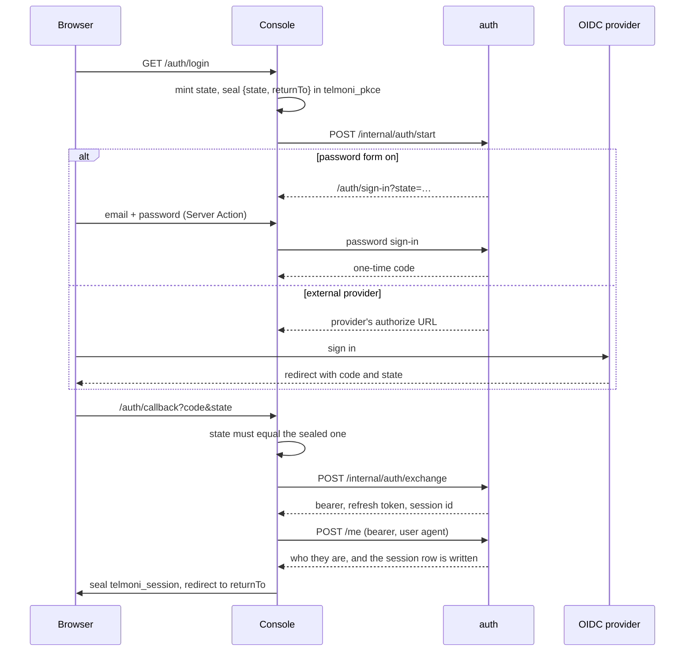

# Identity and sessions

Auth is the only issuer. A person can prove who they are in four ways:
- a password;
- an OpenID Connect provider;
- a device they approved from the console;
- the test door.

Whichever way it was, auth mints the same opaque tokens and stores only their hashes. The console holds those tokens in a sealed cookie and relays the bearer on each request. Auth looks the bearer up every time, so a session that ends is refused from the next request on.

## Contents

- [One issuer](#one-issuer)
- [Signing in](#signing-in)
- [Linking a person to a provider](#linking-a-person-to-a-provider)
- [Gates](#gates)
- [Sessions](#sessions)
- [The console's side](#the-consoles-side)
- [Resolving a request](#resolving-a-request)
- [API tokens](#api-tokens)
- [The CLI](#the-cli)
- [The test door](#the-test-door)
- [Abuse limits](#abuse-limits)
- [Mail](#mail)
- [Secrets and hashing](#secrets-and-hashing)
- [Where it lives](#where-it-lives)

## One issuer

`crates/auth/src/issuer.rs` mints every token, whichever way the person signed in. An external provider only answers "who is this". It never issues the session. This is why the password form and an OIDC provider can sit side by side in one deployment: the console's session, the refresh, the Sessions page, the sign-out and the CLI's grant are the same for both.

⚠ **Every token is an opaque secret stored as its hash. Nothing is signed.**
- **There is no signing key**, so there is none to hold, rotate or leak.
- **Ending a session deletes its tokens.**
- **A signature would buy nothing.** Every person request reads the session anyway, to refuse a revoked one.

The tokens:

| Token | Stored in | Lifetime |
|---|---|---|
| Bearer | `auth.access_tokens` | `BEARER_TTL_SECS`, short, because revocation is checked on every request anyway; the lifetime only bounds a copied bearer |
| Refresh token | `auth.refresh_tokens` | `REFRESH_TTL_DAYS`, the same as the console's cookie. Rotated on every use. |
| One-time sign-in code | `auth.authorization_codes` | `CODE_TTL_SECS`, one redirect |
| Device codes | `auth.device_codes` | `DEVICE_TTL_SECS` |

## Signing in

**Start.**
- `/auth/login` (and `/auth/signup`) mint a random `state` and seal `{state, returnTo}` into the short-lived `telmoni_pkce` cookie. Then they ask auth to start.
- Auth answers with one of two places:
  - the console's own sign-in page, while the password form is on;
  - the provider's authorize URL, when the form is off or the person chose the provider.

**The password form** (`crates/auth/src/password/mod.rs`):
1. The sign-in page requires the cookie's state to equal the query's.
2. The checks run in this order:
   1. An unknown address burns a decoy Argon2 check, so a wrong guess takes as long either way. It answers 401. (Two other answers do reveal that an address has an account: a locked account's 429, and sign-up's 409 for an address already taken. See [Abuse limits](#abuse-limits).)
   2. A locked account is refused before its hash is checked.
   3. A wrong password counts a failure toward the lockout.
   4. After a right password:
      - an account whose deletion is pending is refused;
      - with `VERIFY_EMAIL` on, an unverified address is refused and a new link is sent;
      - otherwise a one-time code is minted.
3. The browser carries the code to `/auth/callback`. The exchange spends it with `DELETE … RETURNING`, so it is used once.

**OpenID Connect** (`crates/auth/src/oidc/`, `crates/shared/src/oidc/`):
- **A confidential client.** The provider's endpoints are discovered on first use and held for the life of the process. A failed discovery is not cached. A discovery document naming a different issuer is refused.
- **The authorization request** asks for `openid profile email` and carries `state`. It adds `prompt=create` for a sign-up and a `login_hint` when there is one. It sends no `nonce` and no PKCE challenge.
- **The token request** uses `client_secret_basic`, or `client_secret_post` when the provider offers only that.
- **The person is read only from the id token, verified first:**
  - RS256 only, with a `kid`;
  - `iss` must match;
  - `aud` must name this client. A token minted for another client of the same provider verifies under the same keys.
  - `exp` and `nbf` are checked, with leeway;
  - `sub` must not be empty.
- **The key set** is cached, and refetched at most once per interval, so forged `kid`s cannot turn auth into a request generator. No lock is held across the network.
- **Sign-out** is RP-initiated, with `id_token_hint`.

**The exchange** (`POST /internal/auth/exchange`).
- An in-memory `ExchangeCache` answers a repeat of the same code for a short while. A double-click or a retried callback cannot spend a code twice and fail the person's sign-in.
- The console's callback then:
  - with `VERIFY_EMAIL` on, refuses an address the provider marks unverified. With it off (the default), auth reports every provider address as verified, including one linked by address alone;
  - calls `/me` with the new bearer and the user agent, which writes the session row;
  - seals the session cookie.

**The first admin.** `ADMIN_EMAIL` and `ADMIN_PASSWORD`, both or neither, seed a verified password account at boot if no identity holds that address yet. Later boots leave it alone. Like everyone else, the admin gets their first organization at their first `/me` (see [tenancy](tenancy.md#the-model)).

## Linking a person to a provider

`crates/auth/src/external.rs`.

**Identity rows.**
- An external identity is keyed by `(provider, subject)` in `auth.external_identities`. The provider is the issuer URL; the subject is `sub`.
- A person has at most one identity per provider.

**On each external sign-in:**
1. **Already linked:** the identity is updated with what the provider just asserted.
2. **An account here already holds the address:** it is linked only under `OIDC_ALLOW_INSECURE_EMAIL_LOOKUP`. Otherwise the answer is 409. The setting trusts the provider to have proved the address. It is off by default. A deployment turns it on to move its password accounts onto a provider.
3. **Otherwise a new person is created**, if `OIDC_ALLOW_SIGN_UP` allows it. Otherwise the answer is 403.

Concurrent first sign-ins are settled by the unique keys.

**Addresses are not unique across identities.**
- `auth.identities.email` deliberately has no unique index. Making it unique once locked out a person whose address changed at the provider before they signed in again.
- The password table's address is unique.

**`AccountHolder`** (`crates/auth/src/holder.rs`) sends password resets, email changes and erasure to whoever holds the account: the password row if there is one, otherwise the linked provider.

## Gates

| Setting | Effect |
|---|---|
| `DISABLE_LOGIN_FORM` (default off) | Removes the password provider and unmounts its lanes. Boot refuses it without an external provider, or with an admin seed set. |
| `ALLOW_SIGN_UP` (default off) | Off: a **password** sign-up works only for an address that holds a live invitation. It does not gate provider sign-ups. |
| `VERIFY_EMAIL` (default off) | On: sign-up mails a verification link, and `/me` refuses unverified people. Off: an address is taken at its word for signing in, from a password sign-up or a provider alike; `auth.identities.email_verified` still records only what was proved, so an invitation to an unproved address is accepted from its link alone, never from the console. |
| `OIDC_ALLOW_SIGN_UP` (default **on**) | Whether an unknown provider identity may create a person. ⚠ Adding a provider to an invitation-only deployment lets in anyone that provider can sign in, unless this is turned off. |
| `OIDC_ALLOW_INSECURE_EMAIL_LOOKUP` (default off) | Whether a provider identity may link to an existing account by address alone |
| the global `Signup` flag | Whether a person with no organization gets one provisioned at their first `/me`, and whether anyone may create one on request (`POST /internal/organizations`): off, the switcher offers no **New organization**, and the lane refuses |

**Boot refuses:**
- an OIDC issuer without its client id and secret, or one that is not `https` on a deployed tier;
- a half-set admin seed;
- `ALLOW_TEST_SESSION` on a deployed tier;
- plaintext SMTP on a deployed tier.

The console refuses to start in production without its required variables, or with a short `AUTH_SECRET` or a non-`https` `AUTH_URL` (`web/lib/env.ts`, `web/instrumentation.ts`).

## Sessions

A sign-in mints a session id (`sid`). Every grant on that sid writes a bearer and a refresh token, both stored only as hashes.

**Refresh rotates** (`crates/auth/src/db/refresh_tokens.rs`):
- **Each use marks the token spent** and mints a new pair on the same sid.
- **A spent token presented again within `REUSE_GRACE_SECS` mints another pair.** Two tabs, or a page and its heartbeat, refreshing at once must not sign each other out.
- **⚠ Reuse after the grace period ends the session.** It revokes every token on the sid and the session row. A refresh token presented twice that late has most likely been copied.
- **Spent tokens are kept for `SPENT_RETENTION`** so reuse can be recognized. After that, a replay is only unknown, and ends nothing.

**The session row** (`auth.sessions`) is what the Sessions page lists.
- It is written by the first `/me` for the sid. The user agent is stored with a length cap.
- A refresh updates `last_seen_at` when the console names the row. It refuses before spending the token if the row is revoked.
- Revoked rows are pruned later by the retention sweep.

**Revocation takes effect on the next request.** One statement resolves a bearer's hash and refuses it if its session is revoked or its person has asked to be deleted (`crates/auth/src/db/access_tokens.rs`). Even if deleting the tokens failed, the bearer is still refused.

**What ends sessions:**

| Act | Ends |
|---|---|
| Sign-out (`/internal/auth/logout`) | That session: the row is revoked and its tokens are deleted |
| Revoking from the Sessions page | That session, audited |
| A password reset | Every session, and every token and code the person holds |
| A confirmed email change | Every session |
| An account deletion | Every session |

There is no lane that signs a person out of every session but the current one.

## The console's side

**Cookies** (`web/lib/auth/session.ts`), each sealed with `AUTH_SECRET` by iron-session:

| Cookie | Holds | Lives |
|---|---|---|
| `telmoni_session` | The person's id, address and names; the bearer, the refresh token, the sid, the session row's id, the expiry, the provider's id token, the sign-in method | `SESSION_TTL_SECONDS`. `httpOnly`, `SameSite=Lax`, `secure` in production. |
| `telmoni_pkce` | The sign-in's `state`, where to return, and the chosen provider | One sign-in |
| `telmoni_connect` | A connector handshake's `state`, organization, project and vendor, each by id | One handshake |
| `telmoni-organization` | Plain, not sealed, and not `httpOnly`: the id of the organization of the last page on screen, for the paths that name none. ⚠ The browser writes it, never the proxy; one Server Action sets it for an organization no page has shown yet, an invitation's accept. | It claims nothing. Auth honours it only for a member. See [the console's paths](console.md#paths-and-slugs). |

Rotating `AUTH_SECRET` voids every console session.

**Who checks what:**
- **`proxy.ts`** checks only that the cookie unseals and names a person. It does not check expiry, refresh or the blacklist (see [the console](console.md#proxyts)).
- **`getSession`** (`web/lib/auth/session.ts`) does those. Pages reach it through `getServerSession`, which caches it per request; route handlers call it directly.
  - it unseals the cookie;
  - it checks the session blacklist;
  - it refreshes when the bearer is within `REFRESH_THRESHOLD_MS` of expiring.
- **A Server Component cannot write a cookie**, so a refresh there spends the cookie's refresh token without replacing it, and marks the session `needsReseal`.
- **`SessionHeartbeat`**, a client leaf, then posts `/api/auth/heartbeat` at once, which refreshes again and re-seals the cookie. Otherwise the heartbeat runs just before expiry.
- ⚠ **The reuse grace is what makes that double refresh safe, and only within it.** If the heartbeat's immediate post fails, or the tab closes first, the cookie keeps a token already spent. Its next use, past `REUSE_GRACE_SECS`, reads as reuse and ends the session.
- **A failed refresh deletes the cookie.**

**Relaying identity** (`web/lib/server/entities/identity-context.ts`). A person's request to the server carries:
- `Authorization: Bearer <opaque token>`;
- `x-service-secret`;
- `x-organization-id`, and `x-project-id` when it is about a project;
- a fresh `x-request-id`.

⚠ **No role or identity claim travels.** The token names the person, and auth works out the role itself, on every request. Lanes that run before sign-in send the service secret alone.

**Signing out** (`/auth/logout`). A cross-site GET is refused.
1. The session is added to the blacklist, a Redis key with a TTL. A message on the session's channel closes its open event streams at once.
2. The console asks auth for the provider's logout URL.
3. It always calls auth's logout.
4. It clears the cookies.

## Resolving a request

**In auth's own lanes:**
1. `require_service_secret` runs first.
2. `require_person_token` (`crates/auth/src/person.rs`) parses the bearer.
   - A `telmoni_` API token is refused here before any lookup.
   - Otherwise the token's hash is looked up in auth's maintenance lane. No tenant is known yet.
   - An unknown, expired or revoked token answers 401.
3. The result is a `Principal` (person, session, expiry), carried as a request extension. **Handlers never read who is asking from a header.** Headers name only what is acted on.
4. Membership and role are read inside the handler's own transaction (see [tenancy](tenancy.md#who-is-acting)).

**In the other modules,** `seam::Auth::resolve` does the same from the request's headers and answers an `Acting`. `resolve_again`, without the bearer:
- checks that the session is still live and the person has not asked to be deleted;
- reads their roles again;
- answers the project's organization as it is now.

It does not compare that organization with the one before. A caller that must not follow a moved project refuses the move itself, as the agent does.

Nothing about identity is cached between requests in the server. The only caches in this area are:
- the exchange cache;
- OIDC discovery;
- the key set;
- the decoy password hash.

## API tokens

API tokens are for the public `/v1` API (`crates/auth/src/handler/tokens.rs`, `crates/auth/src/handler/v1.rs`).

- **Format and storage.** `telmoni_` followed by a random secret, stored as its SHA-256. The plaintext is shown once.
- **Scope.**
  - Minted on a project: each row carries its organization and project, with a composite foreign key that follows a project transfer (`ON UPDATE CASCADE`).
  - Admins and the owner create, rotate and revoke tokens; members list them.
- **Expiry.**
  - `DEFAULT_TTL_DAYS` unless the creator chooses otherwise. "Never" is allowed.
  - Capped at `MAX_DURATION_SECS`.
- **Rotation.**
  - The old token stays valid for a grace period (`DEFAULT_ROTATE_GRACE_SECS`, or none for an emergency), beside a freshly minted replacement.
  - Revoking ends a grace at once.
  - Revoked and expired rows are deleted later by retention.
- **Validation on `/v1`.**
  - The service secret first, then `require_token`.
  - The token must be live, and its organization must be active. While an organization is pending deletion its keys stop working, and they go with it when it is erased. An account deletion revokes the keys of the organizations it takes.
  - The `PublicApi` flag must be on for the token's organization: its own row, else the global one.
  - `last_used_at` is updated at most once an interval.
- **`/v1` resolves the organization and reads at the project.** A token names its organization and the project it was minted on. `GET /v1/members` answers that project's roster — what every member of the project sees in the console — and never the organization's, which a project admin's seat is refused there; a key reads no further than whoever minted it could.
  - `GET /v1/organization` answers its id, its slug, its name and its owner, all from the validation's own join. The slug is there so a script holding only a key can spell a console link. No lane takes one back: a token is its organization.

The console relays `/v1/*` (`web/app/v1/[...path]/route.ts`), passing the client's own `Authorization` header, and meters each token and each source address.

## The CLI

The CLI signs in with a device grant, modelled on RFC 8628.

**The console's `/cli` door** (`web/app/cli/[...path]/route.ts`) is ⚠ a security boundary:
- It forwards a fixed allowlist of lanes: start, poll, refresh, `/me`, and revoking one of the person's sessions. That can be any of their sessions, browser sessions included, not only the CLI's own.
- A path outside the allowlist, a revoke whose id is not a UUID included, is a `404` of the door's own type, `/errors/not-found`. Auth's `/errors/auth/not-found` on a revoke says the session is already gone, and a client reads it so.
- It refuses any request from a browser (`Sec-Fetch-Site`).
- It refuses an `x-organization-id` that is not an organization id (`400`). `/me` reads one it cannot parse as none and answers the person's own organization, which is right for the console's stale cookie and wrong for a client that named one: a slug sent by mistake would act elsewhere.
- It caps and re-encodes bodies, so only the fields in its schema cross.
- It meters each source and each bearer.
- ⚠ It answers auth refusing the service secret (`/errors/auth/service-credential-rejected`) as a `503` `/errors/upstream-unavailable`, never as the `401` itself. A `401` tells a client its own session was refused, and a client may end it on one, so a botched `SERVICE_SECRET` rotation relayed as one would tell every client at once. The CLI reads the type and keeps its session either way.

**Start.**
- Auth mints a device code (a hashed secret) and a short user code made of consonants only, shown as `XXXX-XXXX`.
- The verification URI is the console's `/auth/device` page.

**Approve.**
- The person signs in to the console if they need to, keeping the code across the sign-in.
- Approving binds the person and a fresh session id. Denying only marks the code denied.

**Poll.**

| State | Answer |
|---|---|
| Pending, or polled too fast | 202, with the status |
| Denied | 403 |
| Expired | 400 |
| Approved | The same tokens as a console sign-in, on a session of its own |

The answers differ from RFC 8628's error codes, and the polling interval never grows. "Too fast" is measured on the database's clock alone: one statement reads the last poll's stamp and writes this one's, so a skew between the server's clock and the database's neither shortens nor stretches the interval.

## The test door

`ALLOW_TEST_SESSION` mounts `POST /test/session`, behind the service secret alone. It records a verified identity from the request body and opens a real session. End-to-end tests sign in this way.

- `serve` refuses to start with it on a deployed tier.
- The console's `/api/test/session` works only outside production.
- ⚠ Outside Kubernetes the server's refusal does not fire. The setting must simply never be on outside a laptop.

## Abuse limits

**Server side.** These bind anyone holding the service secret, who would skip the console's limits:

| Limit | Where |
|---|---|
| Lockout after `LOCKOUT_AFTER` wrong passwords, for `LOCKOUT_MINUTES` | `crates/auth/src/db/credentials.rs`. Kept short, because anyone who knows an address can cause a lockout. |
| A decoy hash check for unknown addresses | `crates/auth/src/password/hashing.rs` |
| Verification and reset links per day (`LINKS_PER_DAY`) | `crates/auth/src/password/mod.rs` |
| Email-change codes per day (`EMAIL_CHANGE_DAILY_MAX`) | `crates/auth/src/handler/account.rs` |
| Six-digit codes | One live code per purpose. `MAX_ATTEMPTS` wrong guesses **burn** the code rather than lock the account, so it can't be aimed at somebody else. The failure count is committed before the refusal. |
| "Forgot password" | Mails from a spawned task and always answers 202, so the answer does not reveal whether the address exists |
| What still reveals an address | Sign-up answers 409 for an address that already has an account, before the closed-sign-ups check. A locked account answers 429, which the console words differently from a wrong password. |

**Console side** (`web/lib/api/rate-limit.ts`):
- A Redis sliding window, on Redis's own clock, for each source address and each person, on every sign-in step.
- It falls back to a per-instance limiter while Redis is unavailable, and logs that it has (see [the console](console.md#redis)).

## Mail

`MailSender` (`crates/shared/src/mail.rs`) is the transport trait. A deployment's binary can replace it.
- **`SmtpSender`** (`crates/auth/src/smtp.rs`) uses lettre with pooled connections and a timeout per step. It is built at boot but connects only when it sends.
- **`NoopSender`** only logs, and is used when `SMTP_URL` is unset.
- ⚠ **A mail error carries the server's reply code, never its text**, which can echo the recipient's address.

`ComposingMailer` (`crates/auth/src/mailer.rs`) writes plain-text mail:
- verification and reset links;
- email-change and deletion codes;
- invitations;
- transfer notices.

The verify page spends nothing when it loads, so mail scanners that open links cannot use them up.

## Secrets and hashing

| Secret | Held as |
|---|---|
| `SERVICE_SECRET` (and `SERVICE_SECRET_NEXT`), `OIDC_CLIENT_SECRET`, `ADMIN_PASSWORD`, `SMTP_URL`, the password lanes' request bodies | `Redacted` (see [server](server.md#logging)) |
| Codes and tokens in other request bodies (the sign-in code, refresh and device tokens, deletion and email-change codes) | Plain strings with a hand-written masked `Debug` |
| Passwords | Argon2id, with length bounds and no composition rules |
| Bearers, refresh tokens, one-time and device codes, link tokens, API tokens | SHA-256. These are high-entropy random secrets, so a fast hash suffices. Six-digit codes rely on their short lifetime and the burn after a few guesses. |
| `AUTH_SECRET` (console) | Read through `web/lib/env.ts`, a `server-only` module, and directly by `proxy.ts`. It seals cookies and keys the person channels' HMAC. |

## Where it lives

| Concern | File |
|---|---|
| Minting tokens, the device grant | `crates/auth/src/issuer.rs` |
| Password provider | `crates/auth/src/password/` |
| OIDC client, id-token verification, key set | `crates/auth/src/oidc/`, `crates/shared/src/oidc/`, `crates/shared/src/oidc.rs` |
| Linking external identities | `crates/auth/src/external.rs` |
| Who holds an account | `crates/auth/src/holder.rs` |
| Provider trait | `crates/auth/src/provider.rs` |
| Gates and boot checks | `crates/auth/src/boot.rs`, `crates/auth/src/config.rs`, `crates/auth/src/smtp.rs`, `crates/telmoni/src/lib.rs` (the test door) |
| Bearer lookup, `Principal` | `crates/auth/src/person.rs`, `crates/shared/src/person_token/` |
| Sign-in and session lanes | `crates/auth/src/handler/session.rs`, `crates/auth/src/handler/sessions.rs`, `crates/auth/src/handler/me.rs` |
| Token tables | `crates/auth/src/db/{access_tokens,refresh_tokens,sessions,authorization_codes,device_codes}.rs` |
| API tokens and `/v1` | `crates/auth/src/handler/{tokens,v1}.rs`, `crates/auth/src/db/tokens.rs` |
| Mail | `crates/shared/src/mail.rs`, `crates/auth/src/{smtp,mailer}.rs` |
| Console session, heartbeat, sign-out | `web/lib/auth/`, `web/app/api/auth/heartbeat/`, `web/app/(auth)/auth/` |
| Identity headers | `web/lib/server/entities/identity-context.ts` |
| CLI door | `web/app/cli/[...path]/route.ts` |
