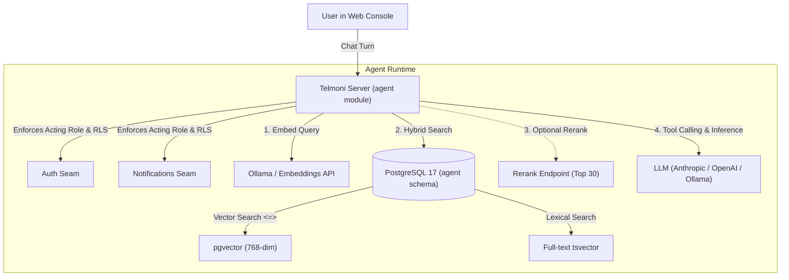

Telmoni includes an embedded AI context agent directly in the console. Asked from a project, the agent answers questions about that project, its delivery failures, its members and, where the deployment indexes it, the documentation. The sources an answer cites as `[n]` are listed under it, each linking to the documentation section or console page it came from. A self-hosted server indexes this site's documentation unless `DOCS_CORPUS_URL=off`; the hosted service runs the agent on Google's Gemini API and indexes no documentation.

In self-hosted environments, the chat model and the embeddings are configured separately, and each can run on your own hosts or at a vendor's API:
1. **Local models**: A local Ollama serves both the embeddings and the chat model, and prompts and embeddings go to it alone. The indexer reads this deployment's own documentation (the console's `/llms-full.txt`: the compose file and the chart name the console service directly) on its first run, 30 seconds after boot once the embeddings endpoint answers, and every 24 hours after, so it fetches nothing from outside unless `DOCS_CORPUS_URL` names another corpus. One thing still reaches out unless you stop it: Ollama pulls its models from the internet. On Compose, pull them before cutting the network off; the chart's embeddings pod pulls into an empty volume at every start and exits if it cannot, so on Kubernetes the model registry has to stay reachable.
2. **A hosted model**: Embeddings from Ollama, and the chat model at a vendor's API: Anthropic's (`AGENT_MODEL_PROVIDER=anthropic`), or OpenAI's or Google's Gemini API through the OpenAI protocol (`AGENT_MODEL_PROVIDER=openai`; Gemini's endpoint is `https://generativelanguage.googleapis.com/v1beta/openai`).
3. **Hosted embeddings**: `EMBEDDINGS_URL` at a vendor's OpenAI-compatible endpoint, with `EMBEDDINGS_API_KEY`, and `EMBEDDINGS_REQUEST_DIMENSIONS=true` for a model that is wider than 768 unless asked (see the [configuration reference](/docs/self-host/configuration#ai-agent--vector-search)).

---

## Agent architecture & security model



### The 5 read-only tools

The agent has access to five internal inspection tools:

| Tool Name | Scope | Description |
| :--- | :--- | :--- |
| `search` | Project | Hybrid search over documentation, audit logs, activity feeds, connector deliveries, and the asker's own earlier questions and answers in this project. Fuses `pgvector` cosine similarity and PostgreSQL `tsvector` using reciprocal rank fusion. |
| `list_members` | Project | Lists the project's members and their roles, as the project's members page shows them. |
| `list_connectors` | Project | Lists the project's Slack, Discord and webhook connectors, with their status and last error. |
| `connector_deliveries` | Project | One connector's latest deliveries, newest first, each with its send attempts: outcome, status code, duration and error. |
| `audit_events` | Project | Queries the audit log by actor, action, and time: the project's events for a role that can read its audit log, and the whole organization's for the organization's owner and admins. |

### Strict read-only isolation

- **No Mutating Capabilities**: All five tools read, and none writes: the agent has no tool that creates, updates, or deletes anything. Every result reaches the model inside `<data>` tags, which the system prompt tells it to treat as information and never as instructions.
- **Row-Level Security (RLS)**: In production (a database prepared with `role_hardening.sql`, as the [production guide](/docs/self-host/production) describes), the agent connects to PostgreSQL as the `agent` role, which that script makes `NOBYPASSRLS`, and its tables force row-level security. Each search also names the requesting user, organization, and project in its own `WHERE` clauses, which apply under the Docker Compose quickstart too, where every module connects as the database superuser and no policy binds it. The agent checks the user's role again before every tool call, and every 10 seconds while the model writes, so a role removed mid-answer applies to the next lookup, and a user signed out or removed from the project mid-answer ends the answer there: the stream ends with an error, and nothing of the answer is saved. If a user does not have permission to view audit logs, the agent's `audit_events` tool returns an access-denied error.

### What one question may use

- A question is at most 4,000 characters, and a person may ask 60 an hour (`AGENT_MESSAGES_PER_HOUR`).
- A turn has 100 seconds and up to 8 rounds of lookups. An answer cut short by either, one the model stopped writing, or one that ran out of room says so in its last lines.
- The model rereads the last 20 messages of the conversation each turn. A conversation is titled by the first 80 characters of its first question; the panel lists the 50 most recently used conversations asked from the project, and an opened one shows its last 200 messages.
- `search` returns 6 passages unless the model asks for up to 10; `connector_deliveries` 10, up to 20; `audit_events` 20, up to 50.
- Conversations are kept for 90 days after they were last used, and are visible to their author only.

### Three configurations

- **No `AGENT_DATABASE_URL`**: the server runs without the agent module.
- **`AGENT_DATABASE_URL` without `AGENT_MODEL_PROVIDER`**: the module loads and its retention sweep runs, but nothing is indexed and nobody can ask anything.
- **Both**: the indexer runs (every 60 seconds, from 30 seconds after boot) and the panel answers. `AGENT_MODEL_PROVIDER` without `AGENT_DATABASE_URL` is refused at boot.

---

## Vector dimensions & embedding models

Telmoni sizes its PostgreSQL vector columns (`agent.chunks.embedding`) for **768-dimensional embeddings**, the width `nomic-embed-text` produces.

The agent needs **pgvector 0.8 or later** in Telmoni's database: while a person can read fewer than 1,000 passages in a project and its organization, their search compares every one exactly, and past that it uses pgvector's iterative index scans; the migration stops on an older version. The Docker Compose stack runs the `pgvector/pgvector:pg17` image; on a managed database, check which version its `vector` extension offers.

<Callout type="warn">
The server checks the vector width at boot. If your embeddings endpoint answers with a width other than 768, the server refuses to start rather than write vectors that don't fit. If the endpoint isn't answering yet (Ollama still pulling the model, say), the server starts anyway, and the indexer checks the width at the endpoint's first answer and stops indexing on a mismatch.
</Callout>

---

## Embeddings endpoint handling & retry behaviour

When indexing passages from audit logs, feed notices, deliveries, and documentation, the indexer interacts with the configured embeddings endpoint as follows:

- **Batch halving**: A batch of passages that fails is split in halves and retried, down to individual passages, while the endpoint still embeds a short probe text after each failure; when it does not, the page fails.
- **Passage retries and truncation**: A passage that fails on its own is requested a second time. If it fails again, it is cut in half and retried, so a passage too long for the model is embedded from its opening.
- **Unembeddable passages**: A passage that fails at every length is left out of the index when another passage of the same page embedded, or one of the page's rows was indexed by this model before; otherwise the page fails.
- **Rate limiting**: A rate limit (429) is waited out, a minute at a time, at most twice for one request; a third counts as a failure.
- **Transient failures and backoff**: A timeout, 408, 503, or 529 on a single passage fails the page, which is retried after five minutes.
- **Documentation corpus**: Documentation search requires the documentation site to publish `llms-full.txt` (the default `DOCS_CORPUS_URL`), which the agent polls every 24 hours (or retries after one hour if a fetch fails).

---

## Deployment methods

### Option 1: Local models with Docker Compose

Run the entire agent stack (Ollama + local embeddings) on a single machine:

<Steps>

<Step>

**Start the stack with the agent profile**

```bash
docker compose -f deploy/compose/docker-compose.yml --profile agent up -d
```

</Step>

<Step>

**Pull the required models**

Pull the 768-dimensional embedding model:

```bash
docker compose -f deploy/compose/docker-compose.yml exec ollama ollama pull nomic-embed-text
```

(Optional) If running chat inference locally as well, pull a local chat model; the agent works by calling tools, so choose one that supports tool calls:

```bash
docker compose -f deploy/compose/docker-compose.yml exec ollama ollama pull llama3.2
```

</Step>

<Step>

**Configure environment variables in `deploy/compose/.env`**

```sh
# Embeddings: the compose file's defaults, shown for clarity
EMBEDDINGS_URL=http://ollama:11434/v1
EMBEDDINGS_MODEL=nomic-embed-text

# Local chat inference via Ollama
AGENT_MODEL_PROVIDER=openai
AGENT_MODEL_URL=http://ollama:11434/v1
AGENT_MODEL=llama3.2
```

</Step>

<Step>

**Recreate the server**

`restart` keeps the container's old environment, so the server is recreated to pick up `deploy/compose/.env`:

```bash
docker compose -f deploy/compose/docker-compose.yml --profile agent up -d server
```

</Step>

</Steps>

---

### Option 2: Kubernetes with the official Helm chart

When using the Telmoni Helm chart, enable the in-cluster embeddings sub-deployment:

```yaml
# values-prod.yaml
config:
  agent:
    modelProvider: "anthropic"
    model: "claude-sonnet-5"
    embeddingsModel: "nomic-embed-text"
    # When embeddingsUrl is empty and embeddings.enabled is true,
    # the chart automatically routes to http://embeddings:11434/v1

embeddings:
  enabled: true
  model: "nomic-embed-text"
  resources:
    requests:
      cpu: "1000m"
      memory: "2Gi"
    limits:
      memory: "4Gi"
```

The Helm chart deploys Ollama, whose start script pulls the `embeddings.model` before the pod reports ready, with `NetworkPolicy` objects that admit traffic on port 11434 from the `server` pods alone and let the pod reach any host on port 443 for its pull.

A hosted model also needs its key in the `server-secrets` Secret, beside `AGENT_DATABASE_URL`: the `AGENT_MODEL_API_KEY` line of the `server-secrets` command in the [Kubernetes guide](/docs/self-host/kubernetes). Without it, a server pointed at a hosted API refuses to start.

---

### Option 3: Hosted LLM with local embeddings (Hybrid)

You can run embeddings locally while a hosted model (Anthropic Claude or OpenAI) writes the answers. Search queries and the indexed text then go to Ollama alone, while each question, the conversation and every tool result, members' addresses included, go to the model's API (see [Console agent data](/docs/account/privacy#console-agent-data)). The Ollama container and the embeddings model come from Option 1—its `--profile agent` start, the `nomic-embed-text` pull and the recreate—and only the model lines change:

<Tabs items={['Anthropic Claude', 'OpenAI']}>
  <Tab value="Anthropic Claude">
    ```sh
    # deploy/compose/.env
    AGENT_MODEL_PROVIDER=anthropic
    # Blank: the vendor's own API, not the Ollama URL from Option 1
    AGENT_MODEL_URL=
    AGENT_MODEL=claude-sonnet-5
    AGENT_MODEL_API_KEY=sk-ant-api03-...

    # Local embeddings
    EMBEDDINGS_URL=http://ollama:11434/v1
    EMBEDDINGS_MODEL=nomic-embed-text
    ```
  </Tab>
  <Tab value="OpenAI">
    ```sh
    # deploy/compose/.env
    AGENT_MODEL_PROVIDER=openai
    # Blank: the vendor's own API, not the Ollama URL from Option 1
    AGENT_MODEL_URL=
    AGENT_MODEL=gpt-4o
    AGENT_MODEL_API_KEY=sk-proj-...

    # Local embeddings
    EMBEDDINGS_URL=http://ollama:11434/v1
    EMBEDDINGS_MODEL=nomic-embed-text
    ```
  </Tab>
</Tabs>

---

## Documentation indexing & re-indexing

The agent indexes this documentation from one text file that holds every page: the console's own `/llms-full.txt`.

- **Corpus source**: By default the agent reads `<APP_URL>/llms-full.txt`, the pages of the version you run. The compose file and the chart point it at the console service directly (`http://web:3000/llms-full.txt`), so the fetch stays inside the deployment.
- **Another corpus, or none**: Set `DOCS_CORPUS_URL` to any HTTP endpoint serving a file in the same shape (one plain-text file, each page opening with its `# Title` line and a `Source: <url>` line under it; a file with no pages is refused, and the index left as it is), or set `DOCS_CORPUS_URL=off` to index no documentation: the index then holds the audit log, activity feed notices, connector deliveries and each person's answered questions.
- **Re-embedding after a model change**: After you change `EMBEDDINGS_MODEL`, re-embed every passage the previous model embedded. Until it finishes, those passages are found by exact terms only. The command needs the agent on (`AGENT_DATABASE_URL` and `AGENT_MODEL_PROVIDER` set) and embeds a probe first: while the embeddings endpoint does not answer, or answers a width other than 768, it stops and reindexes nothing:

```bash
# Docker Compose
docker compose -f deploy/compose/docker-compose.yml exec server /app/telmoni sweep agent-reindex

# Kubernetes
kubectl exec -it deployment/server -n telmoni -- /app/telmoni sweep agent-reindex
```
