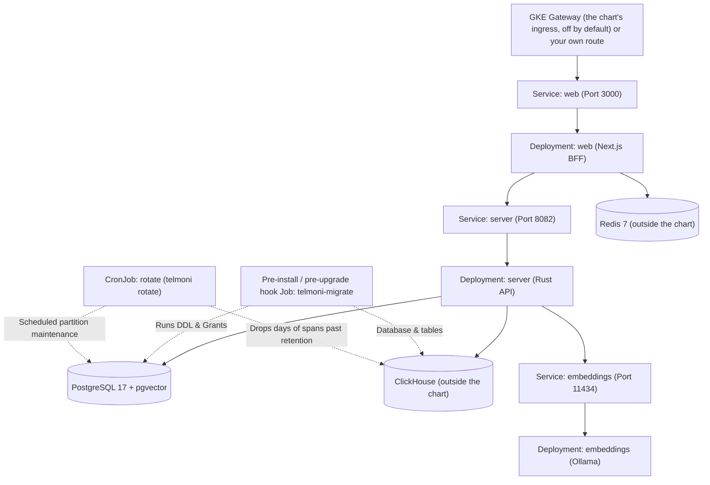

Telmoni provides a Helm chart located in `deploy/charts/telmoni`. It packages the core backend server, the Next.js web console, a migration hook Job, a partition-rotation CronJob, network policies, and an optional in-cluster Ollama vector embeddings deployment.

## Architecture on Kubernetes



---

## Prerequisites

Before deploying the Helm chart, ensure you have:
- A Kubernetes cluster
- [Helm](https://helm.sh/docs/intro/install/) 3 (the chart's `apiVersion` is `v2`)
- Nodes that run `linux/amd64`: the published images are built for it alone, tagged `latest` and with the full SHA of their commit, which `global.imageTag` pins
- A PostgreSQL 17 database instance with the `vector` extension, pgvector 0.8 or later, created by a superuser before the first migration
- The five login roles `auth`, `notifications`, `agent`, `telemetry` and `migrator`, created by you, each with its own password, then hardened with `role_hardening.sql` as the [production guide](/docs/self-host/production) describes; the connection strings below log in as them
- A ClickHouse server outside the chart, one node, reached over its HTTP interface (8123 for `http` and 8443 for `https`, by default), with two users of its own:
  - `migrator`, which the migration and rotation run as, granted `CREATE DATABASE, CREATE TABLE, CREATE VIEW, CREATE ROW POLICY, SELECT, INSERT, ALTER DELETE ON telemetry.*`, the last for dropping partitions past retention. It creates the `telemetry` database, its tables, a row policy that holds every user but itself to the projects each read names, and one that lets it read every row, for the nightly drop; so the server's user must not be the migrator's. Name the rights one by one rather than `ALL ON telemetry.*`: ClickHouse grants `ALL` on the bare name `telemetry` too, which is the server's user's, and with it the rights to alter or drop that user and to act as it.
  - `telemetry`, which the server connects as, granted `SELECT, INSERT ON telemetry.spans` and `SELECT ON telemetry.spans_hourly`, and nothing else in the database. A grant on all of it would take in the view that fills the hourly totals, which reads as the migrator, past the row policy, and so answers every project's totals.
- ClickHouse's configuration: `crates/telemetry/clickhouse/low-memory.xml`, the one to give a one-node ClickHouse and the one that keeps a customer's values out of ClickHouse's own log, its logger stopping at warnings, writing no query's error and masking every quoted literal anything else writes. Use it whole. `crates/telemetry/clickhouse/dev-users.xml` shows the two users and their grants as a `users.d` file, but its passwords are the development ones in plain text and it admits every network: write yours with `password_sha256_hex` and `networks` narrowed to your pods' range. The server must keep one default: `custom_settings_prefixes` allowing `SQL_`, or every read is refused
- A way to ClickHouse that a pod accepts: `https` with a certificate from a public CA, or plain `http` to loopback or a Service's name inside the cluster, with its namespace (`clickhouse.<namespace>.svc`, `….svc.cluster.local`): a bare name no Service in the namespace answers falls through the node's DNS search path to whatever outside the cluster does. In a pod, the server and the migrator refuse `http` to any other host, a VM on the same network included, and trust no private CA for ClickHouse. A ClickHouse inside the cluster needs two `NetworkPolicy`s of your own. One lets the `server` and `migrator` pods reach it on 8123, by pod and namespace selector: the chart's egress rule names addresses, which Kubernetes means for destinations outside the cluster, and which some network plugins, Cilium's among them, do not match against pods. The other admits them to ClickHouse's pod when it runs in the chart's own namespace, which the chart closes to all traffic
- A Redis 7 instance outside the chart, reached at a single endpoint (the console does not support Redis Cluster mode)
- A route from outside to the `web` Service on port 3000. The chart's own `ingress` is a GKE Gateway (a Gateway API `Gateway` on a named static address with an HTTPS listener and an HTTP-to-HTTPS redirect, plus GKE's `HealthCheckPolicy` on `/api/health` and a `GCPBackendPolicy` with a 3,600-second timeout for the console's event streams) and is off by default; on another cluster, bring your own Ingress or Gateway
- For connectors (Slack, Discord and webhooks alike): a Google Cloud KMS key the server pods may encrypt and decrypt with. They reach it with the token the GKE metadata server gives their Kubernetes service account, `server`, which the chart creates without a Workload Identity annotation, so after installing the chart either grant the key's encrypt and decrypt roles to that account's principal (`principal://iam.googleapis.com/projects/<project number>/locations/global/workloadIdentityPools/<project>.svc.id.goog/subject/ns/telmoni/sa/server`) or bind a Google service account that holds them (`kubectl annotate serviceaccount server -n telmoni iam.gke.io/gcp-service-account=<account>`, then restart the server pods). The server does not try the key at boot: a missing binding first shows as a `502` `/errors/connectors/key-unavailable` when a connector is set up. A mounted key file is not read, and a `local:` `CONNECTOR_KEK` is refused in a pod

---

## Deployment steps

<Steps>

<Step>

**Prepare namespace and Kubernetes secrets**

Create a dedicated namespace:

```bash
kubectl create namespace telmoni
```

Generate random 32-byte tokens for the service communication secret and session cookie seal:

```bash
SERVICE_SECRET=$(openssl rand -hex 32)
AUTH_SECRET=$(openssl rand -hex 32)
```

`DATABASE_CA_CERT` (the PEM of the database's CA) belongs in both Secrets that reach the database: `server-secrets`, and `migrator-secrets`, which holds `MIGRATOR_DATABASE_URL`, `MIGRATOR_CLICKHOUSE_URL` and `DATABASE_CA_CERT` (the console's `web-secrets` holds no database settings). In a Kubernetes pod the server and the migrator refuse to start without it.

Create the required Kubernetes secret objects. Each database URL carries the password you gave its role in the [production guide](/docs/self-host/production), and each ClickHouse URL the password of its ClickHouse user, with any character other than a letter, a digit, `-`, `.`, `_` or `~` percent-encoded (`@` as `%40`). The ClickHouse URLs below reach a server outside the cluster over `https`, its certificate a public CA's; one inside it is `http://telemetry:<password>@clickhouse.<namespace>.svc:8123` instead, and the same for `migrator`. The `AGENT_MODEL_API_KEY` line is for a hosted model only; leave it out otherwise.

```bash
# 1. Server secrets
kubectl create secret generic server-secrets \
  --namespace telmoni \
  --from-literal=AUTH_DATABASE_URL="postgres://auth:<auth password>@postgres.internal:5432/telmoni" \
  --from-literal=NOTIFICATIONS_DATABASE_URL="postgres://notifications:<notifications password>@postgres.internal:5432/telmoni" \
  --from-literal=AGENT_DATABASE_URL="postgres://agent:<agent password>@postgres.internal:5432/telmoni" \
  --from-literal=TELEMETRY_DATABASE_URL="postgres://telemetry:<telemetry password>@postgres.internal:5432/telmoni" \
  --from-literal=TELEMETRY_CLICKHOUSE_URL="https://telemetry:<ClickHouse telemetry password>@clickhouse.example.com:8443" \
  --from-literal=SERVICE_SECRET="$SERVICE_SECRET" \
  --from-literal=ADMIN_EMAIL="admin@example.com" \
  --from-literal=ADMIN_PASSWORD="<admin password>" \
  --from-literal=AGENT_MODEL_API_KEY="sk-..." \
  --from-file=DATABASE_CA_CERT=/path/to/database-ca.pem

# 2. Web console secrets
kubectl create secret generic web-secrets \
  --namespace telmoni \
  --from-literal=SERVICE_SECRET="$SERVICE_SECRET" \
  --from-literal=AUTH_SECRET="$AUTH_SECRET" \
  --from-literal=REDIS_URL="redis://redis.internal:6379"

# 3. Migrator secrets
kubectl create secret generic migrator-secrets \
  --namespace telmoni \
  --from-literal=MIGRATOR_DATABASE_URL="postgres://migrator:<migrator password>@postgres.internal:5432/telmoni" \
  --from-literal=MIGRATOR_CLICKHOUSE_URL="https://migrator:<ClickHouse migrator password>@clickhouse.example.com:8443" \
  --from-file=DATABASE_CA_CERT=/path/to/database-ca.pem
```

Each Secret is handed to its pods whole, as environment. `server-secrets` is therefore also where the server's other secrets go when you use them: `SMTP_URL`, `OIDC_ISSUER`, `OIDC_CLIENT_ID` and `OIDC_CLIENT_SECRET`, the `SLACK_*` and `DISCORD_*` credentials, `EMBEDDINGS_API_KEY` and `RERANK_API_KEY`. `REDIS_CA_CERT`, for a `rediss://` URL, belongs in `web-secrets`. Everything else the two read comes from the chart: the values under `config` through the `telmoni-tier` ConfigMap (`APP_URL`, `AUTH_URL`, `LOG_LEVEL`, the sign-in switches, `OIDC_NAME`, `OIDC_REDIRECT_URI` from `config.oidcRedirectUri`, which defaults to `http://localhost:3000/auth/callback` and is set to `https://<your host>/auth/callback` with an identity provider, `AUTH_PROVIDER_ORIGINS`, `COMPANY_NAME`, `SUPPORT_EMAIL`, `LEGAL_URL`, `MAIL_FROM`, `CONNECTOR_KEK` and the agent settings), and `PORT`, `SERVER_URL` and `TRUSTED_PROXY_HOPS` from the Deployments themselves. Pods read them when they start, and a `helm upgrade` that changes only values under `config`, or a changed Secret, restarts no pod, so follow it with `kubectl rollout restart deployment -n telmoni`.

</Step>

<Step>

**Configure Helm values**

Create a custom `values-prod.yaml` file. 

Notice that `CONNECTOR_KEK` is not a secret, and a `local:` key is refused in a pod. It comes from the chart value `config.connectorKek`, whose default (`local:dev_key`) is refused there too, so the server will not boot until you set it: a Cloud KMS key name like `projects/<p>/locations/<l>/keyRings/<r>/cryptoKeys/<k>`, or `""` to run without connectors:

```yaml
config:
  logLevel: "info"
  appUrl: "https://telmoni.example.com"
  authUrl: "https://telmoni.example.com"
  allowSignUp: false
  verifyEmail: false
  connectorKek: "projects/my-project/locations/global/keyRings/my-ring/cryptoKeys/connector-kek"

  # Optional AI Agent configuration. Anthropic's, OpenAI's or Google's API
  # needs AGENT_MODEL_API_KEY in server-secrets, or the server refuses to start.
  agent:
    modelProvider: "anthropic" # or "openai"
    model: "claude-sonnet-5"
    # If embeddingsUrl is left empty and embeddings.enabled is true,
    # the chart automatically routes to the in-cluster Ollama service.
    embeddingsUrl: ""
    embeddingsModel: "nomic-embed-text"

# In-cluster Ollama deployment for local embeddings
embeddings:
  enabled: true
  model: "nomic-embed-text"
  resources:
    requests:
      cpu: "500m"
      memory: "2Gi"
    limits:
      memory: "4Gi"

# Core backend server
server:
  enabled: true
  replicas: 2
  resources:
    requests:
      cpu: "250m"
      memory: "256Mi"
    limits:
      memory: "1Gi"

# Web console (Next.js). Its per-address rate limits read X-Forwarded-For
# trustedProxyHops entries back from the end: the GKE Gateway appends the
# client's address and then its own, so 2 is the default; change it only
# behind another appending hop.
web:
  enabled: true
  replicas: 2
  trustedProxyHops: 2
  resources:
    requests:
      cpu: "200m"
      memory: "256Mi"
    limits:
      memory: "512Mi"

# High availability configurations
highAvailability:
  enabled: true
  minReplicas: 2
  maxReplicas: 3
  targetCpuUtilization: 70

# Database migration and partition maintenance
migrator:
  enabled: true
  hook:
    enabled: true # Executes as a pre-install / pre-upgrade Helm hook
  rotateSchedule: "0 2 * * *" # Daily partition rotation
```

Enabling `highAvailability.enabled` creates a `HorizontalPodAutoscaler` and a `PodDisruptionBudget` for both `web` and `server` (`deploy/charts/telmoni/templates/high-availability.yaml`).

</Step>

<Step>

**Install the Helm chart**

From your repository root, run `helm install`:

```bash
helm install telmoni ./deploy/charts/telmoni \
  --namespace telmoni \
  --values values-prod.yaml
```

</Step>

<Step>

**Verify the installation**

Check the pods:

```bash
kubectl get pods -n telmoni
```

The `server` and `web` Deployments run between the autoscaler's `minReplicas` and `maxReplicas` (two to three above; with `highAvailability.enabled` off, the `replicas` you set) and `embeddings` one pod, each `Running` and `1/1` once its probes pass: the server's readiness probe reads every module's tables (`/health`, with `/livez` for liveness), the console's is `/api/health`, and the embeddings pod is ready only once its model has been pulled. The migration Job, `telmoni-migrate`, is a Helm hook deleted as soon as it succeeds, so its pod is listed only while it runs or after it failed, and a failed migration fails `helm install` itself.

</Step>

</Steps>

---

## Kubernetes security & isolation

The Telmoni Helm chart sets these defaults:

- **Non-root enforcement**: Every container runs as UID `65532` with `runAsNonRoot: true`, `allowPrivilegeEscalation: false`, the `RuntimeDefault` seccomp profile and `drop: [ALL]`, and no pod mounts a service-account token or receives service-link environment variables. The server, the migrator jobs and the embeddings pod mount a read-only root filesystem (the embeddings pod writes its model to an `emptyDir`), while the console's stays writable for Next's render cache.
- **NetworkPolicies**: `default-deny-all` refuses every pod's ingress and egress, and the rest open only what is used:
  - `allow-kube-dns`: every pod may reach cluster DNS on port 53.
  - `allow-web-ingress`: the console accepts port `3000` from anywhere, since the load balancer reaches its pods directly.
  - `allow-web-egress`: the console reaches the `server` pods on `8082` and any address on `6378` or `6379`, for Redis, and nothing else.
  - `allow-server-ingress`: the server accepts `8082` from the `web` pods alone.
  - `allow-server-and-jobs-egress`: the server and the migrator jobs may reach any address, for the database, ClickHouse, the mail and identity vendors, the KMS key and customers' webhooks; the server's own URL guard is what keeps a webhook off private addresses. A ClickHouse inside the cluster needs policies of your own (see [Prerequisites](#prerequisites)).
  - `allow-embeddings-ingress`, `allow-embeddings-egress` and `allow-server-to-embeddings`, with `embeddings.enabled`: the embeddings pod accepts `11434` from the `server` pods alone and may reach any host on port 443 for the model pull at each start, and the server may reach it on `11434`.
- **Pre-upgrade Migration Safety**: Migrations run as a Kubernetes `Job` annotated `"helm.sh/hook": pre-install,pre-upgrade` at weight `-5`, with `backoffLimit: 0` and `activeDeadlineSeconds: 300`; the `telmoni-tier` ConfigMap and the `migrator` ServiceAccount it needs are hooks too, at weight `-10`, and are kept. If a migration fails, the release fails before any Deployment is updated, though the `telmoni-tier` ConfigMap already holds the new values, and a pod that restarts afterwards reads them.
- **Partition Management**: The chart runs partition rotation itself, as a CronJob named `rotate` (`migrator.rotateSchedule`, default `"0 2 * * *"`, in `Etc/UTC`, never two at once), running `telmoni rotate` as the migrator role to ensure the current month and the next three months of audit partitions exist ahead of time, and, as the migrator's ClickHouse user, to drop each day of spans once every span in it arrived more than 360 days ago, and each month of hourly totals once it is more than 13 months behind.

## Reaching the console

`ingress.enabled: true` renders the chart's GKE Gateway: `ingress.gatewayClassName` (default `gke-l7-global-external-managed`), `ingress.staticAddressName` (default `telmoni-web`, a global static address you have reserved) and `ingress.annotations` (default `networking.gke.io/certmap: telmoni-web`, the certificate map holding the console's certificate). Port 80 answers a `301` to HTTPS, and the Gateway's health check reads `/api/health`. That Gateway appends two `X-Forwarded-For` entries, which is what `web.trustedProxyHops: 2` counts.

