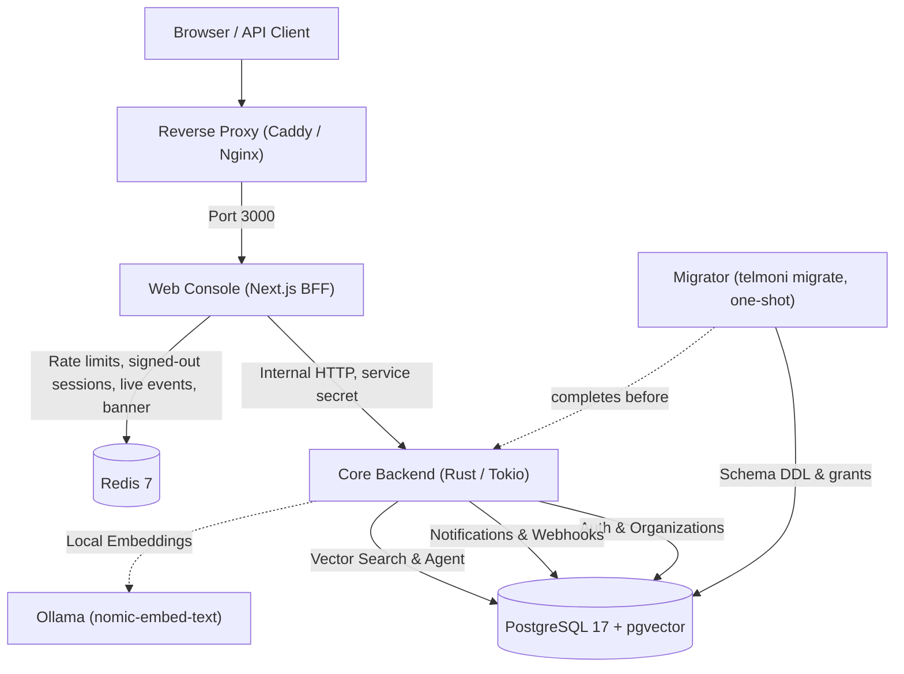

Telmoni open core runs on infrastructure you operate: the server, the console, PostgreSQL and Redis. On Compose, the key that seals connector secrets can be a `local:` key on your host. On Kubernetes, connectors (webhooks included) seal their secrets with a Google Cloud KMS key, reached with the service account the GKE metadata server gives the server pods (Workload Identity), since a `local:` key is refused in a pod and a mounted key file is not read. Organization management, project scoping, audit logging and the activity feeds need nothing outside your network; mail goes to the SMTP server you configure, a sign-in through an identity provider goes to that provider, and a connector's deliveries go to its Slack, Discord or webhook destination. The AI agent reaches out: to the model, embeddings and rerank endpoints you configure, unless they run on your own hosts; and to download its models (on the chart, the embeddings pod pulls its model at every start while `embeddings.enabled` is on; on Compose, you pull Ollama's models once). The documentation it indexes is this deployment's own console's, fetched inside it.

## System architecture

The Telmoni deployment consists of six components:

### Component breakdown

1. **Core Backend (`telmoni serve`)**: A single-binary Rust service built on Axum and Tokio. It serves the `/v1` API and the internal service API on port `8082`, both only to callers carrying the service secret, so every request from outside, the public API's included, enters through the web console. Its queries are scoped to one organization, and Row-Level Security (RLS) holds the database to that where its modules connect as the hardened roles (on the Compose quickstart they connect as the database's superuser, which RLS does not bind). It signs webhook payloads, dispatches notifications, and runs automated maintenance loops (retention purges, soft-deletion sagas, and an audit verification walk every 24 hours).
2. **Web Console (`telmoni/web`)**: A Next.js application that serves the dashboard, handles server-side session cookies (sealed with `AUTH_SECRET`), proxies authenticated requests to the backend server, and applies the per-address and per-key rate limits.
3. **PostgreSQL 17 with `pgvector`**: The primary relational store. Telmoni uses native partitioning for the audit ledger and the `vector` extension for semantic document search. In production, each server module (`auth`, `notifications`, `agent`) connects as its own role, which `role_hardening.sql` makes `NOSUPERUSER` and `NOBYPASSRLS`; migrations run as a fourth role, `migrator`, which owns the tables and holds `BYPASSRLS`.
4. **Redis 7**: An in-memory store used only by the web console, for its sliding-window rate limits, its list of signed-out sessions, the channels behind the console's live event stream, and the announcement banner. On the `/v1` and `/cli` routes a rate-limit bucket is keyed by a SHA-256 digest of the `Authorization` header, so the token itself is never a Redis key. Rate-limit windows expire in milliseconds (`PEXPIRE`), and the Compose file runs Redis without disk snapshots (`--save ""`).
5. **Migrator (`telmoni migrate`)**: A one-shot CLI command packaged within the backend binary. It executes pending database migrations and applies the object grants before the server boots.
6. **AI Agent & Embeddings (Optional)**: Telmoni includes an embedded context assistant. An optional Ollama service serves `nomic-embed-text` embeddings; on Compose it can also serve a chat model you pull, and with the model and embeddings URLs on the `ollama` service and `DOCS_CORPUS_URL=off`, every endpoint the agent calls is on the Compose network once its models are downloaded. The chart's embeddings pod serves embeddings only. Hosted model providers (Anthropic, or an OpenAI-compatible endpoint such as Google's Gemini API) can be configured via environment variables.

---

## Production recommendations checklist

When moving from a local evaluation or single-node Docker quickstart to a production environment, follow these best practices:

- **Enterprise OIDC Authentication (Recommended)**: While the email and password setup (`ADMIN_EMAIL` / `ADMIN_PASSWORD`) is provided to bootstrap an instance quickly, we strongly recommend connecting an OpenID Connect (OIDC) identity provider: one that publishes its discovery document at `{issuer}/.well-known/openid-configuration` and signs ID tokens with RS256. Once OIDC is tested, remove `ADMIN_EMAIL` and `ADMIN_PASSWORD` and disable the password form entirely via `DISABLE_LOGIN_FORM=true`, so that every sign-in goes through your provider and its own MFA policy.
- **Database roles & RLS**: Connect each module as its own role, never as a PostgreSQL superuser, and apply `crates/migrator/sql/role_hardening.sql`, which makes the `auth`, `notifications`, and `agent` roles `NOBYPASSRLS`.
- **Reverse Proxy with TLS**: Never expose internal ports `3000` or `8082` directly to the internet. Always terminate TLS using Caddy, Nginx, or a cloud Ingress controller.
- **Audit Partition Maintenance**: On Compose, schedule `telmoni rotate` (weekly is enough) to maintain the 4-month forward partition runway; the Helm chart runs it daily as a CronJob.
- **Encryption Key Retention**: `CONNECTOR_KEK` is either a `local:` key, which is a secret to keep and back up alongside your database dumps, or a Cloud KMS key name, which is not a secret and cannot be dumped: never disable or destroy that key, or connector credentials stop decrypting.

---

## System requirements

- **Platform**: The published images are built for `linux/amd64` only. Building your own does not change that for the server, whose Dockerfile compiles for x86_64 alone.
- **Database**: PostgreSQL with the `vector` extension at pgvector 0.8 or later; the Compose stack runs `pgvector/pgvector:pg17`.
- **Redis**: One endpoint for the console; the Compose stack runs `redis:7-alpine`.
- **Sizing**: Telmoni states no minimum hardware. The Helm chart's default resource requests and limits for each pod are in `deploy/charts/telmoni/values.yaml`.

---

## Deployment methods

Choose the deployment workflow that fits your infrastructure:

<Cards>
  <Card title="Docker Compose" href="/docs/self-host/docker-compose">
    The recommended deployment method for single-node installations. Runs PostgreSQL, Redis, the migration engine, the core server, and the web console with healthcheck dependencies.
  </Card>
  <Card title="Kubernetes & Helm" href="/docs/self-host/kubernetes">
    Deploy with the Helm chart in `deploy/charts/telmoni`; `highAvailability.enabled` adds an autoscaler and a disruption budget for the server and the console.
  </Card>
  <Card title="Self-hosted AI agent" href="/docs/self-host/agent">
    Configure local vector embeddings with Ollama, hybrid search, read-only tools, and documentation corpus indexing.
  </Card>
  <Card title="Production hardening" href="/docs/self-host/production">
    Configure enterprise OIDC, hardened PostgreSQL roles, automated audit partition rotations, and TLS reverse proxies.
  </Card>
</Cards>
